<div align="center">

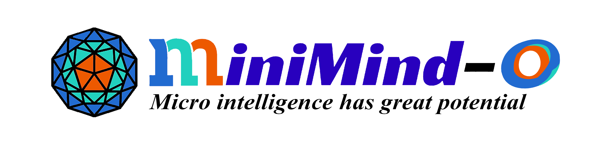
</div>


<div align="center">

 [](https://github.com/jingyaogong/minimind-o/stargazers) [](라이센스) [](https://github.com/jingyaogong/minimind-o/commits/master) [](https://github.com/jingyaogong/minimind-o/pulls) [](https://huggingface.co/collections/jingyaogong/minimind-o) [](http://arxiv.org/abs/2605.03937)
</div>

<div align="center">
  <h3>"적을수록 좋다"</h3>
</div>

<div align="center">

[中文](./README.md) | 영어
</div>

* 이 프로젝트는 단일 가중치 세트가 텍스트/오디오/이미지 입력을 공동으로 처리하고 텍스트/스트리밍 음성 출력을 생성하는 소규모 엔드투엔드 Omni 모델을 처음부터 구현합니다.
* `minimind-3o`에는 ~0.1B 매개변수만 있습니다. 소비자 GPU에서 훈련할 수 있고 CPU에서 빠르게 실행될 수 있으므로 공개적으로 사용할 수 있는 가장 작고 완전한 기능을 갖춘 Omni 구현 중 하나입니다.
* `mini` 및 `full`라는 두 가지 훈련 데이터세트가 출시되었습니다. `mini`는 단일 RTX 3090에서 약 2시간 만에 전체 파이프라인을 실행하며 시작하기 위한 것입니다. `full`는 릴리스된 가중치에 해당합니다.
* Thinker-Talker 이중 경로 아키텍처, 스트리밍 음성 생성, 실시간 참여, 거의 이중 상호 작용, 음성 복제 및 전화 모드 WebUI를 다루는 전체 코드베이스 및 기술 보고서가 출시되었습니다.
* 모든 핵심 알고리즘 구성 요소는 기본 PyTorch에서 처음부터 구현되며 타사 프레임워크의 높은 수준 추상화에 의존하지 않습니다.
* MiniMind-O는 [MiniMind](https://github.com/jingyaogong/minimind)(언어) 및 [MiniMind-V](https://github.com/jingyaogong/minimind-v)(비전 언어)의 디자인 철학을 이어갑니다.

> 참고: "약 2시간"은 단일 NVIDIA RTX 3090을 사용하여 미니 데이터 세트에서 SFT를 실행하는 데 측정된 시간을 나타냅니다.

---

<div align="center">

[📄 MiniMind-O Technical Report](http://arxiv.org/abs/2605.03937)
https://github.com/user-attachments/assets/10cbcc5f-4e70-45cf-bdc5-d6361e40bb86
[🔗 Online Demo (Gradio)](https://modelscope.cn/studios/gongjy/MiniMind-O) &nbsp;|&nbsp; [🔗 Video Intro](https://www.bilibili.com/video/BV1V1RsBcEMX)
</div>

---

# 😀 프로젝트 소개

[MiniMind](https://github.com/jingyaogong/minimind)(LLM) 및 [MiniMind-V](https://github.com/jingyaogong/minimind-v)(VLM)에 이어 MiniMind-O가 이 시리즈의 세 번째 정거장입니다. "Omni"는 동시에 듣고 보고 말할 수 있는 모델을 의미합니다. 즉, 텍스트, 음성 및 시각적 신호를 입력으로 사용하고 스트리밍 음성과 함께 텍스트를 생성합니다.
GPT-4o는 아마도 자연스러운 스트리밍 음성 상호 작용을 실제처럼 느끼게 한 최초의 시스템이었을 것입니다. 이후 Mini-Omni2, Moshi, GLM-4-Voice, Qwen3-Omni 등의 오픈소스 프로젝트가 점차 등장했습니다. 그러나 목표가 수십억 개의 매개변수가 있는 미리 만들어진 체크포인트를 호출하는 것뿐만 아니라 완전한 Omni 모델을 처음부터 완전히 이해하고 훈련하고 수정하는 것이라면 오픈소스 커뮤니티에는 여전히 엔드투엔드 파이프라인을 갖춘 충분히 가벼운 시작점이 부족합니다. 음성을 Omni 모델로 가져오는 일반적인 방법은 ASR, LLM 및 TTS를 계단식으로 연결하는 것입니다. 음성은 먼저 텍스트로 기록되고 LLM이 이를 처리한 다음 답변이 다시 음성으로 합성됩니다. 이는 엔지니어링 관점에서 보면 간단하지만 전사 단계가 추가되고 대기 시간, 운율 및 감정적 단서가 눈에 띄게 손상됩니다.
MiniMind-O는 이 격차를 메우려고 시도합니다. 음성과 텍스트는 숨겨진 상태 수준에서 직접 연결되고 훈련 가능한 백본은 ~0.1B 매개변수만 유지되며 엔드투엔드 Omni 파이프라인은 보존됩니다. Talker 측은 MTP(Multi-Token Prediction)를 채택하여 여러 Mimi 코드북 레이어를 한 번에 예측하고 이를 VAD와 결합하여 실시간 바지인 및 거의 이중 상호 작용(작은 Omni 모델을 위한 실용적인 엔지니어링 경로)을 지원합니다. 코드, 모델 가중치, 교육 데이터 및 기술 보고서는 모두 오픈소스입니다. 단일 RTX 3090은 약 2시간 만에 미니 데이터 세트에 대한 훈련을 완료할 수 있습니다. 목표는 동일합니다. 모든 사람이 코드의 첫 번째 줄부터 프로젝트를 읽고 듣고, 보고, 생각하고, 말할 수 있는 모델을 처음부터 훈련시키는 것입니다.
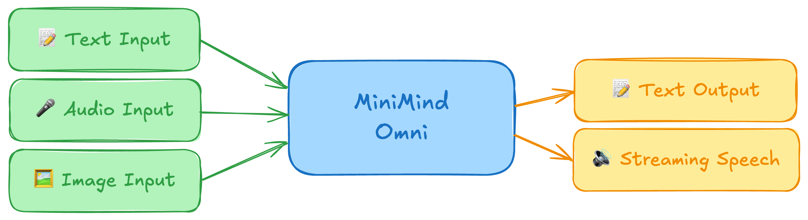
😊 즐겁게 조립해보세요.
---

#### 🎉 이 프로젝트가 제공하는 것

- 완전한 MiniMind-O 아키텍처: Thinker, 독립 Talker, 오디오/비전 프로젝터, Mimi 코드북 인터페이스 및 MTP 오디오 헤드.
- T2A, I2T 및 A2A 데이터를 포괄하고 전체 매개변수 교육, 오디오 프로젝터 전용 교육, 비전 프로젝터 전용 교육 및 DDP 다중 GPU 교육을 지원하는 전체 SFT 파이프라인입니다.
- 두 개의 훈련 데이터 세트, `mini` 및 `full`. `mini`는 빠른 온보딩을 위해 고안되었으며 단일 RTX 3090에서 최대 2시간 만에 파이프라인을 실행합니다. `full`는 출시된 가중치와 일치하며 중국어 음성 및 이미지 작업을 다룹니다.
- 다중 내장 음성 프롬프트, 보이지 않는 음성 프롬프트 및 임의 참조 오디오로부터의 음성 복제를 통해 음성 제어 실험을 쉽게 재현할 수 있습니다.
- 완전한 추론 및 데모 툴킷: CLI, 웹 UI, 스트리밍 재생, 바지인 중단 및 전화 모드 데모.
- 주요 모듈은 고급 타사 래퍼 없이 기본 PyTorch에서 처음부터 작성되는 동시에 `transformers` 토크나이저 및 기본 가중치 형식과의 호환성을 유지합니다.
- 동반 기술 보고서는 아키텍처, 훈련 곡선, CER/WER 평가, 음성 복제 유사성 및 모델 간 비교를 다루고 있습니다. 상단의 기술 보고서 ​​배지를 확인하세요.

#### 🎉 출시 모델

| 모델 | 백본 매개변수 | 출시 |
|---|---|---|
| minimind-3o | ~0.1B | 2026.05.05 |
| minimind-3o-moe | ~0.3B-A0.1B | 2026.05.05 |

---

#### 👉 업데이트 로그

<details close><summary> <b>🔥 2026-05-05</b> </summary>

- MiniMind-O의 첫 번째 릴리스: `minimind-3o`(115M) 및 `minimind-3o-moe`(312M-A115M).
- Thinker–Talker 이중 경로 아키텍처. Talker는 MTP를 사용하여 다중 코드북 Mimi 코드를 예측하고 24kHz 스트리밍 음성 생성 및 참여를 지원합니다.
- 오디오 코덱은 Mimi(8 코드북, 12.5Hz, 24kHz)입니다. Talker는 코드북 인터페이스에서 공유 백본과 경량 어댑터를 사용합니다.
- 음성 및 시각적 특징은 각각 동결된 SenseVoice-Small 및 SigLIP2에 의해 추출되고 2층 MLP 프로젝터를 통해 MiniMind 숨겨진 공간에 주입됩니다.
- 미니 및 전체 훈련 데이터 세트가 함께 출시됩니다. mini는 단일 RTX 3090에서 최대 2시간 만에 전체 Thinker-Talker 파이프라인을 실행합니다.
- 음성 복제 및 전화 모드 WebUI가 포함된 내장 음성 프롬프트 5개와 보이지 않는 음성 프롬프트 7개.

</details>

# 😀 빠른 시작

<details style="color:rgb(128,128,128)"><summary>참조 하드웨어/소프트웨어 설정</summary>

* CPU: Intel(R) Core(TM) i9-10980XE CPU @ 3.00GHz
* RAM: 128GB
* GPU: NVIDIA GeForce RTX 3090(24GB) * 8
* 우분투==20.04
* CUDA==12.2
* 파이썬==3.10
* [requirements.txt](./requirements.txt)

</details>
## 0단계(필수)

### 1' 환경

```bash
# 저장소 복제
git clone --depth 1 https://github.com/jingyaogong/minimind-o
# 종속성 설치
pip install -r requirements.txt -i https://pypi.tuna.tsinghua.edu.cn/simple
```

### 2' 리소스 다운로드

```bash
# SenseVoice-Small 오디오 인코더를 ./models/SenseVoiceSmall에 다운로드하세요.
modelscope download --model gongjy/SenseVoiceSmall --local_dir ./models/SenseVoiceSmall
# SigLIP2 비전 인코더를 ./models/siglip2-base-p32-256-ve에 다운로드하세요.
modelscope download --model gongjy/siglip2-base-p32-256-ve --local_dir ./models/siglip2-base-p32-256-ve
# Mimi 오디오 코덱을 ./models/mimi에 다운로드하세요.
modelscope download --model gongjy/mimi --local_dir ./models/mimi
# CAM++ 스피커 인코더를 ./models/campplus에 다운로드하세요.
modelscope download --model gongjy/campplus --local_dir ./models/campplus
# MiniMind LLM 가중치를 ./checkouts로 다운로드합니다(Omni 교육을 위한 언어 백본으로 사용됨).
modelscope download --model gongjy/minimind-3o-pytorch llm_768.pth --local_dir ./checkouts
```

[ModelScope Collection](https://modelscope.cn/collections/gongjy/MiniMind-O) 또는 [HuggingFace Collection](https://huggingface.co/collections/jingyaogong/minimind-o)(LFS 필요)에서 해당 저장소를 `git clone`할 수도 있습니다. 여기서는 자세한 내용을 생략했습니다.
다운로드 후 디렉토리는 다음과 같아야 합니다.
```text
minimind-o/
├── models/
│   ├── SenseVoiceSmall/
│   ├── siglip2-base-p32-256-ve/
│   ├── mimi/
│   ├── campplus/
│   └── ...
├── checkouts/
│   └── llm_768.pth
└── ...
```

## Ⅰ 🚀 추론

### 1' 릴리스된 가중치 다운로드

```bash
# 릴리스된 가중치를 ./checkouts에 다운로드합니다.
modelscope download --model gongjy/minimind-3o-pytorch --local_dir ./checkouts
```

### 2' 명령줄 채팅

```bash
python eval_omni.py --load_from model --weight sft_omni
```

Transformers 형식 모델을 사용하려면 먼저 모델 디렉토리를 다운로드하십시오.
```bash
git clone https://huggingface.co/jingyaogong/minimind-3o
python eval_omni.py --load_from minimind-3o
```

### 3' WebUI 실행(선택 사항)

```bash
# ⚠️ Transformers 형식 모델 폴더를 ./scripts/에 복사합니다. web_demo_omni 스크립트
#    는 이 디렉터리에서 가중치 파일이 포함된 하위 폴더를 자동으로 검색합니다. 그것
#    은 아무것도 발견되지 않으면 오류를 발생시킵니다.
cp -r minimind-3o ./scripts/minimind-3o
cd scripts && python web_demo_omni.py
```

참고: `scripts/web_demo_omni.py`는 비실시간 Gradio 데모입니다. 업로드되거나 녹음된 오디오는 백엔드에서 실제 샘플링 속도에서 16kHz로 리샘플링됩니다. 실시간 음성 통화에는 `webui/web_demo.py`를 사용하세요.
## Ⅱ 🛠️ 훈련

<details style="color:rgb(128,128,128)"><summary>Torch가 CUDA를 사용하고 있는지 확인</summary>

```python
import torch
print(torch.cuda.is_available())
```

사용할 수 없는 경우 [torch_stable](https://download.pytorch.org/whl/torch_stable.html)에서 일치하는 `.whl`를 다운로드하여 수동으로 설치하십시오.
</details>
### 1' 데이터 다운로드

빠른 시작을 위해서는 [dataset link](https://huggingface.co/datasets/jingyaogong/minimind-o_dataset)에서 `_mini` 마루 파일만 다운로드하여 `./datas` 아래에 배치하는 것으로 충분합니다.
### 2' 열차

권장되는 미니 학습 파이프라인은 다음과 같습니다. `trainer/` 디렉터리에서 실행되도록 되어 있습니다. 마찬가지로 `cd trainer && bash train.sh`를 실행합니다.
```bash
CUDA_VISIBLE_DEVICES=0 torchrun --master_port 29560 --nproc_per_node 1 train_sft_omni.py --learning_rate 5e-4 --data_path ../datas/sft_t2a_mini.parquet --epochs 1 --batch_size 40 --use_compile 1 --from_weight llm --save_weight sft_zero --max_seq_len 512 --use_wandb --use_moe 0
CUDA_VISIBLE_DEVICES=0 torchrun --master_port 29560 --nproc_per_node 1 train_sft_omni.py --learning_rate 5e-4 --data_path ../datas/sft_a2a_mini.parquet --epochs 1 --batch_size 40 --use_compile 0 --from_weight sft_zero --save_weight sft_zero --max_seq_len 640 --mode audio_proj --use_wandb --use_moe 0
CUDA_VISIBLE_DEVICES=0 torchrun --master_port 29560 --nproc_per_node 1 train_sft_omni.py --learning_rate 2e-5 --data_path ../datas/sft_a2a_mini.parquet --epochs 1 --batch_size 16 --use_compile 0 --from_weight sft_zero --save_weight sft_zero --max_seq_len 768 --use_wandb --use_moe 0
```

### 3' 훈련된 모델 테스트(선택 사항)

테스트할 모델 `*.pth`가 `./checkouts/` 아래에 있는지 확인하세요.
```bash
python eval_omni.py --weight sft_omni
```

# 😀 모델 상세정보

MiniMind-O의 언어 백본은 자매 프로젝트 [MiniMind](https://github.com/jingyaogong/minimind)에서 나왔습니다. LLM 아키텍처 및 교육 세부정보는 해당 저장소를 참조하세요. LLM 내부 내용을 다루지 않고도 위의 빠른 시작 섹션에 따라 MiniMind-O를 처음부터 끝까지 학습할 수 있습니다.
## Ⅰ 아키텍처 개요

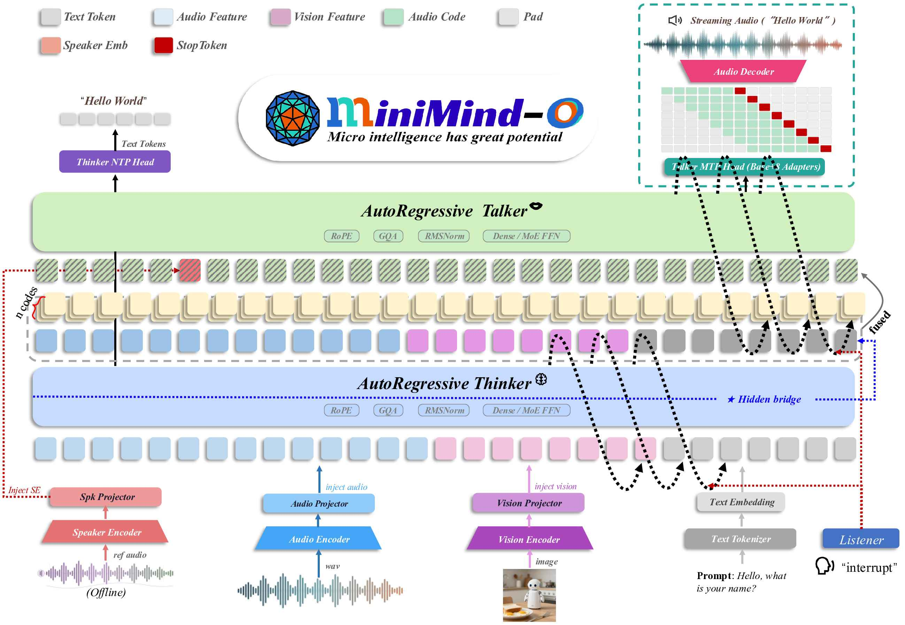
MiniMind-O는 Thinker와 Talker의 두 가지 경로로 구성됩니다. Thinker는 텍스트, 음성 및 이미지 입력을 이해하고 의미 수준의 텍스트 응답을 생성하는 일을 담당합니다. Talker는 Thinker의 의미론적 조건을 취하고 MTP를 사용하여 다중 코드북 Mimi 오디오 코드를 공동으로 예측합니다. 오디오 디코더는 이를 최종적으로 스트리밍 음성으로 복원합니다. 요점은 ASR, LLM 및 TTS를 함께 연결하는 것이 아니라 단일 통합 시퀀스 내에서 텍스트 추론, 음성 생성 및 스트리밍 상호 작용을 유지하는 것입니다.
텍스트 입력은 언어 백본으로 직접 이동합니다. 음성과 이미지는 먼저 각각 Audio Encoder와 Vision Encoder에 의해 인코딩된 다음 MiniMind 숨겨진 공간에 투영됩니다. 음성 정보는 스피커 인코더 또는 참조 오디오 코드를 통해 제공됩니다. 추론 시 VAD와 결합되어 말하는 동안 듣기, 실시간 참여 및 거의 이중 방식 상호 작용이 가능합니다. 이후 섹션에서는 프로젝터, 시퀀스 레이아웃 및 교육 목표를 더 자세히 설명합니다. 코드 수준 세부정보는 `model/model_omni.py` 및 [technical report](http://arxiv.org/abs/2605.03937)를 참조하세요.
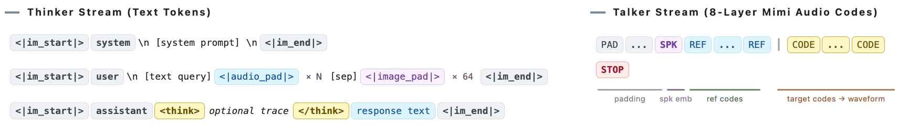
위 그림은 텍스트 토큰, 음성 특징, 이미지 특징 및 음성 조건이 입력 시퀀스에 어떻게 배치되어 있는지 보여줍니다.
## Ⅱ Thinker 측의 다중 모드 이해

Thinker는 텍스트, 음성, 이미지 정보를 균일하게 수신하여 의미 수준의 텍스트 응답을 생성합니다. 텍스트 토큰은 언어 백본에 직접 입력되는 반면 음성 및 이미지 기능은 해당 프로젝터를 통해 자리 표시자 위치에 주입되므로 모든 양식은 결국 동일한 시퀀스 내에서 모델링됩니다.
## Ⅲ 중간층 교량

Thinker에서 Talker로 전달된 표현은 임베딩 레이어나 최종 레이어가 아닌 중간 레이어에서 가져옵니다. 임베딩 레이어는 의미론적 정보가 너무 적고, 최종 레이어는 다음 토큰 예측을 위해 과도하게 형성되어 있습니다. 중간 계층은 일반적으로 LM 헤드에 의해 과도하게 조정되지 않고 이미 상황별 정보와 교차 모달 정보를 융합하므로 음성 생성을 위한 더 나은 조건화 소스가 됩니다. 기본적으로 `bridge_layer = num_hidden_layers // 2 - 1`이며 다양한 규모의 구성을 통해 조정될 수 있습니다.
## IV Talker 측 음성 생성

Talker는 Thinker의 의미 상태를 8개의 Mimi 코드북 코드 스트림으로 변환합니다. 별도의 긴 경로를 통해 각 코드북을 실행하는 대신 MTP를 사용하여 여러 오디오 코드북을 동시에 예측합니다. 0.1B 모델 내부의 추가 매개변수 수를 제어하기 위해 오디오 임베딩 및 출력 헤드는 경량 코드북별 어댑터와 공통 백본을 공유합니다. 이는 각 코드북 계층에 대한 전체 매개변수 복사를 방지하면서 코드북 간의 분포 차이를 유지합니다.
## Ⅴ 시퀀스 형식 및 스트리밍 디코딩

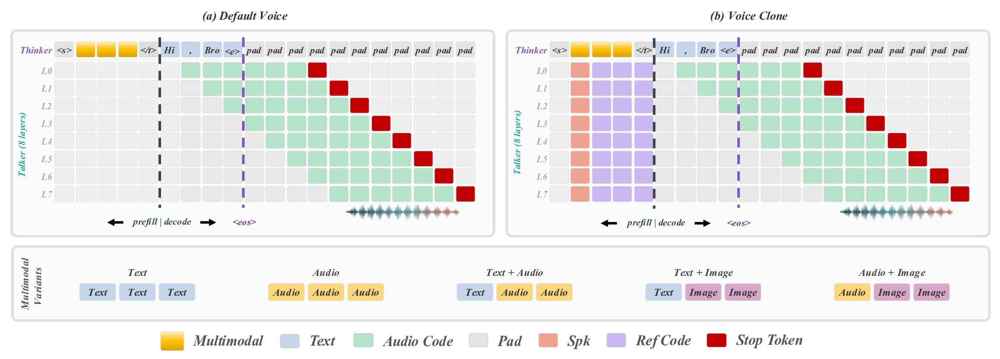
MiniMind-O는 동일한 훈련 샘플에 텍스트 토큰과 8개의 오디오 코드 스트림을 배치합니다. Thinker는 텍스트 시퀀스를 처리하고 Talker는 오디오 코드 시퀀스를 처리하며 음성/이미지/음성 조건은 자리 표시자 또는 참조 코드를 통해 주입됩니다. 대상 텍스트 및 대상 오디오의 손실은 응답이 시작된 후에만 계산됩니다. 참조 및 조건화 영역은 조건으로만 사용되며 재구성 대상의 일부가 아닙니다.
스트리밍 생성을 위해 모델은 MTP와 지연 일정을 통해 8레이어의 Mimi 코드를 동시에 채우는 동시에 텍스트 토큰을 방출합니다. Mimi 디코더는 24kHz 파형을 점진적으로 재구성할 수 있으므로 전체 응답이 완료될 때까지 재생이 기다릴 필요가 없습니다.
## Ⅵ 음성 제어

음성 제어는 상황 내 음성 복제를 통해 실현됩니다. 참조 오디오는 먼저 음성 프롬프트로 인코딩된 다음 가중치를 미세 조정하거나 음성을 지정하기 위해 텍스트 프롬프트를 다시 작성하는 대신 상황별 조건으로 Talker에 제공됩니다. 모델은 스피커 임베딩을 추가로 사용하여 보다 안정적인 스피커 제약 조건을 제공할 수 있습니다. 추론 시 음성을 전환하려면 이러한 조절 입력만 변경하면 되며 Thinker 프롬프트와 Talker 가중치는 변경되지 않습니다.
기본 릴리스에는 5개의 내장 음성 프롬프트(dylan, eric, serena, Uncle_fu, vivian)가 포함되어 있으며 평가를 위해 7개의 보이지 않는 프롬프트(arthur, chelsie, Cherry, ethan, jennifer, momo, Moon)가 예약되어 있습니다.
## Ⅶ 모듈 및 매개변수 규모

MiniMind-O에 대해 참조된 "0.1B"는 Thinker, Talker 및 두 개의 프로젝터로 구성된 훈련 가능한 백본을 나타냅니다. 릴리스된 체크포인트의 경우 `minimind-3o`는 약 113M이고 `minimind-3o-moe`는 약 315M입니다. Audio Encoder, Vision Encoder 및 Speech Codec은 기능 추출 또는 오디오 (디)코딩에만 사용되는 고정된 외부 측면 모듈입니다. 모두 합하면 약 425M 매개변수가 포함되어 있으며 활성 MiniMind-O 매개변수로 계산되지 않습니다.
아래 표는 출시 모델별 메인 모듈 크기를 나타냅니다. 훈련 가능한 수는 중복된 묶음 임베딩이 포함된 PyTorch 모듈을 기반으로 합니다.
| Counting scope | minimind-3o | minimind-3o-moe |
|---|---:|---:|
| 훈련 가능한 백본 | 113.13M | 314.89M |
| 고정된 외부 모듈 | 424.70M | 424.70M |
| 런타임 시 로드된 총계 | 537.83M | 739.59M |

| 모듈 | 구현 | 키 구성 | 상태/매개변수(~3o / ~3o-moe) |
|---|---|---|---|
| Thinker | MiniMind Transformer | 8 layers, hidden 768 | trainable, 63.91M / 198.42M |
| Talker | Standalone MiniMind blocks | 4 layers, 8 codebook heads | trainable, 47.05M / 114.30M |
| 오디오 프로젝터 | `MMAudioProjector` | 512 → 768 | 훈련 가능, 0.99M |
| 비전 프로젝터 | `MMVisionProjector` | 768 → 768 | 훈련 가능, 1.18M |
| 오디오 인코더 | SenseVoice-소형 | 16kHz 음성 기능 | 동결, 234.00M |
| 비전 엔코더 | SigLIP2 베이스-p32-256 | 256×256 이미지, 64개 토큰 | 냉동, 94.55M |
| 음성 코덱 | 미미 | 코드북 8개, 12.5Hz, 24kHz | 냉동, 96.15M |
| 스피커 상태 | CAM++ 임베딩 | 192-d 스피커 벡터 | 사전 계산됨 |

# 😀 실험

## Ⅰ 데이터세트

데이터세트 다운로드: [ModelScope](https://www.modelscope.cn/datasets/gongjy/minimind-o_dataset) | [HuggingFace](https://huggingface.co/datasets/jingyaogong/minimind-o_dataset)
모든 음성 데이터는 Mimi 코드(8개 코드북, 12.5Hz 프레임 속도)로 균일하게 저장됩니다. 이미지는 256×256으로 균일하게 크기가 조정되고 SigLIP2 P32에 의해 64개의 패치 토큰으로 인코딩됩니다. 훈련 데이터는 주로 [VoiceAssistant-400K](https://huggingface.co/datasets/gpt-omni/VoiceAssistant-400K), [UltraChat-300K-SLAM-Omni](https://huggingface.co/datasets/worstchan/UltraChat-300K-SLAM-Omni) 등을 포함한 공개 Omni/음성 교육 자료에서 나옵니다. Qwen3-TTS로 대량의 다중 스피커 오디오를 추가로 합성하고, CAM++를 사용하여 스피커 임베딩을 음성 조건으로 추출합니다. I2T 데이터는 [MiniMind-V](https://github.com/jingyaogong/minimind-v)에서 사용되는 시각적 명령 데이터와 동일한 소스를 따릅니다. 원본 구성 및 인용은 해당 프로젝트를 참조하세요.
저장소는 **미니** 및 **전체**라는 두 가지 훈련 세트를 제공합니다. 미니 세트는 "English + no-vision" 기준을 사용하여 전체에서 필터링되며 기본 `--data_path`를 사용하여 `train_sft_omni.py`와 함께 작동합니다. 출시된 모델의 중국어 음성 능력을 재현하기보다는 Thinker-Talker 파이프라인, Mimi (디)코딩, 시퀀스 레이아웃 및 음성 주입 경로를 저렴한 비용으로 검증하는 것이 목표입니다. 중국어 말하는 사람은 더 복잡한 자소-음소 매핑, 운율적 일시 중지 및 다중 화자 안정성을 처리해야 합니다. 이는 분명히 영어보다 어렵고 단일 RTX 3090에서 최대 2시간 이내에 수렴할 것으로 기대할 수 없습니다.
전체 세트는 출시된 `minimind-3o` / `minimind-3o-moe` 체크포인트에 해당하며 중국어-영어 T2A/A2A는 물론 이미지-텍스트까지 포괄합니다. 크기와 언어 비율은 다음과 같습니다. 이는 논문에 보고된 CER/음성 유사성 수치 뒤에 있는 실제 교육 소스입니다.
T2A는 텍스트-오디오, A2A는 오디오-오디오, I2T는 이미지-텍스트를 의미합니다.
| 데이터세트 | 하위 집합 | 음성 입력 | 음성 출력 | 참고 |
|---|---|---|---|---|
| `sft_t2a_mini` | 영어 T2A | — | ~470.14시간 | 미니 온보딩 |
| `sft_a2a_mini` | 영어 A2A | ~74.64시간 | ~56.60시간 | 미니 온보딩 |
| `sft_t2a` | zh+en T2A | — | ~1636.01 h | full training |
| `sft_a2a` | zh+en A2A | ~1711.97 h | ~423.40 h | full training |
| `sft_i2t` | 이미지 I2T | — | — | 전체 교육 |

`sft_t2a`에서 중국어/영어/혼합 샘플은 각각 45.7%/46.5%/7.8%를 차지합니다. `sft_a2a`에서는 비율이 70.8% / 21.2% / 8.0%입니다. 이러한 분포는 행동에 직접적으로 반영됩니다. 짧은 중국어와 짧은 영어 응답은 일반적으로 안정적인 반면, 긴 영어 음성은 잘못된 발음과 단어 누락이 발생하기 쉽습니다. 미니 하위 집합은 영어만 유지하므로 매개 변수 및 데이터에 대한 예산이 부족하더라도 언어 내 CER은 사용 가능한 범위에 유지됩니다.
## Ⅱ 훈련

훈련 진입점은 `train_sft_omni.py`이며, 권장 파이프라인은 `trainer/train.sh`에서 찾을 수 있습니다. 전체 훈련은 여러 개의 복잡한 사전 훈련 단계로 분할되지 않습니다. 대신 데이터 흐름에 따라 기능이 점진적으로 도입됩니다.
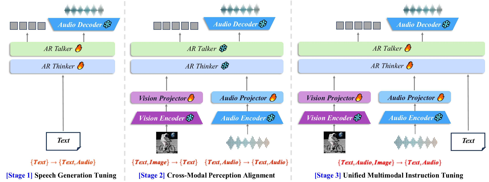
- `sft_t2a`: 먼저 텍스트를 음성 출력과 정렬하여 Talker가 Thinker의 의미론적 조건에 따라 Mimi 코드를 생성하는 방법을 학습하도록 합니다.
- `sft_a2a`: 음성 입력을 가져와 모델이 음성 명령과 동일한 Thinker-Talker 응답 경로에 들어갈 수 있도록 합니다.
- `sft_i2t`: 시각적 경로를 마지막에 정렬합니다. `vision_proj` 모드는 비전 프로젝터만 업데이트하여 이미지 데이터가 언어 및 음성 능력을 덮어쓰는 것을 방지합니다.

훈련 모드 중 `all`는 MiniMind/Tacker/프로젝터를 업데이트하는 반면, `audio_proj` 및 `vision_proj`는 해당 프로젝터를 정렬하는 데에만 사용됩니다. SenseVoice-Small, SigLIP2 및 Mimi는 전체적으로 정지된 상태로 유지됩니다. Dense 및 MoE 변형은 동일한 데이터 순서를 공유합니다. 미니 명령은 파이프라인을 엔드투엔드로 실행 가능하게 만들고 기본적으로 단일 RTX 3090에서 최대 2시간 안에 완료하는 데만 사용됩니다. 릴리스된 가중치는 전체 훈련에 해당합니다.
전체 훈련 중 T2A 및 A2A 손실 곡선은 참고용으로 아래에 표시됩니다.
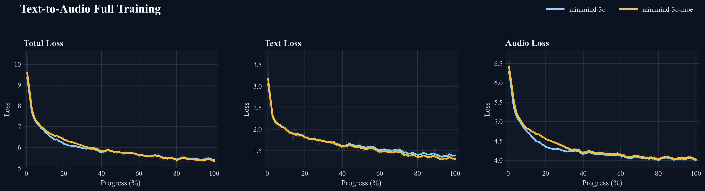
> `sft_t2a`: 텍스트 음성 출력 경로

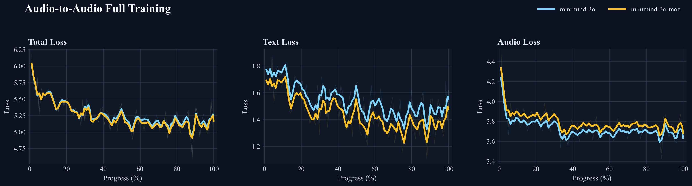
> `sft_a2a`: 음성 입력 추가 후 손실

호환되지 않는 체중 이력서로 인한 초기 스파이크가 T2A 곡선에서 제거되었습니다. MoE 변형은 Dense에 비해 총 매개변수가 더 많지만 활성 매개변수 수가 비슷하므로 용량 할당 참조로 더 유용합니다.
## Ⅲ 모델 가중치

| 형식 | 모델 범위 | 포옹얼굴 |
|---|---|---|
| PyTorch (`*.pth`) | [minimind-3o-pytorch](https://www.modelscope.cn/models/gongjy/minimind-3o-pytorch) | [minimind-3o-pytorch](https://huggingface.co/jingyaogong/minimind-3o-pytorch) |
| Transformers | [minimind-o collection](https://modelscope.cn/collections/gongjy/MiniMind-O) | [minimind-o collection](https://huggingface.co/collections/jingyaogong/minimind-o) |

> Transformers 버전에는 `minimind-3o` 및 `minimind-3o-moe`가 모두 포함되어 있으며 `eval_omni.py` 및 WebUI와 함께 직접 사용하는 데 적합합니다. 기본 PyTorch 가중치는 주로 훈련, 실험 재현 및 지속적인 미세 조정을 위한 것입니다.

# ❗평가

현재 Omni 모델에 대한 통합 평가 프로토콜은 없습니다. LLM 백본, 오디오 신디사이저 및 시스템 목표에서 다양한 작업이 다릅니다. 일부는 LLM의 자체 지식과 추론에 중점을 두고 MMLU, HumanEval 및 관련 벤치마크를 보고합니다. 일부는 스트리밍 대기 시간과 오디오 품질을 강조합니다. 일부는 음성 일관성 측정항목을 강조합니다. 다른 사람들은 자연스러운 상호 작용이나 광범위한 Omni 세대에 중점을 둡니다. 이러한 시스템의 대부분은 최첨단 오픈소스 LLM에서 지속적으로 훈련되는 반면 MiniMind의 0.06B 백본은 복잡한 지식 QA, 수학 추론, 코드 생성 또는 긴 개방형 응답에서 분명히 경쟁력이 없으며 Talker의 자연성, 운율 및 안정성도 전체 시스템보다 약합니다.
따라서 여기의 목표는 포괄적인 순위표를 쫓는 것이 아니라 몇 가지 더 재현 가능한 로컬 평가 및 사용 사례에 초점을 맞추는 것입니다. 즉, Talker 숨겨진 크기 제거, 음성 복제 유사성, 동일한 질문 및 동일한 ASR 파이프라인에서의 CER/WER 비교, 질적 A2A, I2A 및 실시간 상호 작용 예입니다. CER/WER은 주로 텍스트 일관성을 검사하는 데 사용되는 반면 오디오 품질, 자연성 및 인간 선호도는 정성적 샘플과 실제 청취 테스트에 맡겨집니다.
## Ⅰ 발화자 숨겨진 크기 절제

음성 생성만 고려한다면 Talker를 1024/2048 숨겨진 크기로 확장하거나 더 많은 레이어를 쌓는 것이 분명히 더 안정적일 것입니다. 그러나 MiniMind-O는 전체 Omni 파이프라인을 ~0.1B 매개변수 내에 맞춰야 하며 대부분의 예산을 음향 측면에 할당할 여력이 없습니다. Thinker와 Talker가 분리되면 언어 이해와 교차 모드 융합은 주로 Thinker에서 수행되는 반면 Talker는 의미 조건에서 Mimi 코드만 렌더링합니다. 이것은 작은 Talker를 가능하게 합니다. 여기서 렌더링은 "의미론적 토큰을 예측하여 외부 음향 모델에 전달"하는 것이 아닙니다. Talker는 디코딩 가능한 Mimi 음향 코드를 직접 생성하므로 실제 병목 현상은 출력 측에 있습니다. 단일 다음 토큰 예측 스트림이 아닌 8개의 Mimi 코드북을 처리해야 합니다.
384-d는 유혹적입니다. 밀도가 높은 버전은 ~88M으로 압축되기 때문입니다. 512-d도 더 가볍습니다. 그러나 아래 표는 크기가 작다고 자동으로 더 나은 할당을 의미하지는 않는다는 것을 보여줍니다. 짧은 발화는 허용되지만 중간에서 긴 발화는 단어 누락, 반복 및 발음 드리프트가 발생하기 쉽습니다. 768-d는 MiniMind 백본 너비와 일치하고 Thinker의 마지막 4개 레이어에서 초기화할 수 있기 때문에 결국 유지되었습니다. 매개변수 수는 약 0.1B로 유지되고 훈련 비용은 눈에 띄게 증가하지 않으며 일관성은 확실히 더 안정적입니다.
| 변형 | 발화자 숨김 | 매개변수 | 평균 CER ↓ | 짧은 ↓ | 미드/롱 ↓ |
|---|---|---|---|---|---|
| Dense | 768 | 115.29M | **0.0897** | 0.1528 | 0.0874 / 0.0675 |
| Dense | 512 | 96.13M | 0.1745 | 0.2709 | 0.2455 / 0.0976 |
| Dense | 384 | 88.72M | 0.2767 | 0.3904 | 0.1865 / 0.4046 |
| MoE | 768 | 317.05M-A115.33M | **0.0900** | 0.2075 | 0.0533 / 0.0271 |
| MoE | 512 | 261.32M-A96.17M | 0.1265 | 0.0711 | 0.1490 / 0.1464 |
| MoE | 384 | 240.04M-A88.75M | 0.3280 | 0.3757 | 0.2777 / 0.4313 |

Dense 및 MoE CER은 아키텍처 전체에서 직접 비교하면 안 됩니다. 동일한 질문에서 두 Thinker는 길이가 다른 서로 다른 콘텐츠를 생성할 수 있으며 이는 Talker의 합성 난이도가 서로 다를 수 있습니다. 더 중요한 것은 아키텍처 내 추세입니다. 두 경우 모두에서 768이 512와 384를 확실히 능가합니다.
## Ⅱ 음성 복제 유사성

음성 복제는 이번 릴리스의 베타 품질 기능 중 하나입니다. 우리가 아는 바로는 대부분의 오픈소스 Omni 모델은 고정 출력 음성만 지원하는 반면 minimind-3o는 다중 음성 생성을 단일 Talker에 맞추려고 합니다. 이 목표는 단순히 "말할 수 있는 것"보다 더 어렵습니다. 모델이 올바른 내용을 말할 뿐만 아니라 Mimi 코드를 생성하는 동안 화자 신호를 보존해야 하기 때문입니다.
품질은 아직 고품질 복제에 도달하지 못했습니다. 동일한 참조 음성이 질문 전체에서 항상 일관되게 유지되는 것은 아니며 발음 및 리듬 문제로 인해 긴 발화가 표류할 수 있습니다. 그러나 기본적인 남성/여성의 차이, 억양 경향 및 운율의 일부는 구별 가능합니다.
아래의 CAM++ 스피커 내장 코사인 유사성은 자동 참조일 뿐입니다. `voices.pt`에 내장된 5개의 음성에서 나옵니다. Unseen은 훈련 중에 한 번도 볼 수 없었던 `voices_unseen.pt`의 7가지 목소리에서 나옵니다. 각 음성은 동일한 텍스트 질문 세트를 사용하며 음성 조건만 교체됩니다.
발표자별 분석:
| 분할 | 스피커 | 밀집 ↑ | 환경부 ↑ |
|---|---|---|---|
| Seen | dylan | 0.6997 | 0.6837 |
| Seen | eric | 0.5289 | 0.4232 |
| Seen | serena | 0.7092 | 0.7041 |
| Seen | uncle_fu | 0.7241 | 0.7337 |
| Seen | vivian | 0.5744 | 0.5888 |
| Unseen | arthur | 0.7171 | 0.6750 |
| Unseen | chelsie | 0.6437 | 0.6240 |
| Unseen | cherry | 0.5689 | 0.5678 |
| Unseen | ethan | 0.4783 | 0.4847 |
| Unseen | jennifer | 0.4749 | 0.4003 |
| Unseen | momo | 0.6470 | 0.5720 |
| Unseen | moon | 0.4282 | 0.6673 |

전반적으로 minimind-3o와 minimind-3o-moe는 비슷한 평균에 도달했으며 둘 다 초기 기준보다 약간 높습니다. 이는 음성 보유가 주로 비활성 전문가 역량에 의해 결정되지 않음을 시사합니다. 보다 직접적인 요소는 참조 클립 품질, CAM++ 임베딩의 분리성, Talker 생성 자체의 안정성입니다. 화자별,Uncle_fu, serena 및 arthur와 같은 음성은 보존하기가 더 쉬우며 적어도 하나의 변형이 0.70을 초과합니다. Eric 및 Moon과 같은 이상값은 생성 품질에 더 민감합니다. 즉, 이 기능은 이미 일부 스피커 특성을 분리하지만 "참조 클립이 주어지면 음색을 충실하게 재현"하는 제품 수준의 경험과는 여전히 어느 정도 거리가 있습니다.
### 음성 복제 절제 샘플(오디오 재생)

보다 직접적인 청취 테스트를 위해 Seed=42 및 온도=0.7이 고정되고 생성된 샘플이 음성당 하나씩 표시됩니다. 유일한 변수는 참조 오디오 코드와 스피커 임베딩입니다. 컨트롤로서 참조 음성 조건이 없는 기본 출력이 먼저 표시됩니다(음성 텍스트는 모든 샘플에서 동일함).
https://github.com/user-attachments/assets/b31fd8f2-e3af-4fed-ba19-65424b59bec6
#### 본 목소리
"Seen"은 모델이 친숙한 화자를 얼마나 잘 보존하는지 검사하는 데 사용되는 훈련 데이터에 나타나는 음성을 의미합니다.
<table>
<tr><th width="100">Speaker</th><th width="380">Reference</th><th width="380">Output</th><th width="80">Avg</th></tr>
<tr><td>dylan</td><td>

https://github.com/user-attachments/assets/070ea3ab-0e8e-4aa0-84b5-af8d3c4e2725
</td><td>

https://github.com/user-attachments/assets/eb2da7ed-173c-47e9-9431-7bdb5a9b7385
</td><td>0.6712</td></tr>
<tr><td>eric</td><td>

https://github.com/user-attachments/assets/c74aa5dc-1edd-44c1-9546-6e57194c2f60
</td><td>

https://github.com/user-attachments/assets/f3fa8906-4e14-4610-a9d9-c16c915ca1b3
</td><td>0.4430</td></tr>
<tr><td>serena</td><td>

https://github.com/user-attachments/assets/0eeeac87-fa70-4025-b66e-1f0197f2b434
</td><td>

https://github.com/user-attachments/assets/c5901dca-4b2a-47f5-9b30-c89de54f908e
</td><td>0.6600</td></tr>
<tr><td>uncle_fu</td><td>

https://github.com/user-attachments/assets/fdd1bb28-6648-44bf-8bcb-4509e709e347
</td><td>

https://github.com/user-attachments/assets/95b480f1-f015-4712-8d7c-17db465f6584
</td><td>0.6632</td></tr>
<tr><td>vivian</td><td>

https://github.com/user-attachments/assets/f64731c4-67a3-4e18-b7d7-61bf44ef4bdd
</td><td>

https://github.com/user-attachments/assets/3f1cc9bb-16d2-4ce0-a473-40676cf4523e
</td><td>0.5320</td></tr>
</table>

#### 보이지 않는 목소리
"보이지 않음"은 학습 중에 표시되지 않는 음성을 의미하며 생성된 음성으로 새 참조 음성의 제로샷 전송을 검사하는 데 사용됩니다.
<table>
<tr><th width="100">Speaker</th><th width="380">Reference</th><th width="380">Output</th><th width="80">Avg</th></tr>
<tr><td>arthur</td><td>

https://github.com/user-attachments/assets/3430ecdb-6de8-4fb0-a6a7-ad82bdce01a1
</td><td>

https://github.com/user-attachments/assets/e598dbc2-ba28-4c38-b52d-6fa6c2349a5b
</td><td>0.6479</td></tr>
<tr><td>chelsie</td><td>

https://github.com/user-attachments/assets/f9166af6-3a98-42f3-9cf8-ad105eea87d6
</td><td>

https://github.com/user-attachments/assets/eccca693-4708-409a-88f7-85eb25f66fe6
</td><td>0.5975</td></tr>
<tr><td>cherry</td><td>

https://github.com/user-attachments/assets/e69b9cac-e12f-43ae-a9dc-7e1618ef3a43
</td><td>

https://github.com/user-attachments/assets/bb41cdef-cc92-48fa-a508-76a75d391565
</td><td>0.5418</td></tr>
<tr><td>ethan</td><td>

https://github.com/user-attachments/assets/9c992505-2046-483e-a7cf-50ec18a5e329
</td><td>

https://github.com/user-attachments/assets/98013c5e-f5b5-4e1a-bc0e-a0f0be5d3240
</td><td>0.4323</td></tr>
<tr><td>jennifer</td><td>

https://github.com/user-attachments/assets/924b035d-5c7c-45a5-a8f8-5dbdc18f71db
</td><td>

https://github.com/user-attachments/assets/853d1370-0065-4567-9a71-dc88a6a34d56
</td><td>0.4052</td></tr>
<tr><td>momo</td><td>

https://github.com/user-attachments/assets/7e97f524-da6d-4a2f-9095-e7f99262f4a5
</td><td>

https://github.com/user-attachments/assets/4c193c8f-8750-4424-acba-2bd13089a634
</td><td>0.5968</td></tr>
<tr><td>moon</td><td>

https://github.com/user-attachments/assets/527df88a-adc0-48d3-9a6a-827ca1ba7fb0
</td><td>

https://github.com/user-attachments/assets/3f533e26-1ad8-4ab3-baf1-21267734d3ee
</td><td>0.5874</td></tr>
</table>

## Ⅲ 크로스 모델 영어 T2A 비교

우리는 `Answer briefly in one short sentence`로 제한되는 20개의 영어 질문을 선택했습니다. 개방형 영어 능력을 평가하는 것이 아니라 응답 길이를 비슷한 범위 내로 유지하려는 의도입니다. 그런 다음 세 가지 모델은 Qwen3-ASR에 의해 균일하게 기록되는 오디오를 합성합니다. 전사본과 대상 텍스트 간의 CER/WER은 Talker 측 텍스트 일관성을 비교하는 데 사용됩니다.
| Length bucket | [Mini-Omni](https://huggingface.co/gpt-omni/mini-omni) CER/WER | [Mini-Omni2](https://huggingface.co/gpt-omni/mini-omni2) CER/WER | minimind-3o CER/WER |
|---|---|---|---|
| short (≤15w) | 0.0195 / 0.0384 (n=8) | 0.0503 / 0.0584 (n=14) | 0.0531 / 0.0417 (n=8) |
| mid (16–30w) | 0.0038 / 0.0052 (n=12) | 0.0062 / 0.0076 (n=6) | 0.1327 / 0.1420 (n=11) |
| long (31–60w) | — | — | 0.0431 / 0.0508 (n=1) |

15 단어 이하의 답변에 대해 minimind-3o는 이미 Mini-Omni2에 가깝습니다. 그 격차는 실제로 16~30단어에서 벌어집니다. 이 길이는 더 이상 단순한 문구가 아니며 화자는 완전한 짧은 문장에서 발음, 리듬 및 표면 형식을 동시에 일관되게 유지해야 합니다. 이는 현재의 0.1B Talker가 가장 쉽게 불안정성을 드러내는 체제이기도 하다.
## IV 교차 모델 비전-언어 비교

[Mini-Omni](https://huggingface.co/gpt-omni/mini-omni)는 VL 경로를 지원하지 않으므로 [Mini-Omni2](https://huggingface.co/gpt-omni/mini-omni2)(0.5B)와 minimind-3o(0.1B)를 비교합니다. 9개의 합성 이미지에서 두 모델 모두 영어 답변을 생성한 다음 균일하게 전사되어 비전-음성 일관성 참조로 CER/WER을 계산하는 데 사용됩니다.
| 모델 | 매개변수 | 평균 CER ↓ | 평균 WER ↓ |
|---|---|---|---|
| [Mini-Omni2](https://huggingface.co/gpt-omni/mini-omni2) | 0.5B | 0.7609 | 0.9756 |
| minimind-3o | 0.1B | 0.8241 | 1.0293 |

이 숫자를 개방형 이미지 설명의 절대적인 정확성으로 읽어서는 안 됩니다. 이미지 캡션에는 동등한 표현이 많으며 동의어 선택과 단어 순서 모두 CER/WER에 영향을 미치므로 높은 절대값이 예상됩니다. 동일한 자동 파이프라인에서 minimind-3o는 Mini-Omni2보다 뒤처지지만 대략 1/5 매개변수로 동일한 크기를 유지합니다.
## Ⅴ 정성샘플

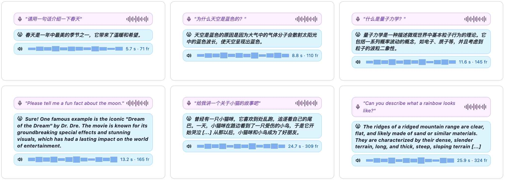
음성-음성 샘플에서 입력은 실제 음성이고 Thinker는 의미 체계를 구성하며 Talker는 음성을 렌더링합니다. 짧은 답변이 더욱 안정적인 체제입니다. 중국어 설명 질문은 일반적으로 일관된 답변을 생성하는 반면, 영어 발음과 리듬은 상대적으로 더 안정적입니다.
<table>
<tr>
<td>

https://github.com/user-attachments/assets/c85809b2-4787-4656-9c7e-55b693798494
</td>
<td>

https://github.com/user-attachments/assets/354a5eec-c147-4d18-8c7a-942bd2a0b4b0
</td>
</tr>
</table>

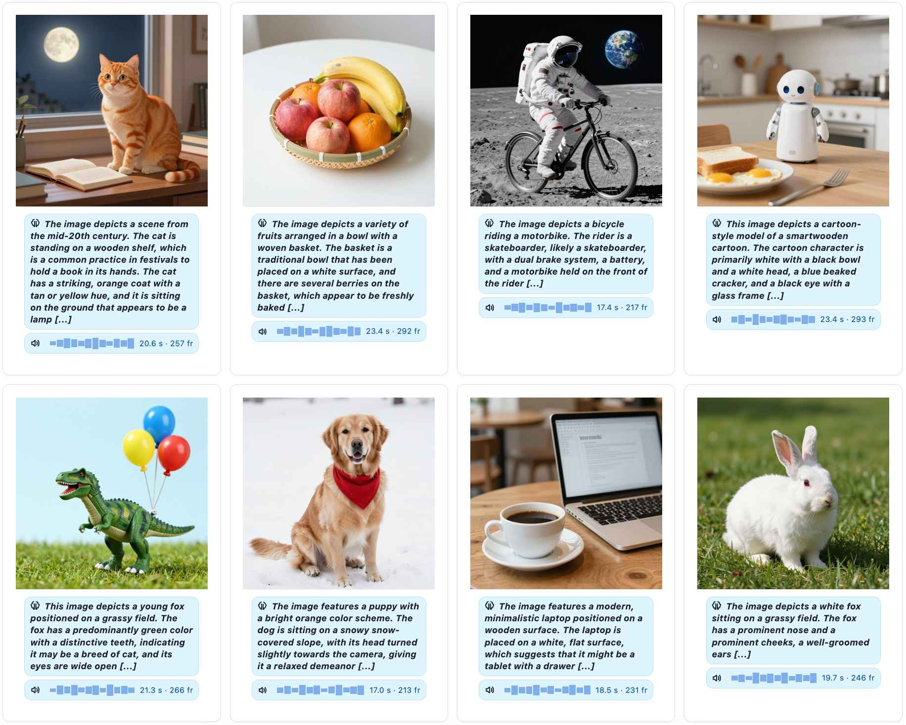
image-QA는 동일한 경로 내에서 체인 시각적 인코딩, 텍스트 생성 및 음성 렌더링을 샘플링합니다. 현재 모델은 일반적으로 주요 개체와 대략적인 장면을 캡처하지만 세밀한 공간 관계, 개수 및 속성이 여전히 잘못된 경우가 많으므로 작은 모델 Omni 파이프라인의 재현 가능한 기준선으로 더 적합합니다.
<table>
<tr>
<td>

https://github.com/user-attachments/assets/244e08b0-5b12-449e-a7a2-2a2139c5d62d
</td>
<td>

https://github.com/user-attachments/assets/3e8d0a76-282d-4a9d-9726-a954cf80198a
</td>
</tr>
</table>

## Ⅵ 실시간 상호작용

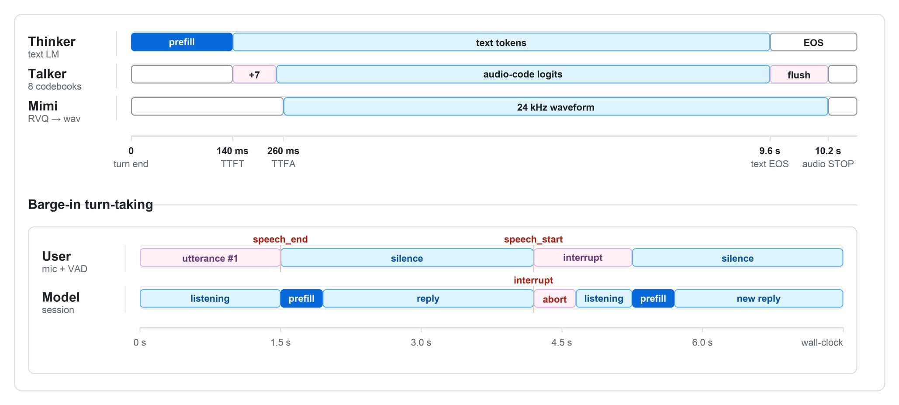
실시간 상호작용 인터페이스입니다. 사용자가 말하기를 멈추면 Thinker는 먼저 의미 측면 사전 채우기를 완료하고 Talker는 오디오 코드를 점진적으로 방출하기 시작하며 Mimi 디코더는 코드를 수신할 때 24kHz 파형을 씁니다. 참여 예시는 실제 대화에 더 가까운 또 다른 경로를 보여줍니다. 즉, 모델이 말하는 동안 사용자가 다시 말하기 시작하면 시스템은 현재 생성을 중단하고 미리 채우기-응답 흐름으로 다시 들어갑니다. 여기서 중단 감지는 아직 의미 수준의 참여가 아닌 단순한 VAD 임계값을 기반으로 합니다. 그러나 엔지니어링 루프 폐쇄 관점에서 볼 때 시스템은 이미 말하기에서 듣기로 되돌아가 다음 차례를 처리할 수 있습니다.
### 🧩 향후 개선 가능성

현재 모델은 대형 Omni 시스템과 비교하면 아직 뚜렷한 격차가 있어 이를 얼버무릴 필요가 없다. 장문의 자연스러움, 복잡한 시각적 추론, 개방형 영어 중/장 답변 및 음성 안정성은 강점이 아닙니다. 시각적 경로는 컴팩트한 비전-음성 링크에 더 가깝고 MoE 변형은 동일한 FLOP 최적보다 용량 할당 실험처럼 보입니다.
이러한 제한 사항은 또한 더 긴 ICL 컨텍스트, 더 정밀한 운율 감독, 더 강력한 비전 인코더, 더 안정적인 음성 조건, 브리지 레이어 및 MTP 코드북 인터페이스에 대한 체계적인 스윕 등 여러 가지 후속 조치를 의미합니다. 모두 계속할 가치가 있습니다.
MiniMind-O의 가치는 바로 여기에 있습니다. 전체 Omni 루프를 0.1B 체제로 압축하고 동일한 검사 가능한 아티팩트 내에 코드, 가중치 및 주요 훈련 데이터를 제공합니다. 이는 단순한 데모가 아니라 충분히 작고, 충분히 투명하며, 처음부터 다시 빌드하고 추가로 수정할 수 있을 만큼 재현 가능한 기준선임을 의미합니다. Thinker-Talker 디커플링, MTP 코드북 인터페이스, 컨텍스트 내 음성 복제 및 중간 숨겨진 브리지를 이해하려는 사람들을 위해 실제로 직접 확인할 수 있는 일련의 디자인 선택을 제공합니다.
# 😀 감사의 말씀

> [!팁]
> `MiniMind-O`가 도움이 되었다면 GitHub.<br/>에서 ⭐를 남겨주세요.
> 제한된 대역폭으로 인해 알려지지 않은 버그가 필연적으로 발생합니다. 이슈에 대한 토론, 수정 및 PR을 환영합니다.<br/>
> 귀하의 지원은 프로젝트를 계속 진행시키는 원동력입니다. 감사합니다!

## 🤝 기여자

<a href="https://github.com/jingyaogong/minimind-o/graphs/contributors">
  
</a>

## 😊 크레딧

- [MiniMind](https://github.com/jingyaogong/minimind) / [MiniMind-V](https://github.com/jingyaogong/minimind-v) (백본, 데이터)
- [Qwen2.5-Omni / Qwen3-Omni](https://github.com/QwenLM/Qwen2.5-Omni) (영감, 데이터)
- [Mini-Omni / Mini-Omni2](https://github.com/gpt-omni/mini-omni) (영감, 데이터)
- [SLAM-Omni](https://aclanthology.org/2025.findings-acl.115/)(데이터)
- [SenseVoice](https://arxiv.org/abs/2407.04051)(컴포넌트)
- [Mimi / Moshi](https://arxiv.org/abs/2410.00037)(컴포넌트)
- [vLLM-Omni](https://github.com/vllm-project/vllm-omni)(추론, 합성 데이터)
- 기타 참조된 오픈소스 프로젝트 및 논문(기술 보고서의 전체 목록)

## 🫶 서포터즈

<a href="https://github.com/jingyaogong/minimind-o/stargazers">
<picture> <source media="(prefers-color-scheme: dark)" srcset="https://bytecrank.com/nastyox/reporoster/php/stargazersSVG.php?user=jingyaogong&repo=minimind-o&theme=dark"/> <source media="(prefers-color-scheme: light)" srcset="https://bytecrank.com/nastyox/reporoster/php/stargazersSVG.php?user=jingyaogong&repo=minimind-o"/>      
</picture></a>

<a href="https://github.com/jingyaogong/minimind-o/network/members">
<picture> <source media="(prefers-color-scheme: dark)" srcset="https://bytecrank.com/nastyox/reporoster/php/forkersSVG.php?user=jingyaogong&repo=minimind-o&theme=dark"/> <source media="(prefers-color-scheme: light)" srcset="https://bytecrank.com/nastyox/reporoster/php/forkersSVG.php?user=jingyaogong&repo=minimind-o"/>      
</picture></a>

<picture> <source media="(prefers-color-scheme: dark)" srcset="https://api.star-history.com/svg?repos=jingyaogong/minimind-o&type=Date&theme=dark"/> <source media="(prefers-color-scheme: light)" srcset="https://api.star-history.com/svg?repos=jingyaogong/minimind-o&type=Date"/>  
</picture>
# 🎓 인용

MiniMind-O가 귀하의 연구나 작업에 도움이 된다면 다음을 인용해 주세요:
```bibtex
% Cite the technical report when referencing the model design or experimental results.
@article{minimind-o-report,
    title   = {MiniMind-O Technical Report: An Open Small-Scale Speech-Native Omni Model}, 
    author  = {Jingyao Gong},
    journal = {arXiv preprint arXiv:2605.03937},
    year    = {2026}
}

% Cite the GitHub repo when referencing the open-source codebase or released weights.
@misc{minimind-o,
    title  = {MiniMind-O: Train a Tiny Omni Model from Scratch},
    author = {Jingyao Gong},
    year   = {2026},
    url    = {https://github.com/jingyaogong/minimind-o},
    note   = {GitHub repository, accessed 2026}
}
```

# 📜 라이센스

이 저장소는 [Apache-2.0 License](LICENSE)로 출시되었습니다.