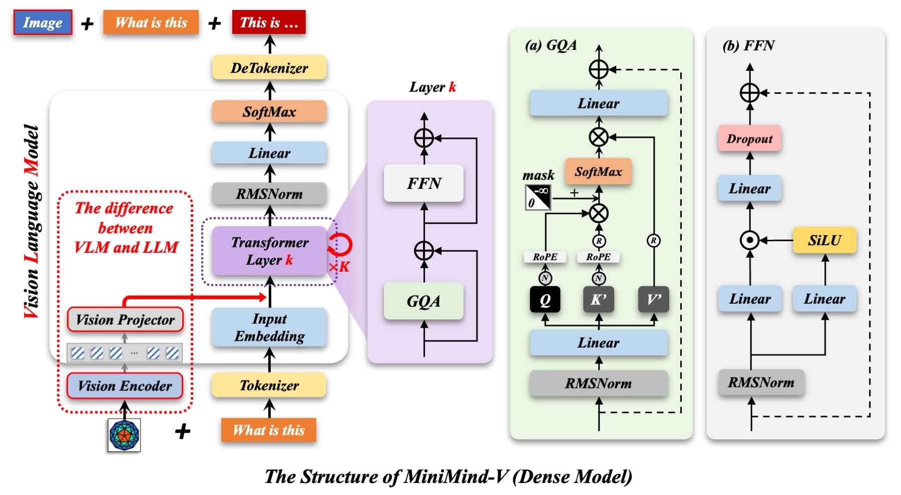
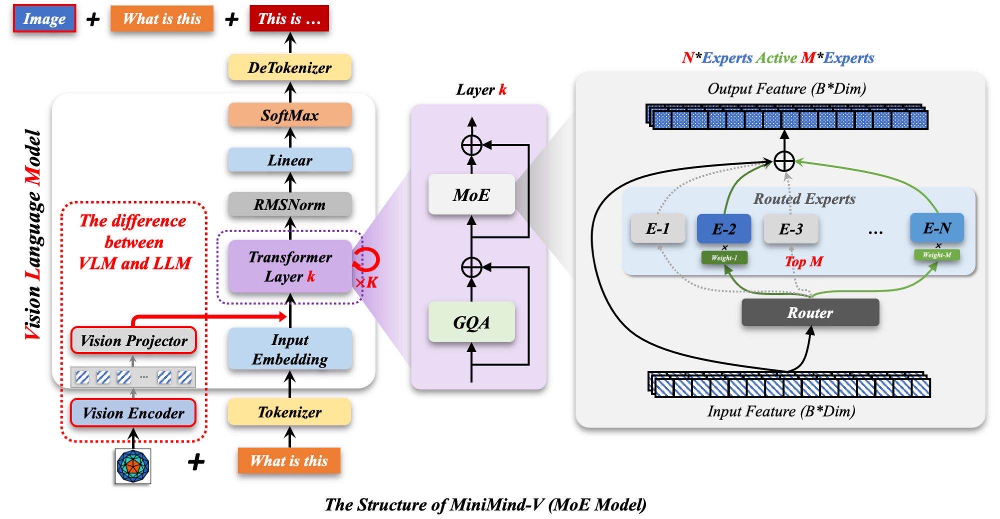
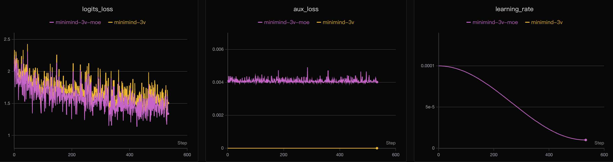

<div align="center">


</div>


<div align="center">

[](https://github.com/jingyaogong/minimind-v/stargazers) [](라이센스) [](https://github.com/jingyaogong/minimind-v/commits/master) [](https://github.com/jingyaogong/minimind-v/pulls) [](https://huggingface.co/collections/jingyaogong/minimind-v-67000833fb60b3a2e1f3597d)
</div>

<div align="center">


</div>


<div align="center">
  <h3>"가장 위대한 길은 가장 단순한 길이다"</h3>
</div>

<div align="center">

[中文](./README.md) | 영어
</div>

* 이 프로젝트는 단 3 RMB의 비용으로 초소형 다중 모드 비전 언어 모델 **MiniMind-V**를 훈련하는 것을 목표로 합니다.
2시간 작업, 처음부터 시작!* **MiniMind-V**의 가장 작은 버전은 GPT-3 크기의 약 $\frac{1}{2600}$에 불과하며 빠른 속도를 가능하게 하도록 설계되었습니다.
개인 GPU에 대한 추론 및 교육까지 가능합니다.* **MiniMind-V**는 [MiniMind](https://github.com/jingyaogong/minimind) 순수 언어 모델의 시각적 기능을 확장한 것입니다. 동일한 제품군의 다중 모드 Omni 모델에 대해서는 [MiniMind-O](https://github.com/jingyaogong/minimind-o)를 참조하세요.
* 이 프로젝트에는 대규모 VLM 모델의 최소 구조, 데이터 세트 정리, Pretrain 및 SFT에 대한 전체 코드가 포함되어 있습니다.
* 이는 오픈소스 VLM 모델의 가장 작은 구현일 뿐만 아니라 초보자를 위한 간결한 튜토리얼입니다.
비전 언어 모델.* 이 프로젝트가 다른 사람들에게 영감을 주고 창조의 기쁨을 공유하는 유용한 사례가 되기를 바랍니다.
더 넓은 AI 커뮤니티에서 발전을 이루세요!
> 참고: 이 프로젝트는 Apache 2.0 라이센스에 따라 릴리스되었으며 완전 무료입니다. "2시간"은 단일 NVIDIA 3090에서 SFT의 `1 epoch`를 실행하는 데 측정된 시간을 나타내고, "3 RMB"는 해당 시간 슬롯의 GPU 임대 비용을 나타냅니다.

<div align="center">


[🔗🤖 Online Experience](https://www.modelscope.cn/studios/gongjy/MiniMind-V) | [🔗🎞️ Video Introduction](https://www.bilibili.com/video/BV1Sh1vYBEzY)
</div>

# 😀 소개

"레고로 비행기를 만드는 것은 일등석을 타는 것보다 훨씬 더 흥미진진해요!" VLM 기반 다중 모드 대형 모델을 구축하는 것이 정말 상상만큼 복잡합니까? 코드 구현은 어떻게 이루어지나요? 훈련과정이 어려운가요? 이제 함께 답을 탐색하고 창조의 기쁨을 느껴보세요!
> [!팁]
> (2026-04-20 기준) MiniMind-V 시리즈는 다음 모델 버전의 교육을 완료했습니다.
> 65M(0.065B) 매개변수만으로 이미지 인식과 대화가 모두 가능합니다!

| 모델 | 매개변수 | 출시 |
|---|---|---|
| minimind-3v-moe | 200M-A65M | 2026.04.20 |
| minimind-3v | 65M | 2026.04.20 |
| MiniMind2-V | 104M | 2025.02.20 |
| MiniMind2-Small-V | 26M | 2025.02.20 |
| minimind-v-v1-small | 27M | 2024.10.04 |
| minimind-v-v1 | 109M | 2024.10.04 |

### 👉**최근 업데이트**

<details><summary> <b>2026-04-20</b> </summary>

- 새로운 체크포인트 출시: minimind-3v(65M) / minimind-3v-moe(200M-A65M)
- 프로젝터: `LayerNorm` 추가, 모양 변경 토큰 병합 제거(P32는 기본적으로 64개의 토큰을 출력하며 다운샘플링이 필요하지 않음)
- 비전 인코더가 `SiglipVisionModel`로 전환됨(P32, 고정 256×256)
- 훈련 데이터가 ALLaVA-4V로 이동되었습니다(Pretrain 1.27M / SFT 2.9M, 단일 단계 SFT로 병합)
- 동결 전략 업데이트됨: `freeze_llm=1`는 첫 번째 + 마지막 레이어를 동결 해제합니다. 사전 훈련/SFT 기본값은 이제 `2`/`1`입니다. `max_seq_len` 360 → 450
- 기타 버그 수정 및 작은 조정

</details>
<details><summary> <b>2026-04-01</b> </summary>

- minimind-3v(67M) 및 minimind-3v-moe(201M-A67M) 모델 추가
- 통합 768+8 아키텍처, 고밀도 모드와 Moe 모드 모두 지원
- Visual Encoder를 CLIP에서 SigLIP2로 전환했습니다(siglip2-base-p16-256-ve)
- QFormer를 MLP 투영 + 변형 압축으로 대체
- 쪽모이 세공 마루로 업데이트된 데이터 세트 형식, 혼합 데이터 소스, 이미지 자리 표시자 `<|image_pad|>`로 업데이트된 토크나이저, 동적 모델 디렉토리 스캐닝 및 드롭다운 모델 전환이 포함된 새로운 WebUI
- 모델 코드 리팩토링됨, Transformers 형식에 대해 LLM/VLM 통합
- 훈련 스크립트는 DDP 다중 GPU, bfloat16 혼합 정밀도, torch.compile 가속을 지원합니다.

</details>
<details><summary> <b>2025-10-24</b> </summary>

- 버그 수정: 모델 가중치 불일치
- ["minimind-1024 update"](https://github.com/jingyaogong/minimind)에 적합
- 코드 리팩토링: 교육 및 평가 스크립트 표준화
- 완전한 체크포인트 재개 지원 추가

</details>
<details>
<summary> <b>더 보기...</b> </summary>

**2025-04-27**

- 호환성 업데이트
- [MiniMind repository new features](https://github.com/jingyaogong/minimind/issues/370)에 적합
- 코드 정규화

**2025-02-20**

- MiniMind2-V가 MiniMind2와 함께 업데이트되었습니다.
- 모든 중복 코드 대폭 감소, 표준화된 코드 형식
- 모델 중복 구조의 대폭 단순화
- 새로운 SFT 데이터세트로 확장된 업데이트된 데이터세트 형식
- 이전 VLM 버전보다 향상된 성능!

**2024-10-05**

- MiniMind-V 예정대로 출시, 첫 오픈소스 출시

</details>
# 😀 빠른 시작

<details><summary>내 소프트웨어 및 하드웨어 설정(참고용)</summary>

* CPU: Intel(R) Core(TM) i9-10980XE CPU @ 3.00GHz
* RAM: 128GB
* GPU: NVIDIA GeForce RTX 3090(24GB) * 8
* 우분투==20.04
* CUDA==12.2
* 파이썬==3.10
* [requirements.txt](./requirements.txt)

</details>
## 0단계(필수)

### 1' 환경설정

```bash
# 저장소 복제
git clone --depth 1 https://github.com/jingyaogong/minimind-v
# 종속성 설치
pip install -r requirements.txt -i https://pypi.tuna.tsinghua.edu.cn/simple
```

### 2' 리소스 다운로드

```bash
# SigLIP2 비전 인코더를 ./models/siglip2-base-p32-256-ve에 다운로드하세요.
modelscope download --model gongjy/siglip2-base-p32-256-ve --local_dir ./models/siglip2-base-p32-256-ve
# MiniMind 언어 모델 가중치를 ./checkouts로 다운로드합니다(VLM 훈련을 위한 기본 언어 모델로 사용됨).
modelscope download --model gongjy/minimind-3v-pytorch llm_768.pth --local_dir ./checkouts
```

또는 [ModelScope Collection](https://modelscope.cn/collections/gongjy/MiniMind-V) 또는 [HuggingFace Collection](https://huggingface.co/collections/jingyaogong/minimind-v-67000833fb60b3a2e1f3597d)에서 동일한 파일을 선택하고 `git clone`(LFS 필요)로 다운로드할 수 있습니다.
리소스가 준비된 후 디렉터리는 다음과 같아야 합니다.
```text
minimind-v/
├── models/
│   ├── siglip2-base-p32-256-ve/
│   └── ...
├── checkouts/
│   └── llm_768.pth
└── ...
```

## Ⅰ 🚀 모델 추론

### 1' 릴리스된 가중치 다운로드

```bash
# 릴리스된 가중치를 ./checkouts에 다운로드합니다.
modelscope download --model gongjy/minimind-3v-pytorch --local_dir ./checkouts
```

### 2' 명령줄 Q&A

```bash
# load_from='model': 기본 PyTorch 가중치 로드, load_from='other path': 변환기 형식 로드
python eval_vlm.py --load_from model --weight sft_vlm
```

변환기 형식 모델을 사용하는 경우 먼저 모델 디렉터리를 다운로드합니다.
```bash
git clone https://huggingface.co/jingyaogong/minimind-3v
python eval_vlm.py --load_from minimind-3v
```

### 3' WebUI 시작(선택 사항)

```bash
# ⚠️ 변환기 형식 모델 디렉터리를 먼저 ./scripts/에 복사해야 합니다. web_demo_vlm은 가중치 파일이 포함된 ./scripts/ 아래의 하위 디렉터리를 검색하고 아무것도 발견되지 않으면 오류를 보고합니다.
cp -r minimind-3v ./scripts/minimind-3v
cd scripts && python web_demo_vlm.py
```

## Ⅱ 🛠️ 모델 트레이닝

<details style="color:rgb(128,128,128)"><summary>참고: Torch가 CUDA를 사용할 수 있는지 테스트하세요.</summary>

```python
import torch
print(torch.cuda.is_available())
```

CUDA를 사용할 수 없는 경우 [torch_stable](https://download.pytorch.org/whl/torch_stable.html)에서 일치하는 whl 파일을 다운로드하여 수동으로 설치하세요.
</details>
### 1' 데이터 다운로드

빠른 시작을 위해 [dataset link](https://huggingface.co/datasets/jingyaogong/minimind-v_dataset)에서 `sft_i2t.parquet`를 다운로드하여 `./datas` 아래에 놓습니다.
<details style="color:rgb(128,128,128)"><summary>참고: 데이터세트 세부정보</summary>

**[참고 1]** 이전 데이터 세트에서는 500,000개의 조각난 이미지 파일을 추출해야 하므로 속도가 매우 느릴 수 있습니다. 2025년 12월 27일부터 데이터 세트는 이미지와 텍스트가 함께 저장된 Parquet로 통합되었습니다. 크기가 더 작고 압축 해제가 필요하지 않으며 로드 속도가 더 빠릅니다.

**[참고 2]** Parquet는 효율적인 압축과 빠른 읽기 기능을 갖춘 컬럼형 저장 형식입니다. 익숙하지 않은 경우 `datas/`에서 `python lm_dataset.py`를 실행하여 처음 5개의 이미지-텍스트 쌍을 시각화합니다.

데이터 사전 학습(선택 사항, 캡션 하위 집합만 포함):```bash
wget https://hf-mirror.com/datasets/jingyaogong/minimind-v_datas/resolve/main/pretrain_i2t.parquet -P ./datas
```

단일 `sft_i2t.parquet` 파일에는 290만 개의 행이 포함되어 있으며 Pretrain을 하위 집합으로 흡수합니다. 전역 사전 인코딩 중복 제거 후에는 원본 SFT 파일보다 크기가 ~10%만 크며 모든 훈련 단계를 처리하기에 충분합니다. 빠른 재현을 위해 Pretrain을 건너뛰고 SFT를 직접 시작할 수 있습니다.
</details>
### 2' 훈련 시작

SFT는 권장되는 시작점입니다. 기본적으로 `--freeze_llm 1`는 중간 계층의 원래 언어 기능을 유지하면서 `vision_proj` 및 첫 번째/마지막 LLM 계층을 교육합니다.
```bash
python train_sft_vlm.py --epochs 2 --from_weight llm
```

프로젝터가 SFT 이전에 이미지-텍스트 쌍에 정렬되어야 하는 경우 먼저 Pretrain을 실행하십시오.
```bash
python train_pretrain_vlm.py --epochs 2 --from_weight llm
python train_sft_vlm.py --epochs 2 --from_weight pretrain_vlm
```

훈련 후에는 `sft_vlm_*.pth`가 `checkouts/` 아래에 SFT 가중치로 기록됩니다.
<details style="color:rgb(128,128,128)"><summary>참고: 교육 세부정보</summary>

- 체크포인트 재개 지원: 마지막 중단에서 계속하려면 `--from_resume 1` 매개변수를 추가하세요.
- GPU 수 변경 지원: 재개 중 GPU 수 변경 시 자동으로 단계 변환
- 원자 저장: 중단으로 인한 가중치 손상을 방지하기 위해 임시 파일 + 교체 메커니즘 사용
- 각 저장은 `checkouts/**.pth`(모델 가중치) 및 `checkouts/**_resume.pth`(교육 상태) 파일을 생성합니다.

```bash
# 중단 후 훈련을 재개하려면 동일한 명령을 사용하고 --from_resume 1을 추가하십시오.
python train_sft_vlm.py --epochs 4 --from_resume 1
```

**매개변수 설명:**
- `--from_weight`: 기본 가중치 이름(llm, pretrain_vlm, none 등)
- `--save_weight`: 중량 접두사 이름 저장
- `--from_resume`: 훈련 재개 여부(0=처음부터 시작, 1=체크포인트에서 계속)
- `--freeze_llm`: 동결 전략(0=모든 학습 가능, 1=proj + 첫 번째/마지막 LLM 레이어, 2=proj만). Pretrain의 경우 기본값 2, SFT의 경우 1
- 자세한 내용은 코드에서 확인할 수 있습니다.

</details>
### 3' 훈련된 모델 테스트(선택 사항)

테스트하려는 `*.pth` 모델 파일이 `./checkouts/` 디렉터리에 있는지 확인하세요. [here](https://huggingface.co/jingyaogong/minimind-3v-pytorch)에서 사전 훈련된 `*.pth` 파일을 직접 다운로드할 수도 있습니다.
```bash
# SFT 모델 테스트(기본값)
python eval_vlm.py --weight sft_vlm

# Pretrain 모델 테스트
python eval_vlm.py --weight pretrain_vlm
```

---

> [!팁]
> 훈련 스크립트는 PyTorch의 기본 프레임워크를 기반으로 하며 다중 카드 가속을 지원합니다. 귀하의 장치에
> N(N>1) GPU:

단일 머신 N 카드 트레이닝 방법(DDP, 멀티 머신 멀티 카드 클러스터 지원)
```bash
torchrun --nproc_per_node N train_xxx.py
```

<details><summary>참고: 기타 세부정보</summary>

단일 머신 N 카드 교육(DeepSpeed)
```bash
deepspeed --master_port 29500 --num_gpus=N train_xxx.py
```

훈련 중에 wandb 로깅을 활성화할 수 있습니다:
```bash
# 로그인이 필요합니다: wandb 로그인
torchrun --nproc_per_node N train_xxx.py --use_wandb
# 그리고
python train_xxx.py --use_wandb
```

`--use_wandb` 매개변수를 추가하면 훈련 과정을 기록할 수 있고, 훈련이 완료된 후 wandb 웹사이트에서 과정을 볼 수 있습니다. `wandb_project` 및 `wandb_run_name` 매개변수를 수정하여 프로젝트 이름과 실행 이름을 지정할 수 있습니다.
[참고]: 2025년 6월 이후에는 국내 네트워크 환경에서 WandB에 직접 연결할 수 없습니다. MiniMind 프로젝트는 기본적으로 [SwanLab](https://swanlab.cn/)를 훈련 시각화 도구로 사용하도록 전환합니다(WandB API와 완벽하게 호환됨). 즉, `import wandb`를 `import swanlab as wandb`로 변경하면 됩니다. 다른 변경 사항은 필요하지 않습니다.
</details>
# ❗ VLM 상세정보

MiniMind-V의 언어 백본은 자매 프로젝트인 [minimind](https://github.com/jingyaogong/minimind)에서 훈련된 `llm_768.pth`입니다. LLM의 자체 구조, 교육 세부 사항 및 실험 분석은 여기서 반복되지 않습니다. 기본 가정은 독자가 MiniMind LLM에 대한 기본적인 이해를 가지고 있다는 것입니다. LLM 프로젝트를 건드리지 않아도 MiniMind-V 실행을 위한 "빠른 시작"을 따르는 데 방해가 되지 않습니다. 흐름은 자체 포함되어 있습니다.
랜딩 페이지에 있는 두 개의 약식 라벨인 "처음부터"와 "65M"도 여기서 더 엄격하게 읽어야 합니다. "처음부터"는 VLM 자체가 0에서 훈련된다는 의미입니다(투영은 무작위로 초기화되고 첫 번째/마지막 LLM 레이어는 정렬을 위해 미세 조정됨). 그러나 LLM 백본은 0에서 사전 훈련되지 않습니다. MiniMind의 가중치에서 계속됩니다. 엄격하게 "0에서 시작하는 사전 훈련" 설정을 위해서는 먼저 MiniMind에서 LLM을 사전 훈련한 다음 여기에 다시 연결하십시오. "65M"은 훈련 가능한 백본(LLM ~64M + 프로젝션 ~1M)을 나타냅니다. SigLIP2 비전 인코더는 전체적으로 고정된 상태로 유지되고 이미지 특징 추출기 역할만 하는 또 다른 ~95M 매개변수를 제공하므로 추론 시 전체 모델은 대략 160M(밀도) / 294M(MoE)입니다.
VLM은 LLM 위에 비주얼 인코더와 기능 투영을 추가하여 다중 모달 입력을 지원하는 모달리티 혼합 분기를 도입합니다:  

<details><summary> [중요] 몇 가지 흥미로운 생각 </summary>

잠시 시간을 내어 두 가지 질문에 대해 생각해 보겠습니다.
* **대형 언어 모델(LLM)**이란 무엇입니까?
* 다중 모드 모델이란 무엇입니까?

[This article](https://www.jiqizhixin.com/articles/2024-09-15-3)는 내 생각과 완벽하게 일치합니다. "대형 언어 모델"(LLM)이라는 이름에 "언어"라는 단어가 포함되어 있지만 실제로는 언어와 밀접한 관련이 없습니다. 이것은 단지 역사적인 문제일 뿐입니다. 더 정확한 이름은 자기 회귀 Transformer 또는 다른 것입니다. LLM은 주로 자체 회귀 변환기를 사용하여 토큰 흐름을 시뮬레이션하는 일반적인 통계 모델링 기술에 가깝습니다. 이러한 토큰은 텍스트, 이미지, 오디오, 행동 선택, 심지어 분자까지 실제로 무엇이든 나타낼 수 있습니다. 따라서 문제가 일련의 개별 토큰을 시뮬레이션하는 프로세스로 변환될 수 있는 한 LLM은 이론적으로 이를 해결할 수 있습니다. 실제로 대규모 언어 모델 기술의 성숙도가 높아짐에 따라 이 모델링 패러다임에 속하는 문제가 점점 더 많아질 수 있습니다. 즉, LLM을 사용하여 "다음 토큰을 예측"하면 문제는 해결되지만 도메인마다 토큰의 역할과 의미가 다릅니다.
[ZJU-LiXi](https://person.zju.edu.cn/xilics#694283)도 비슷한 관점을 언급했습니다(대략 아래에 설명됨). 텍스트, 비디오, 오디오, 동작 등은 인간의 인식에서 "다중 모드" 신호로 간주되지만 "모달리티"라는 용어는 본질적으로 인간이 정보를 저장하는 방식에 따른 분류 개념일 뿐입니다. `.txt` 및 `.png` 파일과 마찬가지로 시각적 표현과 상위 수준 형식이 다르지만 기본적으로 동일합니다. "다중 모드"라는 개념은 인간이 다양한 감각 차원에 따라 이러한 신호를 분류해야 하기 때문에 발생했습니다. 그러나 기계의 경우 신호의 "양식"에 관계없이 궁극적으로 일련의 이진 "단모달" 숫자로 표시됩니다. 기계는 이러한 신호의 출처를 구별하지 않습니다. 단지 이러한 시퀀스에 포함된 정보를 처리하고 분석할 뿐입니다.
개인적으로 **대형 언어 모델(LLM)보다 **GPT(Generative Pretrained Transformer)**가 더 적합한 용어라고 생각합니다.**, 나는 LLM/VLM/GPT와 같은 아키텍처 시리즈의 모델을 표현하기 위해 "GPT"를 사용하는 것을 선호합니다.
OpenAI의 코트테일.
GPT의 역할을 한 문장으로 요약하면 다음과 같습니다.
GPT 모델은 현재 토큰을 기반으로 다음, 다음-다음, 다음-다음-다음 토큰 등을 예측합니다... 모델이 종료 토큰을 출력할 때까지; 여기서 "토큰"은 반드시 텍스트일 필요는 없습니다!
```text
> LLM 모델의 경우 "이미지"를 이해해야 할 경우 "이미지"를 이전에 접한 적이 없는 특별한 "외국어"로 취급하고 "외국어 사전"을 통해 이를 "LLM 언어"로 번역하면 됩니다.
> LLM 모델의 경우 "오디오"를 이해해야 한다면 "오디오"를 이전에 접한 적이 없는 특별한 "외국어"로 취급하고 이를 "외국어 사전"을 통해 "LLM 언어"로 번역하면 됩니다.
> ...
```

<u>**MiniMind-V를 얻으려면 다음 두 가지만 수행하면 됩니다:**</u>
1. 이미지 번역을 잘하는 **"외국어사전"**을 이용하여 **"에서 이미지를 번역해보세요.
외국어"**를 모델이 이해할 수 있는 **"LLM 언어"**로 변환합니다.2. LLM과 **"외국어 사전"**이 적응 기간을 거치도록 미세 조정하여
이미지 이해가 향상되었습니다.
"외국어 사전"을 Visual Encoder 모델이라고 합니다. LlaVA, Qwen-VL 및 기타 시각적 언어 모델과 마찬가지로 MiniMind-V는 이제 오픈소스 SigLIP2 시리즈 모델을 시각적 인코더로 사용합니다. 특히 이미지-텍스트 정보를 기술하기 위해 ViT-B/32 아키텍처 기반의 Visual Encoder인 [siglip2-base-p32-256-ve](https://huggingface.co/jingyaogong/siglip2-base-p32-256-ve)를 사용합니다. 현재 SigLIP2 NaFlex 비전 인코더는 프로세서 출력에서 ​​인코더 계층에 대한 입력으로 64개의 패치 토큰(256×256 이미지 / patch_size 32 = 8×8 = 64)을 생성하며, 이는 텍스트 오류를 ​​계산하기 위한 1×768 차원 임베딩 벡터를 생성합니다. 최종 임베딩 표현이 필요하지 않으므로 핵심 ViT 백본의 출력 기능인 인코더 레이어의 출력만 가져옵니다. 이전 레이어에서 64×768 기능을 수신하며 이는 LayerNorm + 2계층 MLP(선형→GELU→선형)를 통해 LLM의 숨겨진 차원으로 투영되어 MiniMind-V에 64개의 시각적 토큰이 제공됩니다. 이 단계는 정확히 크로스 모달 기능 정렬입니다. 기본 시각적 기능은 텍스트 토큰이 있는 의미 공간으로 가져와 두 가지가 동일한 공간에서 상호 작용할 수 있습니다.
[LlaVA-1](https://arxiv.org/pdf/2304.08485)는 간단한 선형 변환으로 우수한 정렬을 달성하고, [LlaVA-1.5](https://arxiv.org/pdf/2310.03744)는 2레이어 MLP로 업그레이드됩니다. MiniMind-V는 LlaVA-1.5와 동일한 MLP 투영 접근 방식을 채택합니다(P32는 기본적으로 64개의 토큰을 출력하며 추가 모양 변경 압축이 필요하지 않습니다).

이제 MiniMind-V의 내부 구조 변화가 완전히 제시되었습니다.
</details>

---

다음으로 MiniMind-V의 외부 입출력 변화에 대해 간략하게 살펴보겠습니다.
VLM에 대한 입력은 여전히 ​​특수 `<image>` 자리 표시자를 포함하는 텍스트 세그먼트입니다. 텍스트 임베딩을 계산한 후 이미지 인코더에서 생성된 벡터를 자리 표시자의 해당 임베딩 부분에 투영하여 원래 자리 표시자 임베딩을 대체할 수 있습니다. 예를 들면:
```text
<image>\nWhat is in this image?
```

`minimind-v`에서 이미지는 자리 표시자로서 64개의 `<|image_pad|>` 토큰으로 대체됩니다(SigLIP2 P32는 64개의 패치 토큰을 직접 출력하고 MLP를 통해 64개의 시각적 토큰으로 투영됨). 따라서 `minimind-v` 프롬프트는 다음과 같습니다.
```text
<|image_pad|><|image_pad|>...<|image_pad|>(×64)\nWhat is this image describing?
```

임베딩 및 프로젝션을 계산한 후 비전 기능은 해당 자리 표시자 임베딩을 대체하고 나머지 계산은 LLM 부분과 동일합니다.

이제 `MiniMind-V`의 모든 세부 사항이 제시되었습니다. VLM 모델 하위 클래스는 **최소한** 변경 사항, 핵심 알고리즘 수정 `< 50 lines`, 매우 낮은 마이그레이션 난이도만으로 `MiniMind`에서 상속됩니다. 구체적인 구현은 `LlaVA` 및 유사한 모델과 다를 수 있지만 전반적인 아이디어는 일관됩니다.
# 😀 실험

## Ⅰ 데이터세트

이번 라운드에 사용된 모든 이미지-텍스트 데이터는 [ALLaVA-4V](https://huggingface.co/datasets/FreedomIntelligence/ALLaVA-4V) 계열에서 나온 것입니다. 이전 LLaVA 파생 세트에서 결합된 데이터와 비교할 때 ALLaVA-4V는 품질이 더 일관되고 기본적으로 중국어와 영어로 쌍을 이루고 세부적인 설명이 더 철저합니다. 이는 LAION의 선별된 하위 집합(주로 자연 이미지)과 선별된 VFLAN의 하위 집합(문서, 차트, 합성 장면)의 두 가지 이미지 소스로 구성됩니다.
- **사전 학습(`pretrain_i2t.parquet`, ~1.27M 행 / ~640K 고유 이미지)**
  - `ALLaVA-Caption-LAION-4V` en/zh: ~470K + ~440K
  - `ALLaVA-Caption-VFLAN-4V` en/zh: ~195K + ~170K
  - 시각적 토큰에서 언어 토큰까지 기본 정렬을 설정하는 데 사용되는 단일 회전 "이 이미지 설명" 스타일 캡션입니다.

- **SFT(`sft_i2t.parquet`, ~2.90M 행 / ~650K 고유 이미지)**
  - `ALLaVA-Instruct-LAION-4V` en/zh: ~470K + ~470K
  - `ALLaVA-Instruct-VFLAN-4V` en/zh: ~195K + ~165K
  - `Instruct-LAION-4v-gemini-claude-ensembled`(Gemini/Claude가 합성): ~50K
  - `Instruct-LAION-4oiterative`(GPT-4o에 의해 반복적으로 개선됨): ~50K
  - 순수 텍스트 대화(8×8 검정색 자리 표시자 이미지, 기본 언어 능력 유지): ~230K
  - **병합된 전체 사전 훈련 캡션 데이터**(사전 훈련과 동일한 소스, ~99% 이미지 중첩): ~1.27M
  - "이미지 기반 추론 Q&A", "캡션 스타일의 긴 설명" 및 "순수 텍스트 채팅"의 혼합 - 세밀한 후속 조치/긴 생각의 사슬은 물론 이미지 설명 및 일반 언어 능력을 다룹니다.

총 샘플 수는 대략 290만 개입니다. Pretrain 단계는 완전히 건너뛸 수 있습니다(SFT는 이를 하위 집합으로 흡수했습니다). 중국어와 영어는 대략 균형을 이루고 있습니다. MiniMind-V의 학습 가능한 백본은 65M에 불과하므로 영어와 중국어를 혼합하는 것이 실용적인 선택입니다. 중국어 데이터는 모국어 생성에 도움이 되는 반면 원래 영어 설명은 더 정확한 경향이 있습니다. 두 언어는 서로를 보완합니다.
모든 이미지는 `resize`d ~ **256×256**(SigLIP2 NaFlex의 입력 사양과 일치, P32는 64개의 패치 토큰 생성)이며 JPEG로 다시 인코딩되어 마루로 직접 압축됩니다.
(`pretrain_i2t.parquet`) 사전 훈련 데이터 세트 형식:
```text
열: 대화(json 문자열), image_bytes(바이너리)

대화 예:
[
  {"role": "user", "content": "<image>\nPlease describe this image in detail."},
  {"role": "assistant", "content": "The image shows..."}
]
이미지_바이트: <binary image data>
```

(`sft_i2t.parquet`) 단일 이미지 SFT 데이터세트 형식:
```text
열: 대화(json 문자열), image_bytes(바이너리)

대화 예:
[
  {"role": "user", "content": "Based on the image, what time of day is it?<image>"},
  {"role": "assistant", "content": "Judging from the light and shadows..."}
]
이미지_바이트: <binary image data>
```

> 참고: sft_i2t.parquet에는 ~2.9M 샘플이 포함되어 있으며, 그 중 ~1.40M은 이미지 지시 대화이고, ~1.27M은 이미지 캡션 설명(Pretrain에서 병합됨)이고, ~230K는 모델의 기본 언어 기능을 유지하는 데 사용되는 순수 텍스트 대화(t2t, 8×8 검정색 자리 표시자로 채워지는 이미지 열)입니다. Pretrain은 이미 하위 집합으로 포함되어 있으므로 Pretrain 단계를 건너뛰고 SFT를 직접 실행할 수 있습니다.

데이터세트 다운로드 링크: ([ModelScope](https://www.modelscope.cn/datasets/gongjy/minimind-v_dataset) | [HuggingFace](https://huggingface.co/datasets/jingyaogong/minimind-v_dataset))
## Ⅱ 훈련

훈련에는 두 단계가 있습니다(사전 훈련은 선택 사항, SFT 필요). 둘 다 Visual Encoder를 고정하고 Projection과 LLM 레이어의 일부만 교육합니다. 훈련은 DDP 다중 GPU 훈련, 혼합 정밀도(bfloat16), torch.compile 가속 및 swanlab 로깅을 지원하여 LLM Pretrain 가중치에서 초기화됩니다.
> train_pretrain_vlm(선택 사항)

Pretrain 단계는 ~127만 개의 이미지-텍스트 설명 쌍(예: 사슴은 사슴이고 개는 개)에서 일반적인 이미지 지식을 학습합니다. 더 높은 학습률(~4e-4), 최대 시퀀스 길이 450을 사용하고 **LLM 및 Visual Encoder를 완전히 동결하고 투영만 교육합니다**(`--freeze_llm 2`). 목표는 프로젝터가 원래 LLM 가중치를 교란하지 않고 시각적 토큰을 언어 공간에 깔끔하게 정렬하도록 하는 것입니다. SFT 데이터에는 이미 모든 Pretrain 샘플이 하위 집합으로 포함되어 있으므로 이 단계는 선택 사항입니다. 건너뛰면 시간이 절약되는 반면 **먼저 사전 훈련을 한 번 실행하면 프로젝터가 사전 정렬되고 SFT가 더욱 안정적으로 수렴됩니다**.
> train_sft_vlm

SFT 단계는 앞서 언급한 `sft_i2t.parquet`를 사용합니다. 약 2.9M 혼합 샘플은 Pretrain에서 상속된 이미지 캡션, 자연 이미지에 대한 추론 스타일 Q&A, 문서/차트의 세밀한 Q&A, Gemini/Claude/GPT-4o에서 합성한 지침, 최대 230K 순수 텍스트 대화(8×8 검정색 자리 표시자로 채워진 이미지 열)를 포함합니다. 학습 속도는 ~5e-6, 최대 시퀀스 768로 떨어집니다.
일반적인 관행은 SFT 중에 LLM을 완전히 고정 해제하는 것입니다. 그러나 이는 일반적으로 여러 B 매개변수 기반과 SFT에 혼합된 상당한 양의 순수 텍스트 데이터를 가정합니다. MiniMind-V의 언어 백본은 64M에 불과하고 현재 SFT 데이터의 ~92%가 이미지와 관련되어 있으므로 LLM을 완전히 고정 해제하면 이미지 작업 그라데이션에 따라 원래의 일반 언어 기능이 희석될 가능성이 높습니다.
따라서 우리는 `--freeze_llm 1`를 사용합니다. **Projection 레이어와 첫 번째 및 마지막 LLM 레이어만 고정 해제되고 나머지 N-2 레이어는 Pretrain 가중치를 유지합니다**. 첫 번째 레이어는 시각적 토큰이 LLM에 들어간 후 첫 번째 처리 단계이므로 교차 모드 융합을 수행합니다. 마지막 레이어는 답변의 형식과 스타일을 결정합니다. 중간 레이어는 LLM Pretrain의 지식을 유지하며 이미지 작업 그라데이션으로 덮어쓰여지지 않습니다. ~230K 순수 텍스트 샘플은 일반 언어 기능을 위한 정규화 역할을 추가로 수행합니다.
> 훈련 시간 및 손실 추세(참고용)

단일 NVIDIA 3090에서 SFT는 실제로 `epoch`당 최대 2시간이 걸립니다. Dense와 MoE는 유사한 시간에 완료됩니다(활성화된 매개변수는 동일한 순서로 되어 있으며 그 차이는 대부분 전문가 라우팅의 추가 메모리 트래픽에서 발생합니다). 사전 훈련 데이터 볼륨은 SFT의 ~45%이므로 하나의 사전 훈련 에포크는 대략 해당 비율로 확장될 수 있습니다. 3090의 경우 시간당 최대 1.5RMB의 일반적인 클라우드 가격으로 전체 SFT 라운드 비용은 약 3RMB입니다.
사전 훈련 [768+8](밀도 및 모에) 
SFT [768+8] (밀도 및 모에) 
## Ⅲ 모델 중량

| 형식 | 모델 범위 | 포옹얼굴 |
|---|---|---|
| Native PyTorch (`*.pth`) | [minimind-3v-pytorch](https://www.modelscope.cn/models/gongjy/minimind-3v-pytorch) | [minimind-3v-pytorch](https://huggingface.co/jingyaogong/minimind-3v-pytorch) |
| Transformers | [minimind-v collection](https://modelscope.cn/collections/MiniMind-V-42b841dde22d41) | [minimind-v collection](https://huggingface.co/collections/jingyaogong/minimind-v-67000833fb60b3a2e1f3597d) |

> 참고: Transformers 버전은 단일 이미지 SFT 이후의 `MiniMind-V` 모델입니다.

# 😀 테스트

### 효과 테스트

프롬프트: `<image>\nPlease illustrate the image through your words.`
<table>
<thead>    <tr>
<th>image</th> <th>minimind-3v</th> <th>minimind-3v-moe</th>    </tr>
</thead> <tbody>    <tr>
      <td>
        
&nbsp;&nbsp;&nbsp;&nbsp;&nbsp;&nbsp;&nbsp;&nbsp;&nbsp;&nbsp;&nbsp;&nbsp;&nbsp;&nbsp;&nbsp;&nbsp;&nbsp;&nbsp;&nbsp;&nbsp; &nbsp;&nbsp;&nbsp;&nbsp;&nbsp;&nbsp;&nbsp;&nbsp;&nbsp;&nbsp;&nbsp;&nbsp;&nbsp;&nbsp;&nbsp;&nbsp;&nbsp;&nbsp;&nbsp;&nbsp;      </td>
      <td>The image features a golden retriever in mid-motion, captured in mid-air, with its head tilted towards the camera. The dog, which appears to be a Golden Retriever, is in motion, with its tongue slightly out of focus, suggesting it's either waiting or turning. It has a distinctive blue tongue, which is a common feature in many dog breeds. The dog is standing on a grassy field with a few scattered clouds, and its mouth is open as if it is about to take a bite. The sky is partly cloudy, indicating fair weather. The lighting suggests it's daytime with ample sunlight, casting soft shadows on the grass and the grass.</td>
      <td>The image features a golden golden-brown dog with a slightly furrowed brow, likely in motion, as if in mid-motion. It's captured in a bright, natural setting, with a clear sky above and a clear blue sky above. The dog appears to be a German Shepherd, given its size and the prominence of its tongue and the bright red of its tongue. The dog's ears are perked up, suggesting it may be a pet. The grass is a vibrant green, and the sky is clear with no visible clouds, indicating good weather. There is a sense of motion in the photograph, with the dog's head tilted downwards and its eyes looking towards the sky.</td>
    </tr>
    <tr>
      <td>
        
&nbsp;&nbsp;&nbsp;&nbsp;&nbsp;&nbsp;&nbsp;&nbsp;&nbsp;&nbsp;&nbsp;&nbsp;&nbsp;&nbsp;&nbsp;&nbsp;&nbsp;&nbsp;&nbsp;&nbsp; &nbsp;&nbsp;&nbsp;&nbsp;&nbsp;&nbsp;&nbsp;&nbsp;&nbsp;&nbsp;&nbsp;&nbsp;&nbsp;&nbsp;&nbsp;&nbsp;&nbsp;&nbsp;&nbsp;&nbsp;      </td>
      <td>The image shows a rain-shaped umbrella with a gradient of colors ranging from yellow to blue. The umbrella's umbrella is visible, showing a multicolored rainbow pattern with the gradient of colors. The water is illuminated by the rain, suggesting recent rain. The rainbow has a distinctive gradient of colors, primarily red, green, blue, yellow, and white, with the darker colors and the lighter colors on the umbrella's surface. In the background, there are buildings with red-roofed buildings, indicating a residential area. The weather appears overcast, and the lighting is soft, with no harsh shadows, indicating either early morning or late afternoon.</td>
      <td>The image shows a rainbow umbrella in the midground, with a faint reflection of the umbrella. The umbrella is orange with a black fabric, and it is surrounded by a misty effect, suggesting the umbrella is illuminated. The umbrella is turned off, with its umbrella open in the middle ground, showing its umbrella open. The mist appears to be frosted, as indicated by the reflection of the umbrella. The background is blurred but shows an urban setting with buildings, possibly a street, and the sky is overcast. There is no discernible human activity in the image.</td>
    </tr>
    <tr>
      <td>
        
&nbsp;&nbsp;&nbsp;&nbsp;&nbsp;&nbsp;&nbsp;&nbsp;&nbsp;&nbsp;&nbsp;&nbsp;&nbsp;&nbsp;&nbsp;&nbsp;&nbsp;&nbsp;&nbsp;&nbsp; &nbsp;&nbsp;&nbsp;&nbsp;&nbsp;&nbsp;&nbsp;&nbsp;&nbsp;&nbsp;&nbsp;&nbsp;&nbsp;&nbsp;&nbsp;&nbsp;&nbsp;&nbsp;&nbsp;&nbsp;      </td>
      <td>The image features a vibrant pink bicycle on a paved road, with a lush green palette dominated by pink and white blooms. The bicycle is positioned on a road, with a slightly elevated position and a brown handlebar on the right. The bicycle is positioned on a paved road, with a pedestal area visible on the left side of the frame, and a small, round, wooden frame with a rounded top. The bicycle is positioned in front of a white bicycle, and the background is softly blurred, with no discernible features that suggest a location or setting. The lighting is bright, and the overall mood of the image is peaceful and serene.</td>
      <td>The image features a vibrant pink pink scene on a street during the daytime. In the foreground, there's a large, classic bicycle with a sleek design, featuring a classic bike with a brown handlebar and a black frame. The bike has a blue handlebar and a chain strap, indicating it is designed for carrying luggage. Behind the bicycle, a series of pink blossoms and green foliage are visible, suggesting a garden or park setting. The background is blurred, with the focus on the pink and bicycle, which is the central subject of the image. The overall setting appears to be a serene, sunny day, with a clear sky and gentle lighting in the background.</td>
    </tr>
    <tr>
      <td>
        
&nbsp;&nbsp;&nbsp;&nbsp;&nbsp;&nbsp;&nbsp;&nbsp;&nbsp;&nbsp;&nbsp;&nbsp;&nbsp;&nbsp;&nbsp;&nbsp;&nbsp;&nbsp;&nbsp;&nbsp; &nbsp;&nbsp;&nbsp;&nbsp;&nbsp;&nbsp;&nbsp;&nbsp;&nbsp;&nbsp;&nbsp;&nbsp;&nbsp;&nbsp;&nbsp;&nbsp;&nbsp;&nbsp;&nbsp;&nbsp;      </td>
      <td>The image shows a bright yellow sports car positioned on a paved road. The car has a distinctive design with a long streamlined body, aerodynamic contours, and a long, streamlined body, typical of high-performance sports cars. The car's headlights are aerodynamic, and it has a low profile, aerodynamic brake, and a short, streamlined body. The windows appear to be tinted, and there's a clear sky above and a clear blue sky with few clouds. The car is parked on a road, with a hint of a flatbed traffic in the distance, indicating that this may be a busy road trip. The watermark "LOCKERS" is visible on the bottom right corner of the image, suggesting that this image may have been taken by a professional photographer or a promotional material.</td>
      <td>The image features a bright yellow sports car parked on a paved asphalt surface. The car is a sleek, aerodynamic design with a sleek, sporty body, aerodynamic lines, and aerodynamic bodywork. Its design suggests a modern, sporty aesthetic with a sporty appearance. The car's headlights are narrow and integrated into the design, with the headlights appearing to be short and streamlined, indicating a design that is likely sporty. The windows are tinted, and the vehicle is equipped with a black and white livery, which provides a contrast to the vibrant colors of the car. The sky is partly cloudy, with no clouds visible, suggesting a fair weather day. There are no people or other objects in the frame, placing the entire focus on the car.</td>
    </tr>
    <tr>
      <td>
        
&nbsp;&nbsp;&nbsp;&nbsp;&nbsp;&nbsp;&nbsp;&nbsp;&nbsp;&nbsp;&nbsp;&nbsp;&nbsp;&nbsp;&nbsp;&nbsp;&nbsp;&nbsp;&nbsp;&nbsp; &nbsp;&nbsp;&nbsp;&nbsp;&nbsp;&nbsp;&nbsp;&nbsp;&nbsp;&nbsp;&nbsp;&nbsp;&nbsp;&nbsp;&nbsp;&nbsp;&nbsp;&nbsp;&nbsp;&nbsp;      </td>
      <td>The image depicts a man standing on a raised, stern, ornate torch. He is dressed in a vibrant red and blue suit with a white shirt and a red swoosh on his head. His suit is adorned with a red cross, suggesting a superhero's personal style. The torch is illuminated with warm light, possibly from the sun, creating a soft, diffused light that enhances the three-dimensional effect. The sky is partly cloudy, indicating either early morning or late afternoon light. The terrain is populated with numerous high-rise buildings, some of which have a tall, slender building with a white roof. The buildings appear to be part of a cityscape, possibly in the United States. The sky is partly cloudy, suggesting it's either sunrise or sunset. The image is taken during the golden hour, with the sun setting behind the torch and the sky.</td>
      <td>The image features a female superhero standing on a steeplewheeled rooftop. She is dressed in a blue and red suit with a sleeveless blue top, which is red with a large, bold front opening. The suit is complemented by a red belt with a silver buckle, which is a characteristic feature of the superhero's superhero. Her hair is styled in a bun, and she has a confident stance with one hand on her hip and the other holding a weapon. The background is a clear sky with a gradient of warm colors, suggesting either dawn or dusk, with the sun setting in the background being the bright sunlight. The sky is a gradient of warm colors, transitioning from a warm yellow near the horizon to a deeper blue as it moves towards the sky.</td>
    </tr>
    <tr>
      <td>
        
&nbsp;&nbsp;&nbsp;&nbsp;&nbsp;&nbsp;&nbsp;&nbsp;&nbsp;&nbsp;&nbsp;&nbsp;&nbsp;&nbsp;&nbsp;&nbsp;&nbsp;&nbsp;&nbsp;&nbsp; &nbsp;&nbsp;&nbsp;&nbsp;&nbsp;&nbsp;&nbsp;&nbsp;&nbsp;&nbsp;&nbsp;&nbsp;&nbsp;&nbsp;&nbsp;&nbsp;&nbsp;&nbsp;&nbsp;&nbsp;      </td>
      <td>The image captures a dynamic scene of a Ford Motor Company in mid-air, captured during twilight. The car is a Ford Motor Company, characterized by its sleek, aerodynamic design, with a high-performance tires suitable for diesel and aerodynamics. The car is equipped with a low-profile tires, which suggests it is designed for high-speed racing. The tires are marked with red and white markings, indicating a slightly rapid trajectory. The sky is clear with a soft gradient from light blue to orange near the horizon, suggesting either dawn or dusk. The racing has a modern design, with a prominent grille and side mirrors, which are characteristic of Motor Company's racing team. There are no visible race or other people in the immediate vicinity of the car. The car is on a track, indicating its position as a driver, and the background features a crowd of spectators, indicating the location might be in a competitive or high-speed racing area.</td>
      <td>The image depicts a dynamic scene at what appears to be a Formula One race car. The car is a two-person turbo-drive, indicated by the slight blur on the wheels, which suggests it is moving from left to right. The driver is wearing a full-face helmet with a visor, a white grille with a red and black design, and a red and black stripe on the left side of the front wheel. The car is sporty, with a sleek design, and is in motion, as indicated by the blur of the background. The background features a high-speed turn signal at the front, which is likely the car's trackside. The sky is clear with a few scattered clouds, suggesting the sun is either in the sky or the sun is low in the sky. There are no people visible in the image, focusing the attention solely on the driver and the car.</td>
    </tr>
</tbody></table>

### 효과 요약:

두 모델 모두 6/6 주제 인식으로 6개 샘플(개, 우산, 자전거, 스포츠카, 슈퍼히어로, 경주용 자동차) 전체에서 기본 주제를 정확하게 식별하지만, 둘 다 여전히 일부 반복적인 문구와 환각적인 세부 사항을 보여 전반적인 성능을 "요점은 이해하지만 세부 사항은 부정확함" 단계에 둡니다.
MoE 변형은 배경 환경(도시 거리, 도시 스카이라인, 일몰 그라데이션) 및 개체 세부 정보(무지개 패턴, 청적색 슈트 색상, 경주용 자동차 상징)를 더 효과적으로 캡처하여 더욱 풍부한 장면 설명을 생성합니다. Dense 모델은 반복이 적고 더 간결한 경향이 있습니다. 둘 다 비슷한 수준의 환각을 나타내며, 지역 세부 사항이 때때로 부정확합니다.
시각적 신호는 LLM에게 특별한 "외국어" 역할을 하므로 "해당 언어 학습"의 한계는 LLM 자체의 언어 능력에 따라 결정됩니다. 더 강력한 백본은 동일한 이미지-텍스트 데이터에서 더 많은 가치를 추출합니다. MiniMind-V의 백본을 여러 B 규모의 LLM으로 교체하면 명확하게 더 선명한 세부 정보와 더 일관된 추론이 가능해집니다.
#### 향후 개선 영역:

```text
> 동적 해상도와 타일 기반 인코딩(예: LLaVA-NeXT)을 도입하여 고정 해상도 제한을 뛰어넘습니다.
> 더욱 세밀한 이미지 기능을 위해 Visual Encoder를 더 강력한 비전 인코더로 업그레이드할 수 있습니다.
> 다중 이미지 이해, 비디오 이해 및 시각적 접지 기능을 확장합니다.
> ...
```

# 😀 확인

> [!팁]
> `MiniMind-V`가 도움이 되었다면 GitHub에서 ⭐를 환영합니다. <br/>
> 이슈 및 PR은 프로젝트를 사용하면서 발견한 문제나 개선 사항을 공유하기에 가장 좋은 장소입니다.

## 🤝 [Contributors](https://github.com/jingyaogong/minimind-v/graphs/contributors)

<a href="https://github.com/jingyaogong/minimind-v/graphs/contributors">
  
</a>

## 😊 감사의 말씀

<a href="https://github.com/xinyanghuang7"><b>@xinyanghuang7</b></a>: <a href="https://github.com/xinyanghuang7/minimind-v/tree/hxy">Multi-image VLM branch</a> | <a href="https://github.com/jingyaogong/minimind-v/tree/32cf4c5c01337231fd907b92d513de8945594263">Repository provided up to this version</a> 

<details><summary> <b>참고 링크 및 다음의 우수한 논문 또는 프로젝트에 감사드립니다.</b> </summary>

- 특별한 순서는 없습니다.
- [LlaVA](https://arxiv.org/pdf/2304.08485)
- [LlaVA-VL](https://arxiv.org/pdf/2310.03744)
- [Chinese-LLaVA-Vision-Instructions](https://huggingface.co/datasets/LinkSoul/Chinese-LLaVA-Vision-Instructions)

</details>
## 🫶서포터

<a href="https://github.com/jingyaogong/minimind-v/stargazers">
<picture> <source media="(prefers-color-scheme: dark)" srcset="https://bytecrank.com/nastyox/reporoster/php/stargazersSVG.php?user=jingyaogong&repo=minimind-v&theme=dark"/> <source media="(prefers-color-scheme: light)" srcset="https://bytecrank.com/nastyox/reporoster/php/stargazersSVG.php?user=jingyaogong&repo=minimind-v"/>      
</picture></a>

<a href="https://github.com/jingyaogong/minimind-v/network/members">
<picture> <source media="(prefers-color-scheme: dark)" srcset="https://bytecrank.com/nastyox/reporoster/php/forkersSVG.php?user=jingyaogong&repo=minimind-v&theme=dark"/> <source media="(prefers-color-scheme: light)" srcset="https://bytecrank.com/nastyox/reporoster/php/forkersSVG.php?user=jingyaogong&repo=minimind-v"/>      
</picture></a>

<picture> <source media="(prefers-color-scheme: dark)" srcset="https://api.star-history.com/svg?repos=jingyaogong/minimind-v&type=Date&theme=dark"/> <source media="(prefers-color-scheme: light)" srcset="https://api.star-history.com/svg?repos=jingyaogong/minimind-v&type=Date"/>  
</picture>
# 🎓 인용

MiniMind-V가 귀하의 연구나 작업에 도움이 되었다고 생각하시면 다음을 인용해 주십시오:
```bibtex
@misc{minimind-v,
  title = {MiniMind-V: Train a Tiny VLM from Scratch},
  author = {Jingyao Gong},
  year = {2024},
  url = {https://github.com/jingyaogong/minimind-v},
  note = {GitHub repository, accessed 2026}
}
```

# 📜 라이센스

이 저장소는 [Apache-2.0 License](LICENSE)에 따라 라이센스가 부여됩니다.
