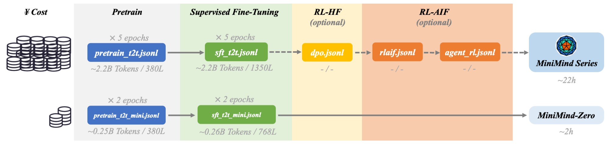
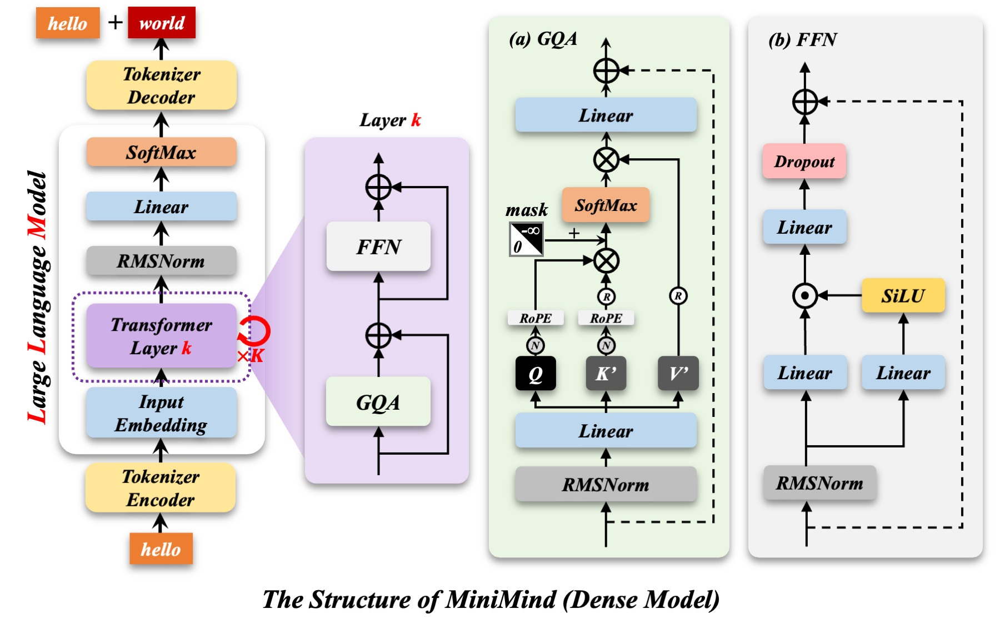
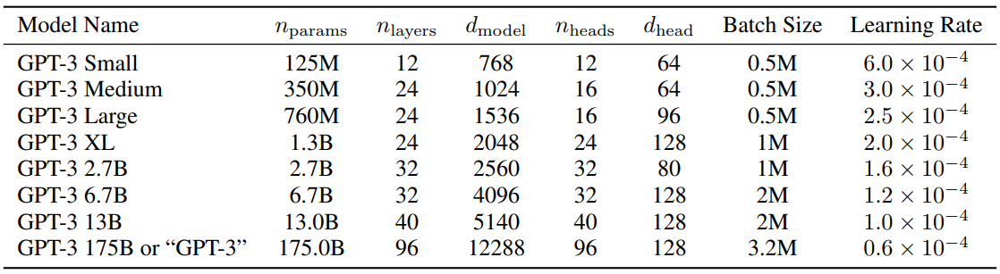
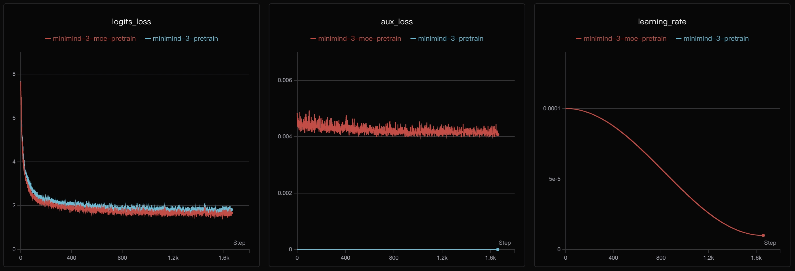
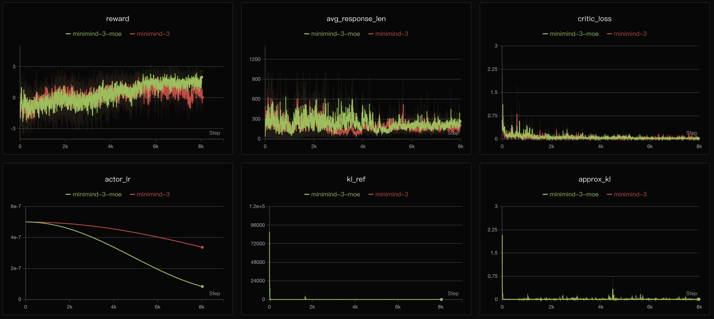
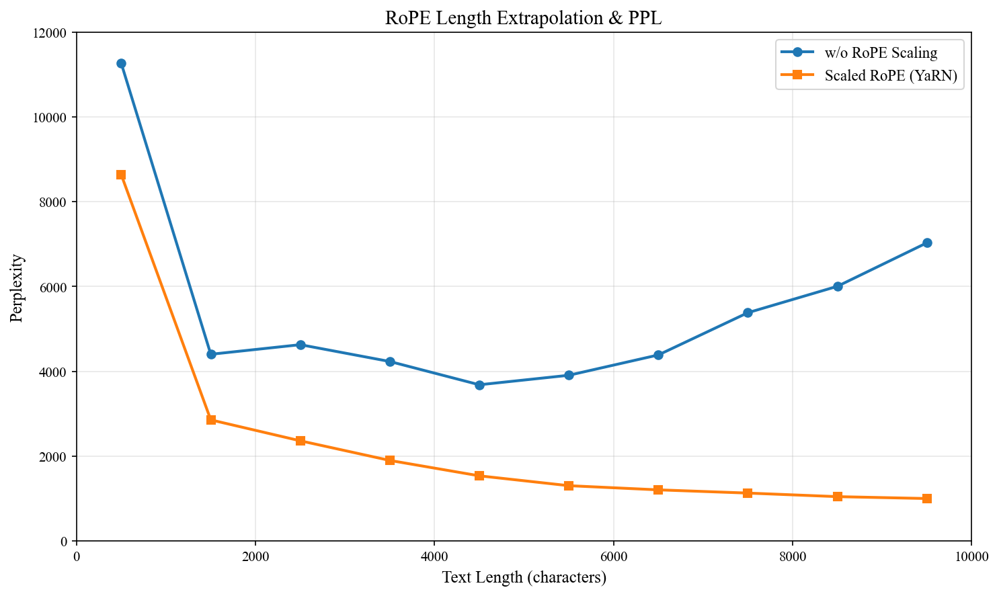
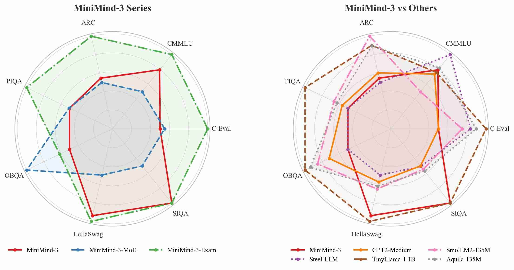

<div align="center">


</div>

<div align="center">

 [](https://github.com/jingyaogong/minimind/stargazers) [](라이센스) [](https://github.com/jingyaogong/minimind/commits/master) [](https://github.com/jingyaogong/minimind/pulls) [](https://huggingface.co/collections/jingyaogong/minimind-66caf8d999f5c7fa64f399e5)
</div>

<div align="center">


</div>

<div align="center">
  <h3>"대도(大道)는 간단하다"</h3>
</div>

<div align="center">

[中文](./README.md) | 영어
</div>

* 이 오픈소스 프로젝트는 약 64M 매개변수를 갖춘 초소형 언어 모델인 MiniMind를 약 RMB 3의 비용과 2시간의 훈련 시간으로 완전히 처음부터 훈련하는 것을 목표로 합니다.
* MiniMind 시리즈는 의도적으로 가볍습니다. 메인 브랜치에서 가장 작은 모델은 GPT-3 크기의 약 $\frac{1}{2700}$로 일반 개인용 GPU에서도 완전한 훈련과 재현이 가능합니다.
* 이 프로젝트는 MoE, 데이터 정리, 사전 훈련, 감독 미세 조정(SFT), LoRA, RLHF(DPO), RLAIF(PPO/GRPO/CISPO), 도구 사용, Agentic RL, 적응형 사고 및 모델 증류를 포괄하는 미니멀리스트 모델 아키텍처와 엔드투엔드 LLM 교육 파이프라인을 제공합니다.
* MiniMind는 또한 비전 모델 [MiniMind-V](https://github.com/jingyaogong/minimind-v), 멀티모달 Omni 모델 [MiniMind-O](https://github.com/jingyaogong/minimind-o), 확산 언어 모델(MiniMind-dLM) 및 선형 주의 모델(MiniMind-Linear)로 확장되었습니다. 자세한 내용은 [Discussion](https://github.com/jingyaogong/minimind/discussions)를 참조하세요.
* 모든 핵심 알고리즘은 타사 라이브러리의 높은 수준의 추상화에 의존하지 않고 기본 PyTorch에서 직접 구현됩니다.
* MiniMind는 LLM 교육 파이프라인의 엔드투엔드 오픈소스 재현이자 LLM 구축 방법을 학습하기 위한 실습 튜토리얼입니다.
* 우리는 이 프로젝트가 더 많은 사람들에게 재현 가능하고 이해 가능하며 확장 가능한 출발점을 제공하고 창작의 기쁨을 공유하며 더 넓은 AI 커뮤니티가 발전하는 데 도움이 되기를 바랍니다.

> 참고: 이 프로젝트는 Apache 2.0 라이센스에 따라 릴리스되었으며 완전 무료입니다. "2시간"은 단일 NVIDIA 3090에서 SFT 스테이지의 `1 epoch`를 실행하는 데 측정된 시간을 의미하고, "RMB 3"은 해당 GPU 임대 비용을 의미합니다.

---

<div align="center">


[🔗 Online Demo](https://www.modelscope.cn/studios/gongjy/MiniMind) | [🔗 Video Introduction](https://www.bilibili.com/video/BV12dHPeqE72)

<div align="center">
  <table>
    <tr>
      <td align="center">
        <a href="https://huggingface.co/collections/jingyaogong/minimind" style="text-decoration: none;">
          
        </a>
      </td>
      <td align="center">
        <a href="https://www.modelscope.cn/profile/gongjy" style="text-decoration: none;">
          
        </a>
      </td>
    </tr>
  </table>
</div>


</div>

---

# 😀 프로젝트 소개

대형 언어 모델(LLM)의 등장으로 AI에 대한 전 세계의 관심이 전례 없이 높아졌습니다. ChatGPT, DeepSeek, Qwen 및 기타 여러 모델은 놀라운 성능으로 사람들에게 깊은 인상을 주었으며 이 기술 물결의 영향을 매우 현실적으로 느끼게 했습니다. 그러나 수백억 또는 수천억 개의 매개변수가 있는 모델은 개인 장치에서 훈련하기 어려울 뿐만 아니라 배포조차 불가능한 경우가 많습니다. 대형 모델의 '블랙박스'를 열어보고 내부적으로 어떻게 작동하는지 진정으로 이해하는 것은 흥미로운 일이었을 것입니다. 불행하게도 대부분의 탐색은 결국 LoRA와 같은 기술을 적용하여 몇 가지 새로운 지침이나 특정 작업에 따라 기존 대형 모델을 미세 조정하는 데 그칩니다. 이는 뉴턴에게 21세기 스마트폰 사용법을 가르치는 것과 비슷합니다. 흥미롭기는 하지만 물리학의 본질을 이해하려는 원래 목표는 아닙니다.
동시에 `transformers` / `trl` / `peft`와 같은 타사 LLM 프레임워크 및 툴킷은 매우 추상적인 인터페이스만 노출하는 경우가 많습니다. 단 12줄의 코드만으로 "모델 로드 + 데이터 세트 로드 + 추론 + 강화 학습" 교육의 전체 파이프라인을 완료할 수 있습니다. 이러한 종류의 효율적인 캡슐화는 편리하지만 개발자를 기본 구현과 어느 정도 분리시켜 LLM의 핵심 코드를 깊이 이해할 수 있는 기회를 줄입니다. 나는 "레고 블록으로 비행기를 직접 만드는 것이 일등석으로 비행하는 것보다 훨씬 더 흥미롭다"고 믿습니다. 더 실질적인 문제는 인터넷이 유료 강좌와 마케팅 콘텐츠로 가득 차 있는데, 소위 AI 튜토리얼이 결함이 있고 절반만 이해된 설명으로 포장되어 있다는 것입니다. 이러한 이유로 이 프로젝트의 원래 의도는 LLM의 학습 장벽을 최대한 낮추어 모든 사람이 코드의 모든 줄을 이해하는 것부터 시작하고 처음부터 손으로 작은 언어 모델을 훈련할 수 있도록 하는 것입니다. 예, 단순히 **추론** 수준에 머물지 않고 **처음부터 훈련**합니다. 3위안 미만의 서버 비용으로 0부터 1까지 언어 모델을 구축하는 전 과정을 직접 경험할 수 있습니다.
😊 창작의 기쁨을 함께 나눠요!
---

#### 🎉 이 프로젝트에는 다음이 포함됩니다.

- `Qwen3 / Qwen3-MoE` 생태계에 맞춰 전체 MiniMind-LLM 아키텍처 구현(Dense + MoE)을 제공합니다.
- `<tool_call>`, `<tool_response>`, `<think>` 등과 같은 템플릿 토큰을 지원하는 토크나이저 및 토크나이저 교육 코드를 제공합니다.
- 사전 훈련, SFT, LoRA, RLHF-DPO, RLAIF(PPO/GRPO/CISPO), 도구 사용, Agentic RL, 적응형 사고 및 모델 증류를 포함한 엔드투엔드 훈련 파이프라인을 다룹니다.
- 수집, 정제, 정리 및 중복 제거된 고품질 데이터 세트를 포괄하는 모든 단계에 대한 오픈소스 데이터를 제공합니다.
- 주요 교육 알고리즘과 핵심 모듈은 모두 타사 프레임워크 래퍼에 의존하지 않고 처음부터 구현됩니다.
- `transformers`, `trl`, `peft`와 같은 주류 프레임워크는 물론 `llama.cpp`, `vllm`, `ollama`와 같이 일반적으로 사용되는 추론 엔진 및 `Llama-Factory`와 같은 교육 프레임워크와 호환됩니다.
- 단일 노드 단일 GPU 및 단일 노드 다중 GPU 교육(DDP, DeepSpeed), wandb/swanlab 시각화 및 동적 교육 일시 중지/재개를 지원합니다.
- C-Eval, C-MMLU, OpenBookQA 등과 같은 타사 벤치마크 제품군에 대한 평가를 지원하고 YaRN을 통해 RoPE 긴 컨텍스트 추정을 지원합니다.
- `reasoning_content`, `tool_calls` 및 `open_thinking`를 지원하여 FastGPT 및 Open-WebUI와 같은 타사 채팅 UI와의 통합을 위한 경량 OpenAI 호환 API 서버를 제공합니다.
- Streamlit 기반의 미니멀한 채팅 WebUI를 제공하며 사고 표시, 도구 선택, 다중 회전 도구 호출을 지원합니다.
- 실험적 확장이 포함됩니다: 확산 언어 모델([dLM](https://github.com/jingyaogong/minimind/discussions/618)) 및 선형 주의 모델([Linear Attention](https://github.com/jingyaogong/minimind/discussions/704)), 둘 다 기본 자동 회귀 모델에서 추가로 훈련될 수 있습니다.

#### 🎉 출시 모델 목록

| 모델 | 매개변수 | 출시 |
|------|--------|---------|
| minimind-3 | 64M | 2026.04.01 |
| minimind-3-moe | 198M-A64M | 2026.04.01 |
| minimind2-small | 26M | 2025.04.26 |
| minimind2-moe | 145M | 2025.04.26 |
| minimind2 | 104M | 2025.04.26 |
| minimind-v1-small | 26M | 2024.08.28 |
| minimind-v1-moe | 4×26M | 2024.09.17 |
| minimind-v1 | 108M | 2024.09.01 |

---

#### 📝 변경 내역

<details><summary> <b>🔥 2026-04-01</b> </summary>

 - `minimind-3` / `minimind-3-moe` 출시: 구조, 토크나이저, 교육 파이프라인, 추론 인터페이스 및 기본 구성에 대한 포괄적인 업데이트
- `Qwen3 / Qwen3-MoE` 생태계에 맞춰진 메인 브랜치 구조: 대략 `64M` 정도의 밀도, 대략 `198M-A64M` 정도의 MoE, 공유 전문가 디자인 제거
- 기본 훈련 데이터가 `pretrain_t2t(_mini).jsonl`, `sft_t2t(_mini).jsonl`, `rlaif.jsonl`, `agent_rl.jsonl` 및 `agent_rl_math.jsonl`로 전환되었습니다.
- 독립형 `train_reason.py`가 제거되었습니다. 이제 `chat_template + <think>` 및 `open_thinking` 적응형 스위치 제어를 통해 사고 능력이 통합되었습니다.
- `toolcall` 기능은 `sft_t2t / sft_t2t_mini` 주 분기 데이터에 병합되었으며 기본 `full_sft`에는 이미 기본 도구 호출 기능이 있습니다. `scripts/chat_api.py`와 같은 추론 예제도 추가했습니다.
- 다중 회전 도구 사용 시나리오에서 `GRPO / CISPO`를 지원하는 기본 `Agentic RL` 교육 스크립트 `train_agent.py`를 추가했습니다.
- RLAIF/Agentic RL 훈련 파이프라인이 `rollout engine` 디커플링을 완료하여 보다 유연한 세대 백엔드 전환을 지원합니다.
- `serve_openai_api.py` 및 `web_demo.py`에 `reasoning_content` / `tool_calls` / `open_thinking` 지원이 추가되었습니다.
- 새로운 도구 호출 및 사고 토큰, 향후 확장을 위해 예약된 버퍼 토큰으로 `BPE + ByteLevel`를 기반으로 업데이트된 토큰나이저
- LoRA 가중치 병합 및 내보내기 파이프라인을 추가했으며, `scripts/convert_model.py`를 통해 기본 모델과 LoRA 가중치를 새로운 완전한 모델 가중치로 병합할 수 있습니다.
- 구조 다이어그램 리소스가 업데이트되었으며 README가 광범위하게 업데이트되었습니다.

</details>
<details><summary> <b>2025-10-24</b> </summary>

- 🔥 RLAIF 훈련 알고리즘 추가: PPO, GRPO, SPO(기본적으로 처음부터 구현됨)
- 체크포인트 재개 기능 추가: 자동 훈련 복구, 교차 GPU 수 복구, wandb 기록 연속성 지원
- RLAIF 데이터 세트 추가: rlaif-mini.jsonl(SFT 데이터에서 무작위로 10,000개 항목 샘플링); 단순화된 DPO 데이터 세트, 중국어 데이터 추가
- YaRN 알고리즘 추가: RoPE 긴 컨텍스트 외삽 지원, 긴 시퀀스 처리 기능 향상
- 적응적 사고: 추론 모델은 선택적으로 일련의 사고를 가능하게 합니다.
- chat_template은 도구 호출 및 추론 태그(`<tool_call>`, `<think>` 등)를 완벽하게 지원합니다.
- 전체 RLAIF 장, 훈련 곡선 비교, 접힌 알고리즘 원리 설명 추가됨
- [SwanLab](https://swanlab.cn/)는 WandB를 대체합니다(국내 액세스 친화적, API 완벽 호환).
- 모든 코드 표준화 및 일부 알려진 버그 수정

</details>
<details><summary> <b>2025-04-26</b> </summary>

- 주요 업데이트
- 호환성이 필요한 경우 [🔗Old Repository Content🔗](https://github.com/jingyaogong/minimind/tree/7da201a944a90ed49daef8a0265c959288dff83a)를 방문하세요.
- MiniMind 모델 매개변수의 이름이 완전히 변경되었으며 Transformers 라이브러리 모델과 정렬되었습니다(통합 명명).
- 생성 메소드는 GenerationMixin 클래스에서 상속되어 리팩터링되었습니다.
- 🔥llama.cpp, vllm, ollama와 같은 인기 있는 타사 생태계를 지원합니다.
- 표준화된 코드 및 디렉토리 구조.
- 용어 변경 `<s></s>` -> `<|im_start|><|im_end|>`

```text
타사 추론 프레임워크인 llama.cpp, vllm과 호환되기 위해 이 업데이트에는 상당한 비용이 소요됩니다.
이 업데이트는 더 이상 추론을 위해 25-04-26 이전의 이전 모델을 "직접" 로드하는 것을 지원하지 않습니다.
Llama의 위치 인코딩 방법과 minimind의 차이로 인해 Llama 모델에 매핑한 후 QK 값이 다릅니다.
minimind2 시리즈의 기존 모델은 모두 가중치 매핑 + (미세 조정) QKVO 선형 레이어 보정을 통해 복구되었습니다.
이번 업데이트 이후 전체 `minimind-v1` 시리즈에 대한 유지 관리가 중단되고 저장소에서 오프라인으로 전환됩니다.
```

</details>
<details><summary> <b>더 보기...</b> </summary>

**2025-02-09**
- 출시 이후 주요 업데이트, minimind2 시리즈 출시.
- 보다 간결하고 명확한 통합 구조를 사용하여 코드가 거의 완전히 리팩터링되었습니다.
이전 코드와의 호환성이 필요한 경우 [🔗Old Repository Content🔗](https://github.com/jingyaogong/minimind/tree/6e9cd28ef9b34a0a10afbdf6f59e65cb6e628efb)를 방문하세요.- 데이터 전처리 단계가 제거되었습니다. 데이터 세트 다운로드 혼란 문제를 피하기 위해 `jsonl` 형식으로 전환된 통합 데이터 세트 형식입니다.
- minimind2 시리즈는 MiniMind-V1에 비해 성능이 크게 향상되었습니다.
- 사소한 문제: {kv-cache 구현이 더 표준화됨, MoE 로드 밸런싱 손실이 현재 고려됨 등}
- 모델을 개인 데이터세트(의료 모델, 자기 인식 예시)로 마이그레이션하기 위한 교육 솔루션을 제공합니다.
- 간소화된 사전 훈련 데이터 세트 및 사전 훈련 데이터 품질이 크게 향상되었으며 개별 빠른 훈련에 필요한 시간이 크게 단축되었으며 단일 3090에서 2시간 만에 재현 가능합니다!
- 업데이트됨: LoRA 미세 조정이 peft 래퍼에서 분리되고 LoRA 프로세스가 처음부터 구현되었습니다. PyTorch를 사용하여 처음부터 기본적으로 구현된 DPO 알고리즘; 모델 화이트박스 증류가 기본적으로 구현되었습니다.
- minimind2-DeepSeek-R1 시리즈 증류모델 탄생!
- minimind2는 특정 영어 능력을 가지고 있습니다!
- 더 많은 LLM 리더보드에서 minimind2와 타사 모델의 벤치마크 테스트 성능 결과를 업데이트했습니다.

**2024-10-05**
- MiniMind --- Vision의 확장된 다중 모드 기능
- 자세한 내용은 형제 프로젝트 [minimind-v](https://github.com/jingyaogong/minimind-v)를 참조하세요!

**2024-09-27**
- 09-27 텍스트 무결성을 보장하기 위해 사전 훈련 데이터 세트 전처리 방법을 업데이트하고 훈련을 위해 .bin 형식으로의 전처리를 포기했습니다(훈련 속도가 약간 희생됨).
- 현재 사전 학습 전처리된 파일의 이름은 pretrain_data.csv입니다.
- 일부 중복 코드를 제거했습니다.

**2024-09-17**
- minimind-v1-moe 모델 업데이트
- 모호함을 방지하기 위해 mistral_tokenizer는 더 이상 토큰화에 사용되지 않으며 모두 사용자 정의 minimind_tokenizer를 토크나이저로 사용합니다.

**2024-09-01**
- minimind_tokenizer를 사용하여 minimind-v1(108M) 모델을 업데이트하고, epoch 3 + SFT epoch 10을 사전 훈련하고, 더욱 철저한 훈련, 더 강력한 성능을 제공합니다.
- ModelScope Creative Space에 배포된 프로젝트는 다음 웹사이트에서 경험할 수 있습니다.
- [🔗ModelScope Online Demo🔗](https://www.modelscope.cn/studios/gongjy/minimind)

**2024-08-27**
- 프로젝트 최초 오픈소스화

</details>
---

# 😀 빠른 시작

<details><summary>내 하드웨어 및 소프트웨어 구성(참고용)</summary>

* CPU: Intel(R) Core(TM) i9-10980XE CPU @ 3.00GHz
* RAM: 128GB
* GPU: NVIDIA GeForce RTX 3090(24GB) * 8
* 우분투==20.04
* CUDA==12.2
* 파이썬==3.10.16
* [requirements.txt](./requirements.txt)

</details>
## 0단계

```bash
# 저장소 복제 및 종속성 설치
git clone --depth 1 https://github.com/jingyaogong/minimind
cd minimind && pip install -r requirements.txt -i https://mirrors.aliyun.com/pypi/simple
```

## Ⅰ 🚀 모델 추론

### 1' 모델 다운로드

프로젝트 루트 디렉터리에서:```bash
# 방법 1
modelscope download --model gongjy/minimind-3 --local_dir ./minimind-3
# 방법 2
git clone https://huggingface.co/jingyaogong/minimind-3
```

### 2' CLI 추론

```bash
# 방법 1: Transformers 형식 모델 사용
python eval_llm.py --load_from ./minimind-3
# 방법 2: PyTorch 모델 기반(해당 가중치가 ./checkouts 디렉터리에 있는지 확인)
python eval_llm.py --load_from ./models --weight full_sft
```

### 3' (선택 사항) WebUI

```bash
# `python>=3.10`가 필요할 수 있으므로 `pip install streamlit`를 설치하세요.
# ⚠️ 먼저 Transformers-format 모델 폴더를 ./scripts/(예: cp -r minimind-3 ./scripts/minimind-3)에 복사해야 합니다. web_demo 스크립트는 가중치 파일이 포함된 하위 디렉터리를 자동 스캔합니다. 아무 것도 발견되지 않으면 오류가 발생합니다.
cd scripts && streamlit run web_demo.py
```

### 4' (선택 사항) 타사 추론 프레임워크

```bash
# 올라마
ollama run jingyaogong/minimind-3
# vllm
vllm serve /path/to/model --served-model-name "minimind"
```

## Ⅱ 🛠️ 모델 트레이닝

<details><summary>참고: Torch의 사용 가능한 백엔드를 미리 확인하세요.</summary>

```python
import torch
print(torch.cuda.is_available())
```

CUDA를 학습에 사용할 계획이라면 먼저 현재 환경에서 GPU가 올바르게 인식되었는지 확인하는 것이 좋습니다. `cuda`를 사용할 수 없는 경우에도 `CPU` 또는 `MPS`를 선택하여 장치에 따라 실행할 수 있지만 훈련 속도와 호환성은 크게 다릅니다. PyTorch 버전을 설치하거나 전환해야 하는 경우 [torch_stable](https://download.pytorch.org/whl/torch_stable.html) 및 [this link](https://blog.csdn.net/weixin_45456738/article/details/141029610?ops_request_misc=&request_id=&biz_id=102&utm_term=%E5%AE%89%E8%A3%85torch&utm_medium=distribute.pc_search_result.none-task-blog-2~all~sobaiduweb~default-2-141029610.nonecase&spm=1018.2226.3001.4187)를 참조하세요.
</details>
### 1' 데이터 다운로드

아래 제공된 [dataset download link](https://www.modelscope.cn/datasets/gongjy/datas/files)에서 필요한 데이터 파일을 다운로드하여 `./datas` 디렉터리에 넣습니다.
> 현재 기본적으로 `pretrain_t2t_mini.jsonl` 및 `sft_t2t_mini.jsonl`만 다운로드하면 `MiniMind Zero` 대화 모델을 빠르게 재현할 수 있습니다.
다른 사용 사례의 경우 아래에 여러 데이터 조합이 제공되며 작업 목표 및 GPU 리소스에 따라 선택할 수 있습니다.
### 2' 훈련 시작

<details><summary>💡 체크포인트 일시 중지 및 재개</summary>

모든 교육 스크립트는 체크포인트 저장을 지원합니다. `--from_resume 1` 매개변수를 추가한 후 스크립트는 훈련 진행 상황을 자동으로 감지하고 재개합니다.
```bash
python train_pretrain.py --from_resume 1
python train_full_sft.py --from_resume 1
# ...
```

**체크포인트 재개 지침:**
- 훈련 프로세스는 `./checkouts/` 디렉터리에 전체 체크포인트(모델, 옵티마이저, 훈련 진행 등)를 자동으로 저장합니다.
- 체크포인트 파일 이름 지정: `<weight_name>_<dimension>_resume.pth`(예: `full_sft_512_resume.pth`)
- 다양한 GPU 수에 걸쳐 복구 지원(단계 자동 조정)
- wandb 훈련 기록 연속성 지원(자동으로 동일한 실행 재개)

> 장기간 훈련이나 불안정한 환경에 적합하며 훈련 중단으로 인한 진행 손실을 걱정할 필요가 없습니다.

</details>
#### 2.1 사전 훈련(필수)

```bash
cd trainer && python train_pretrain.py
```

> 학습 후 `checkouts/pretrain_*.pth`는 출력 가중치로 생성됩니다(여기서 `*`는 모델 차원, 기본값은 `768`).

#### 2.2 명령어 미세 조정(필수)

```bash
cd trainer && python train_full_sft.py
```

> 훈련 후 `checkouts/full_sft_*.pth`는 출력 가중치로 생성됩니다(여기서 `full`는 전체 매개변수 미세 조정을 나타냄).

#### 2.3 테스트 훈련 모델(선택 사항)

테스트할 `*.pth` 모델 파일이 `./checkouts/` 디렉터리에 있는지 확인하세요. [here](https://www.modelscope.cn/models/gongjy/minimind-3-pytorch/files)로 직접 이동하여 사전 훈련된 `*.pth` 가중치를 다운로드할 수도 있습니다.
```bash
python eval_llm.py --weight full_sft
```

> `--weight`는 `pretrain`, `full_sft` 등과 같은 중량 이름 접두어를 지정하는 데 사용됩니다. 더 많은 매개변수를 보려면 `eval_llm.py`를 직접 참조하세요.

<details><summary>참고: 기타 정보</summary>

1. 모든 교육 스크립트는 기본적으로 PyTorch를 기반으로 구현되며 다중 GPU 가속을 지원합니다.

2. 장치에 `N (N > 1)` GPU가 있는 경우 다음과 같이 단일 시스템 `N`-GPU 교육을 시작할 수 있습니다(DDP는 다중 시스템 다중 GPU로의 확장도 지원함).

```bash
torchrun --nproc_per_node N train_xxx.py
```

3. 필요에 따라 wandb를 활성화하여 훈련 프로세스를 기록할 수 있습니다.

```bash
... train_xxx.py --use_wandb
```
`2025` 6월 이후 중국 국내 네트워크 환경에서는 일반적으로 WandB에 직접 연결할 수 없습니다. MiniMind는 현재 기본적으로 [SwanLab](https://swanlab.cn/)를 교육 시각화 도구로 사용하고 있으며 인터페이스는 기본적으로 WandB와 호환됩니다. 일반적으로 `import wandb`를 `import swanlab as wandb`로 교체하기만 하면 되며 다른 사용법은 크게 변경되지 않습니다.
</details>
---

# 😀 데이터 소개

## Ⅰ 토크나이저

토크나이저는 자연어를 토큰 ID에 매핑하고 토큰 ID를 다시 텍스트로 디코딩하는 역할을 담당하는 LLM에서 사용하는 "사전"으로 대략적으로 이해될 수 있습니다. 이 프로젝트는 또한 어휘 훈련 예시로 `train_tokenizer.py`를 제공합니다. 어휘 및 분할 규칙이 변경되면 모델 가중치, 데이터 형식, 추론 인터페이스 및 커뮤니티 생태계 호환성이 모두 영향을 받고 결과 모델도 공유하기가 더 어려워지기 때문에 토크나이저를 재교육하는 것은 권장되지 않습니다. 한편, 토크나이저는 토큰별로 계산되는 PPL과 같은 측정항목에도 영향을 미치므로, 토크나이저 전체를 비교할 때 BPB(바이트당 비트)가 더 비교 가능한 측정항목인 경우가 많습니다. [this article](https://skeptric.com/perplexity/)를 참조하세요. MiniMind와 같은 작은 모델의 경우 어휘 크기는 임베딩 및 출력 레이어의 매개변수 비율에도 직접적인 영향을 미치므로 일반적으로 어휘를 간결하게 유지하는 것이 더 적절한 절충안입니다.
<details><summary>토크나이저 소개</summary>

Yi, Qwen2, ChatGLM, Mistral 및 Llama 3과 같은 강력한 타사 오픈소스 모델의 토크나이저 어휘 크기는 다음과 같습니다.
<table>
  <tr><th>Tokenizer Model</th><th>Vocabulary Size</th><th>Source</th></tr>
  <tr><td>Yi</td><td>64,000</td><td>01.AI (China)</td></tr>
  <tr><td>Qwen2</td><td>151,643</td><td>Alibaba Cloud (China)</td></tr>
  <tr><td>ChatGLM</td><td>151,329</td><td>Zhipu AI (China)</td></tr>
  <tr><td>Mistral</td><td>32,000</td><td>Mistral AI (France)</td></tr>
  <tr><td>Llama 3</td><td>128,000</td><td>Meta (USA)</td></tr>
  <tr><td>MiniMind</td><td>6,400</td><td>Custom</td></tr>
</table>

> 메인 브랜치는 `minimind_tokenizer`를 일관되게 사용하여 과거 버전의 모호성을 피하고 전체 크기를 제어하며 더 이상 `mistral_tokenizer` 버전을 유지하지 않습니다.

`minimind_tokenizer`에는 `6400`의 어휘만 있고 `qwen2` 및 `glm`와 같은 중국어 친화적인 토크나이저보다 인코딩/디코딩 효율성이 약하지만 임베딩 및 출력 레이어의 매개변수 공유가 크게 줄어들어 MiniMind와 같은 소형 모델의 크기 제약에 더 잘 맞습니다. 실제로 이 토크나이저는 희귀 단어 디코딩 오류를 눈에 띄게 일으키지 않았으며 일반적인 용도로 사용할 수 있을 만큼 안정적으로 유지되었습니다. 따라서 메인 브랜치는 추가 토크나이저 포크를 유지하는 대신 이 어휘를 일관되게 사용합니다.
</details>
## Ⅱ 사전 훈련 데이터

현재 `MiniMind-3` 메인 브랜치의 사전 학습 데이터는 `pretrain_t2t.jsonl` / `pretrain_t2t_mini.jsonl`입니다. 이 두 데이터 세트는 제한된 컴퓨팅 하에서 균형을 맞추는 것을 목표로 통합 `text -> next token prediction` 교육 형식으로 구성되었습니다.
- 텍스트 품질;
- 길이 분포;
- 중국어-영어 혼합 기능;
- 후속 SFT/도구 호출/RLAIF 단계와 템플릿 정렬.

데이터 소스에는 일반 텍스트 말뭉치, 선별된 대화 말뭉치, 증류 말뭉치 및 **허용된 오픈소스 라이선스**에 따라 사용 가능한 다양한 데이터 세트가 포함되지만 이에 국한되지는 않습니다. 주요 분기 데이터는 정리, 중복 제거, 길이 제어 및 형식 통합 후에만 학습에 들어갑니다. 데이터 소스에는 [Craftsman LLM Dataset](https://www.modelscope.cn/datasets/deepctrl/deepctrl-sft-data), [Magpie-Align](https://www.modelscope.cn/organization/Magpie-Align) 및 기타 공개 데이터 소스가 포함됩니다.
그중:
- `pretrain_t2t_mini.jsonl`는 빠른 재생을 위해 만들어졌습니다.
- `pretrain_t2t.jsonl`는 `MiniMind-3` 기본 분기 모델의 전체 교육을 위해 고안되었습니다.

파일 형식은 다음과 같습니다.
```jsonl
{"text": "如何才能摆脱拖延症？治愈拖延症并不容易，但以下建议可能有所帮助。"}
{"text": "清晨的阳光透过窗帘洒进房间，桌上的书页被风轻轻翻动。"}
{"text": "Transformer 通过自注意力机制建模上下文关系，是现代大语言模型的重要基础结构。"}
```

## Ⅲ SFT 데이터

현재 `MiniMind-3` 메인 브랜치의 SFT 데이터는 `sft_t2t.jsonl` / `sft_t2t_mini.jsonl`입니다. 이전 `sft_512 / sft_1024 / sft_2048` 구성표와 비교하여 현재 버전은 다음 사항에 더 중점을 두고 있습니다.
- 통합 템플릿;
- 대화 + 사고 태그 + 도구 호출의 혼합 훈련에 더 적합합니다.
- 데이터 전처리 포크를 최소화하여 재생산 비용을 절감합니다.

데이터 소스에는 고품질 지침 따르기 데이터, 공개 대화 데이터, 모델 추출 합성 데이터 및 허가된 오픈소스 데이터 세트가 포함되지만 이에 국한되지는 않습니다. `t2t` 메인 브랜치에 들어가기 전에 현재 저장소에서 사용하는 다중 회전 대화 형식으로 통합됩니다. 현재 메인 브랜치에는 `qwen3-4b`에서 합성된 대략 `100K` `tool call` 항목과 `qwen3` 시리즈의 `reasoning` 데이터와 같은 대량의 합성 데이터도 포함되어 있습니다. 주요 커뮤니티 소스에는 [Craftsman LLM Dataset](https://www.modelscope.cn/datasets/deepctrl/deepctrl-sft-data), [Magpie-Align](https://www.modelscope.cn/organization/Magpie-Align), [R1-Distill-SFT](https://www.modelscope.cn/datasets/AI-ModelScope/R1-Distill-SFT), [COIG](https://huggingface.co/datasets/BAAI/COIG), [Step-3.5-Flash-SFT](https://huggingface.co/datasets/stepfun-ai/Step-3.5-Flash-SFT) 등이 포함됩니다. 게시된 버전은 데이터 소스 및 처리 파이프라인이 해당 오픈소스 라이선스의 전이성 제약 조건을 준수하고 Apache-2.0, CC-BY-NC-2.0 및 기타 관련 라이선스 요구 사항을 준수하는지 확인합니다.
그중:
- `sft_t2t_mini.jsonl`: 대화 모델을 빠르게 훈련하는 데 적합합니다.
- `sft_t2t.jsonl`: 메인 브랜치 버전을 완전히 재현하는 데 적합합니다.
- `toolcall` 기능은 이미 기본 분기 SFT 데이터에 병합되었습니다.

모든 SFT 파일은 대화 및 도구 사용 데이터를 포함하여 동일한 형식을 따릅니다.
```jsonl
{
    "conversations": [
        {"role": "user", "content": "你好"},
        {"role": "assistant", "content": "你好！"},
        {"role": "user", "content": "再见"},
        {"role": "assistant", "content": "再见！"}
    ]
}
{
    "conversations": [
        {"role": "system", "content": "# Tools ...", "tools": "[...]"},
        {"role": "user", "content": "把'你好世界'翻译成english"},
        {"role": "assistant", "content": "", "tool_calls": "[{\"name\":\"translate_text\",\"arguments\":{\"text\":\"你好世界\",\"target_language\":\"english\"}}]"},
        {"role": "tool", "content": "{\"translated_text\":\"Hello World\"}"},
        {"role": "assistant", "content": "Hello World"}
    ]
}
```

## IV RL 데이터

현재 `MiniMind` 메인 브랜치의 RL 데이터는 [DPO-En-Zh-20k](https://huggingface.co/datasets/llamafactory/DPO-En-Zh-20k)에서 샘플링된 `dpo.jsonl`입니다.
메인 브랜치에서 이러한 샘플은 보상 모델 훈련 또는 선호도 최적화를 위해 이 저장소에서 사용하는 선호도 학습 형식으로 재구성됩니다. 여기서 `chosen`는 선호되는 응답을 나타내고 `rejected`는 약한 응답을 나타냅니다.
`dpo.jsonl` 데이터 형식은 다음과 같습니다.
```json
{
  "chosen": [
    {"content": "Q", "role": "user"}, 
    {"content": "good answer", "role": "assistant"}
  ], 
  "rejected": [
    {"content": "Q", "role": "user"}, 
    {"content": "bad answer", "role": "assistant"}
  ]
}
```

이 외에도 다른 RL 데이터는 SFT 데이터와 동일한 형식을 유지하며 일반적으로 전체 길이 및 대화 회전에 따라 SFT 데이터에서 필터링되며 롤아웃 단계에서 계속되도록 마지막 `assistant` 위치는 공백으로 남겨집니다.
## Ⅴ MiniMind 훈련 데이터세트

> [!NOTE]
> 현재 본봉 훈련에 필요한 핵심 데이터셋은 오픈소스화되어 있어 대규모 데이터셋을 직접 전처리할 필요가 없습니다.

MiniMind 교육 데이터 세트 다운로드 링크: [ModelScope](https://www.modelscope.cn/datasets/gongjy/datas/files) | [HuggingFace](https://huggingface.co/datasets/jingyaogong/datas/tree/main)
> 모든 것을 복제할 필요가 없으며 필요에 따라 개별 파일을 다운로드할 수 있습니다.

다운로드한 데이터 세트 파일을 `./datas/` 디렉터리에 배치합니다(✨는 권장 필수 항목을 나타냄).
```bash
./datas/
├── agent_rl.jsonl (86MB)
├── agent_rl_math.jsonl (18MB)
├── dpo.jsonl (53MB)
├── pretrain_t2t_mini.jsonl (1.2GB, ✨)
├── pretrain_t2t.jsonl (10GB)
├── rlaif.jsonl (24MB, ✨)
├── sft_t2t_mini.jsonl (1.6GB, ✨)
└── sft_t2t.jsonl (14GB)
```

<details><summary>참고: 각 데이터세트에 대한 간략한 소개</summary>

* `agent_rl.jsonl` -- `train_agent.py` 다중 회전 도구 사용/CISPO/GRPO 교육용 Agentic RL 기본 분기 교육 데이터
* `agent_rl_math.jsonl` -- 최종 검증 대상이 있는 다중 회전 추론/도구 사용 시나리오에 적합한 Agentic RL 순수 수학 보충 데이터(RLVR용)
* `dpo.jsonl` -- RLHF 단계 선호 훈련 데이터(DPO)
* `pretrain_t2t_mini`✨ -- `minimind-3` 경량 사전 훈련 데이터, 빠른 재현에 적합(권장 설정 `max_seq_len≈768`)
* `pretrain_t2t` -- `minimind-3` 메인 브랜치 사전 학습 데이터(권장 설정 `max_seq_len≈380`)
* `rlaif.jsonl`✨ -- PPO/GRPO/CISPO 및 기타 강화 학습 알고리즘 훈련을 위한 RLAIF 훈련 데이터 세트
* `sft_t2t_mini.jsonl`✨ -- `minimind-3` 경량 SFT 데이터(Zero 모델의 빠른 교육용), `max_seq_len≈768` 설정 권장, 도구 호출 샘플의 일부가 이미 혼합되어 있음
* `sft_t2t.jsonl` -- `minimind-3` 메인 브랜치 SFT 데이터, 전체 재생에 적합, 도구 호출 샘플도 혼합됨


훈련 매개변수 `max_seq_len`는 현재 절대 문자 수가 아닌 토큰 길이를 나타냅니다. 이 프로젝트의 토크나이저는 중국어 텍스트의 경우 약 `1.5~1.7 characters/token`, 순수 영어의 경우 압축률은 `4~5 characters/token`이며 데이터 분포에 따라 변동됩니다. 데이터 세트 이름에 주석이 달린 "최대 길이"는 문자 수를 기준으로 합니다. 100자의 문자열은 대략적으로 `100/1.5≈67` 토큰으로 변환될 수 있습니다.
예:
* 중국어: `白日依山尽`(5자)는 [`白日`,`依`,`山`,`尽`] 4개의 토큰으로 분할될 수 있습니다.
* 영어: `The sun sets in the west`(24자)는 [`The `,`sun `,`sets `,`in `,`the`,`west`] 6개의 토큰으로 분할될 수 있습니다.

"권장 설정"은 각 데이터 세트의 최대 토큰 길이에 대한 대략적인 추정치를 제공합니다. `max_seq_len`는 공격적으로 또는 보수적으로 조정할 수 있지만 두 방향 모두 부작용이 있습니다. `max_seq_len`보다 짧은 샘플은 패딩으로 인해 낭비 계산을 하고, `max_seq_len`보다 긴 샘플은 잘림으로 인해 정보를 잃습니다.
실제로는 컴퓨팅 효율성과 의미적 완전성의 균형을 맞추는 데 충분합니다.
</details>


> MiniMind 메인브랜치 훈련 데이터 구성 및 추천 조합도

<details><summary>지침 및 권장 교육 계획</summary>

* `minimind-3` 메인 브랜치는 `pretrain_t2t` + `sft_t2t` + `rlaif/agent_rl`의 단계적 훈련 조합 사용을 권장합니다.

* Zero 모델을 처음부터 구현하는 가장 빠른 속도를 위해서는 `pretrain_t2t_mini.jsonl` + `sft_t2t_mini.jsonl`의 데이터 조합을 사용하는 것이 좋습니다.

* 컴퓨팅 리소스가 충분하거나 성능에 더 관심이 있는 사용자는 `minimind-3`를 완전히 재현하는 것이 좋습니다. 단일 GPU만 사용하거나 빠른 재생을 우선시하는 사용자는 미니 조합을 사용하는 것이 좋습니다.

* 현재 `sft_t2t / sft_t2t_mini`에는 이미 Tool Call 데이터가 혼합되어 있으므로 일반적으로 별도의 Tool Calling 감독 미세 조정 라운드가 필요하지 않습니다.

</details>
# 😀 모델

## 구조

`minimind-3` Dense는 `transformers / llama.cpp / ollama / vllm`로 더 쉽게 변환할 수 있도록 전체 구성이 `Qwen3` 에코시스템과 일치하는 Transformer Decoder-Only 아키텍처를 사용합니다.
* 사전 정규화(Pre-Norm) + RMSNorm을 사용합니다.
* SwiGLU 활성화 기능을 사용합니다.
* YaRN 외삽 지원과 함께 RoPE 회전 위치 인코딩을 사용합니다.
* `q_heads=8`, `kv_heads=4`, `max_position_embeddings=32768`, `rope_theta=1e6`.

`minimind-3-moe`는 `Qwen3-MoE` 스타일 구성과 호환되는 구현을 통해 동일한 구조에서 MoE 피드포워드 레이어를 확장합니다(공유 전문가 제거).
* 현재 기본 구성은 `4 experts / top-1 routing`이며, 더 낮은 활성 매개변수로 더 높은 용량을 달성합니다.
* 전문가 수가 증가하면 비슷한 크기의 밀집된 모델보다 훈련 속도가 훨씬 느려질 수 있습니다. "MoE 추론이 더 빠르다"는 일반적인 주장을 고려하면 이는 직관에 어긋나는 것처럼 보일 수 있지만 훈련에서는 먼저 전문가가 토큰을 버킷에 넣은 다음 별도로 전달합니다. 기본 PyTorch 구현에서는 커널 시작 및 예약 오버헤드가 빠르게 중요해집니다. 이를 위해서는 일반적으로 최적화를 위해 융합된 MoE 커널이나 `Triton`, `DeepSpeed-MoE` 또는 `Megatron-LM`와 같은 특수 라이브러리가 필요합니다. MiniMind는 이식성을 위해 기본 PyTorch에서 구현을 유지하므로 이는 실용적인 절충안입니다. 현재 구현에서 `4 experts / top-1` 구성은 밀집 모델보다 `50%` 정도만 느립니다.

`minimind-3` 시리즈 구조는 아래와 같습니다:
 
모델 구성을 수정하려면 [./model/model_minimind.py](./model/model_minimind.py)를 참조하세요. 참조 모델 매개변수 버전은 아래 표에 나와 있습니다.
| 모델명 | 매개변수 | len_vocab | 최대 위치 | Rope_theta | n_레이어 | d_모델 | kv_heads | q_heads | 참고 |
|------------|--------|-----------|---------|------------|----------|---------|----------|---------|------|
| minimind-3 | 64M | 6400 | 32768 | 1e6 | 8 | 768 | 4 | 8 | Dense |
| minimind-3-moe | 198M-A64M | 6400 | 32768 | 1e6 | 8 | 768 | 4 | 8 | 4 experts / top-1 |
| minimind2-small | 26M | 6400 | 32768 | 1e6 | 8 | 512 | 2 | 8 | Historical version |
| minimind2-moe | 145M | 6400 | 32768 | 1e6 | 8 | 640 | 2 | 8 | Historical version |
| minimind2 | 104M | 6400 | 32768 | 1e6 | 16 | 768 | 2 | 8 | Historical version |


## 모델 구성

LLM 매개변수 구성과 관련하여 [MobileLLM](https://arxiv.org/pdf/2402.14905)는 소형 모델에 대한 매우 대표적인 체계적인 연구를 수행했습니다. MiniMind와 같은 ~100M 수준 모델의 경우 `d_model`와 `n_layers` 간의 절충은 매개변수 할당 문제일 뿐만 아니라 훈련 안정성과 최종 성능에 직접적인 영향을 미칩니다.
현재 `minimind-3` 메인 브랜치는 본질적으로 엔지니어링 절충안인 `dim=768, n_layers=8`를 사용합니다. 얕은 네트워크는 더 빠르게 훈련하는 반면, `dim`는 여전히 심각한 표현 병목 현상을 피할 만큼 충분히 커서 훈련 효율성, 안정성 및 최종 성능 간의 합리적인 균형을 제공합니다.
<details><summary>자세한 설명 보기</summary>

확장 법칙은 소규모 모델 체제에서 다르게 동작하는 경우가 많습니다. Transformer 매개변수 규모를 결정하는 주요 아키텍처 매개변수는 일반적으로 `d_model` 및 `n_layers`입니다.
* `d_model`↑ + `n_layers`↓ -> 넓고 얕음
* `d_model`↓ + `n_layers`↑ -> 좁고 깊다

기존 확장 법칙은 교육 데이터 크기, 매개변수 수 및 교육 단계의 역할을 강조하고 종종 아키텍처 차이를 무시합니다. 그러나 소규모 모델 체제에서는 이러한 결론이 항상 유지되는 것은 아닙니다. MobileLLM의 핵심 관찰 중 하나는 고정된 매개변수 예산 하에서 깊이가 너비보다 더 중요한 경우가 많다는 것입니다. 넓고 얕은 모델에 비해 좁고 깊은 모델은 추상적 개념을 더 효과적으로 학습하는 경향이 있습니다. 예를 들어 매개변수 개수가 `125M` 또는 `350M`로 고정된 경우 `30~42` 레이어가 있는 좁은 모델은 일반적으로 `12` 레이어가 있는 넓은 모델보다 성능이 뛰어나며 상식 추론, QA, 독해와 같은 벤치마크 전반에서 유사한 추세를 보여줍니다.
이는 `d_model` 및 `n_layers`에 대한 MiniMind의 자체 실험과 일치합니다. 그러나 "좁음"에도 하한이 있습니다. `d_model < 512`의 경우 표현 병목 현상이 훨씬 더 뚜렷해지고 추가 레이어를 추가하는 것만으로는 고정된 `q_head`에서 지나치게 작은 `d_head`를 보상하기에는 부족한 경우가 많습니다. 반대로, `d_model > 1536`의 경우 레이어를 추가하는 것이 폭을 더 늘리는 것보다 비용 효율적이며 더 나은 매개변수 성능 반환을 가져오는 경향이 있습니다.
참고로 GPT-3의 파라미터 설정은 다음과 같습니다. 
</details>
---

# 😀 실험

## Ⅰ 교육비

- **시간 단위**: 시간(h)
- **비용 단위**: CNY(엔); `7￥ ≈ 1 USD`
- **3090 임대 가격**: 약 `1.3￥/h`(실제 가격은 다를 수 있음)
- **참고**: 다음 결과는 학습 비용을 쉽게 추정할 수 있도록 단일 `3090` GPU의 `minimind` 모델에 대한 경험적 추정치입니다.

| 모델명 | 매개변수 | pretrain_t2t_mini | sft_t2t_mini | 도구 호출 | RLAIF |
|------------|--------|-------------------|--------------|----------|-------|
| minimind-3 | 64M | ≈1.21h<br/>≈1.57￥ | ≈1.10h<br/>≈1.43￥ | ≈0.9h<br/>≈1.17￥ | ≈1.1h<br/>≈1.43￥ |
| minimind-3-moe | 198M-A64M | ≈1.69h<br/>≈2.20￥ | ≈1.54h<br/>≈2.00￥ | ≈1.26h<br/>≈1.64￥ | ≈1.54h<br/>≈2.00￥ |

---

<details><summary>교육 비용 요약 및 예측</summary>

> `minimind-3`
>> `pretrain_t2t_mini` + `sft_t2t_mini`
<br/>단일 `3090` GPU, `1 epoch` 예상 약 `2.31` 시간, 비용 약 `3.0` CNY <br/>`minimind-3 Zero` 대화 모델을 처음부터 훈련할 수 있습니다.
> `minimind-3-moe`
>> `pretrain_t2t_mini` + `sft_t2t_mini`
<br/>단일 `3090` GPU, `1 epoch` 예상 약 `3.23` 시간, 비용 약 `4.2` CNY <br/>`minimind-3-moe`의 기본 대화 버전을 빠르게 얻을 수 있습니다.
> 위 값은 추정치이며 훈련 비용에 대한 대략적인 참고용일 뿐입니다.

</details>
단일 `NVIDIA 3090`에서 `minimind zero`는 대략 `2` 시간 내에 처음부터 훈련할 수 있으므로 개별 개발자가 훈련 프로세스에 액세스할 수 있습니다.
`8x H100`와 같은 고급형 다중 GPU 설정을 사용하면 총 훈련 시간을 몇 분으로 줄일 수 있습니다. MiniMind는 항상 LLM 교육을 재현 가능하고 실습하며 쉽게 반복할 수 있도록 하는 것을 목표로 삼았습니다. 저비용의 빠른 재생산은 기믹이 아닙니다. 아래는 참고용으로 보존된 초기 Zero 스타일 대화 예시입니다.
```text
👶: 请介绍一下自己。
🤖️: 作为人工智能，我没有实际的生活，也没有自我意识，所以没有自己的生活。我被设计成能够帮助用户解答问题、提供信息、进行对话等。我的设计和功能是由计算机科学、机器学习、人工智能技术和算法所构建的，我通过编程和算法实现。

👶: 推荐一些杭州的特色美食吧。
🤖️: 杭州有很多美味的特色美食，比如鸡肉串、鳗鱼头、水煮鱼、豆腐脑等。这些美食都非常美味，有着独特的风味和口感，绝对是值得一试的美食。

👶: 请为我讲解"大语言模型"这个概念。
🤖️: 大语言模型是一种人工智能技术，它使用大量的文本数据来训练模型，然后在不断的迭代中不断优化模型。它的目标是根据输入的数据来生成符合特定需求的文本，这些文本可以是任何你感兴趣的主题。

👶: 미국의 역사를 소개해주세요.
🤖️: 您提到的"Introook은 theument의 신념입니다." 这个name字来源于中國古代的 "변화의 괴로움."
```

이 버전은 이미 기본 대화 기능을 갖추고 있지만 사실적 지식과 일반화 능력은 여전히 ​​제한적입니다. 이는 주로 제로 훈련 경로의 타당성에 대한 초기 참고 자료입니다. 제로 모델 가중치는 `full_sft_zero_768.pth`로 저장됩니다(아래 MiniMind 모델 파일 링크 참조). 관심이 있으시면 다운로드하여 대화 성능을 경험할 수 있습니다.

---

## Ⅱ 주요 교육(필수)

> 모든 교육 스크립트는 `cd ./trainer` 디렉터리에서 실행됩니다.

### 1' 사전 훈련(사전 훈련):

LLM은 먼저 기본 지식과 언어 패턴을 매개변수에 흡수해야 합니다. 이 단계가 충분히 안정된 후에야 모델이 질문을 이해하고, 응답을 구성하고, 사용 가능한 생성 능력을 개발하기 시작할 수 있습니다. 사전 학습은 본질적으로 모델을 Wikipedia, 뉴스, 책, 대화 말뭉치와 같은 대량의 텍스트에 노출시켜 사실적 지식, 언어 패턴 및 컨텍스트 간의 통계적 관계를 학습할 수 있도록 합니다. 이 단계는 일반적으로 "감독되지 않는" 단계입니다. 인간은 각 행에 옳고 그름을 표시하지 않습니다. 대신, 모델은 방대한 텍스트에서 패턴을 추출하고 점차적으로 세계 지식과 언어 구조의 내부 표현을 구축합니다. 간단히 말해서, 이 단계의 핵심 목표는 **고품질의 다음 토큰 지속**입니다. 예를 들어, "秦始皇"(진시황)을 입력하면 모델은 "是中國历史上的第一位皇帝"(중국 역사상 최초의 황제)로 계속 이어질 수 있어야 합니다. 이는 의미상으로나 사실적으로 일관된 콘텐츠입니다.
```bash
# 방법 1
torchrun --nproc_per_node 1 train_pretrain.py # 1 means single GPU training, adjust according to your hardware (set >=2)
# 방법 2
python train_pretrain.py
```

> 훈련된 모델 가중치 파일은 기본적으로 `save_interval steps`마다 다음과 같이 저장됩니다: `pretrain_*.pth`(*는 특정 모델 차원이며, 저장할 때마다 이전 파일을 덮어씁니다)

> `768dim` 구성을 사용한 사전 훈련 단계의 손실 곡선

```bash
# 사전 훈련 결과에 대한 간단한 테스트:
python eval_llm.py --weight pretrain

💬: 为什么天空是蓝色的
🧠: 天空之所以看起来是蓝色的，主要是因为太阳光进入大气层后，短波长的蓝光更容易被空气分子散射，因此人眼从各个方向接收到的蓝光会更多。

💬: 解释什么是机器学习
🧠: 机器学习是人工智能的一个重要分支，它通过数据训练模型，使系统能够自动学习规律，并在分类、预测、推荐、自然语言处理等任务中持续改进效果。
```

### 2' 감독형 미세 조정(SFT):

SFT는 모델의 "채팅 개선"을 향상시키는 것만이 아닙니다. 또한 새로운 지식, 행동 패턴 및 응답 스타일을 모델에 계속해서 주입할 수도 있습니다. 현재 MiniMind 메인 브랜치에 있는 SFT 데이터의 `14GB`를 사용하면 이 단계는 이미 단순한 형식 정렬 그 이상이며 지속적인 중간 훈련 프로세스에 더 가깝습니다. 사전 훈련을 통해 모델이 광범위하게 읽고 기본 언어 능력을 습득할 수 있게 되면 SFT는 더 높은 품질과 보다 목표화된 데이터에 대한 추가 처리를 수행합니다. 이는 모델이 다중 회전 대화, Q&A, 도구 호출 및 사고 태그 상호 작용 형식에 적응하는 동시에 특정 지식 분포, 작업 패턴 및 보조자 스타일을 매개변수에 각인시키는 데 도움이 됩니다. 특히 MiniMind에서는 SFT 단계를 통해 모델이 현재 저장소에서 사용되는 다중 회전 대화 템플릿에 적응할 수 있습니다. 이 모델은 `user / assistant / system / tool`의 역할 구조를 점차적으로 이해하는 동시에 지시 따르기, 안정적인 응답 및 작업 완료 기능을 더욱 강화합니다. 현재 교육에서는 주로 VRAM 사용량과 교육 효율성의 균형을 맞추기 위해 지시 및 응답 길이에 잘림을 적용합니다. 나중에 더 긴 컨텍스트가 필요한 경우 증분 미세 조정을 위해 소수의 긴 컨텍스트 샘플을 사용할 수 있습니다. 추론 중에 YaRN 추정은 추가 교육 없이 컨텍스트 길이를 2048 이상으로 확장할 수 있습니다.
```bash
# 방법 1
torchrun --nproc_per_node 1 train_full_sft.py
# 방법 2
python train_full_sft.py
```

> 훈련된 모델 가중치 파일은 기본적으로 `save_interval steps`마다 `full_sft_*.pth`(*
> 은 특정 모델 치수이며, 저장할 때마다 이전 파일을 덮어씁니다.)

> `768dim` 구성을 사용한 SFT 단계의 손실 곡선

```bash
# SFT 결과에 대한 간단한 테스트:
python eval_llm.py --weight full_sft

💬: 解释什么是机器学习
🧠: 机器学习是人工智能的核心技术之一，通过算法让计算机从数据中学习规律，并持续改进预测或决策效果，常见应用包括推荐系统、图像识别、语音识别和自然语言处理。

💬: 推荐一些中国的美食
🧠: 例如北京烤鸭、兰州拉面、四川火锅、广东早茶、小笼包和麻婆豆腐等，这些美食分别代表了不同地区的风味特点，也很适合作为了解中国饮食文化的入门选择。
```

## Ⅲ 기타 교육(선택)

> 모든 교육 스크립트는 `cd ./trainer` 디렉터리에서 실행됩니다.

### 3' 지식 증류(KD)

지식 증류는 크게 블랙박스와 화이트박스로 나눌 수 있습니다. 현재 MiniMind 메인 브랜치는 서로 다른 강조점을 가진 두 가지 접근 방식을 모두 포함합니다.* 블랙박스 증류: 더욱 일반적이며 현재 주요 지점의 실제 관행과 더욱 일치합니다. 엄밀히 말하면 이는 본질적으로 교사의 결과물을 중심으로 감독되는 미세 조정입니다. 즉, 하드 라벨을 기반으로 계속 교육합니다. LLM이 대중화됨에 따라 "강력한 모델 출력에 대해 FT를 수행하는" 접근 방식은 점차적으로 증류 우산 아래로 광범위하게 분류되었으므로 일반적으로 블랙박스 증류라고 합니다. 이는 답변, 스타일 및 행동 패턴을 학습하는 데 중점을 둡니다. 학생 모델은 "교사가 말한 내용"만 볼 수 있지만 교사가 내부적으로 어떻게 판단에 도달했는지는 볼 수 없습니다. `DeepSeek R1`, `Qwen3`는 물론 `tool call`, `reasoning`, 사고 사슬 데이터 등의 고품질 답변은 모두 블랙박스 증류 신호로 볼 수 있습니다. MiniMind의 현재 주요 분기 `full_sft` 데이터에는 이미 이 접근 방식의 상당 부분이 혼합되어 있습니다.
* 화이트박스 증류: 더 나아가 교사의 최종 출력을 학습할 뿐만 아니라 토큰 배포 수준에서 교사의 선호도도 학습합니다. 블랙박스 증류와 비교하여 교사 모델의 출력 레이어에서 더 세분화된 분포 정보를 추가로 활용하므로 학생 모델은 "표준 답변"뿐만 아니라 후보 토큰 간의 교사의 상대적 선호도도 학습합니다. `train_distillation.py`에 대응하여 현재 구현은 이미 SFT가 완료된 가중치 외에 교사 모델에서 제공하는 분포 신호를 사용하여 학생 모델을 계속 훈련하므로 MiniMind의 증류 파이프라인을 이해하기 위한 참조 구현으로 더 적합합니다.

블랙박스 증류는 본질적으로 교사가 생성한 답변을 감독하여 미세 조정하는 것과 동일합니다.```math
\mathcal{L}_{blackbox} = \mathrm{CE}(y_{teacher}, p_{student})
```

화이트박스 증류는 일반적으로 감독 손실 외에도 Teacher 분포에 적합합니다.```math
\mathcal{L}_{whitebox} = \alpha \mathcal{L}_{CE} + (1-\alpha) T^2 \mathrm{KL}(p_t^T \parallel p_s^T)
```

`train_distillation.py` 스크립트는 화이트박스 증류 파이프라인을 이해하기 위한 참조 구현으로 고안되었습니다. 교사/학생 이중 모델 로딩, `CE + KL` 혼합 손실, 온도 스케일링, MoE 및 조밀 조합 증류는 물론 체크포인트 재개 및 분산 교육과 같은 주요 세부 정보를 보여줍니다.
```bash
# 방법 1
torchrun --nproc_per_node 1 train_distillation.py
# 방법 2
python train_distillation.py
```

### 4' LoRA(낮은 순위 적응)

LoRA는 일반적인 PEFT(Parameter-Efficient Fine-Tuning) 방법입니다. 전체 매개변수 미세 조정과 비교하여 원래 모델 가중치를 변경하지 않은 채 새로 추가된 소수의 매개변수만 업데이트하여 훈련 비용을 줄이고 수직 영역 적응에 더 적합하게 만듭니다. 핵심 아이디어는 원래 가중치 행렬과 함께 하위 증분 분기를 도입하여 이러한 하위 매개변수만 교육함으로써 상대적으로 적은 비용으로 기능 이전을 완료하는 것입니다. 관련 구현은 `model_lora.py` 및 `train_lora.py`에서 찾을 수 있습니다. 전체 파이프라인은 타사 래퍼에 의존하지 않고 순전히 손으로 작성되었습니다.
```bash
# train_lora.py는 일반적으로 CPU에서도 상당히 빠르게 완료될 수 있습니다.
# 방법 1
cd trainer && torchrun --nproc_per_node 1 train_lora.py
# 방법 2
cd trainer && python train_lora.py
```

> 훈련된 모델 가중치 파일은 기본적으로 `save_interval steps`마다 다음과 같이 저장됩니다: `lora_xxx_*.pth`(*는 특정 모델 차원이며, 저장할 때마다 이전 파일을 덮어씁니다)


LoRA는 "일반 기능을 최대한 유지하면서 모델을 개인 도메인이나 수직적 시나리오에 빠르게 적응시키는 방법"과 같은 문제를 처리하는 데 매우 적합합니다. 예를 들어 기본 모델에 의학 지식이 부족한 경우 원래 모델 위에 의료 중심의 LoRA 가중치 레이어를 쌓아 상대적으로 적은 비용으로 더 나은 도메인 성능을 얻을 수 있습니다. 일반적으로 동일한 방식으로 다중 회전 대화 형식 데이터를 준비하여 `lora_xxx.jsonl`에 배치한 다음 저장소 루트에서 `cd trainer && python train_lora.py`를 실행하여 새로운 `LoRA` 모델 가중치를 얻으면 됩니다.
예 1: 수직 도메인 데이터
```jsonl
 {"conversations": [{"role": "user", "content": "请问颈椎病的人枕头多高才最好？"}, {"role": "assistant", "content": "颈椎病患者选择枕头的高度应该根据..."}]}
 {"conversations": [{"role": "user", "content": "请问xxx"}, {"role": "assistant", "content": "xxx..."}]}
```

예시 2: 자기 인식 데이터
```jsonl
 {"conversations": [{"role": "user", "content": "你叫什么名字？"}, {"role": "assistant", "content": "您好，我名叫 MiniMind，是由 Jingyao Gong 开发的人工智能助手。我可以帮助你解决各种问题，包括翻译、推荐内容等等。"}]}
 {"conversations": [{"role": "user", "content": "你是谁"}, {"role": "assistant", "content": "您好，我是 MiniMind，由 Jingyao Gong 创建。我的主要职责是提供准确的回答和帮助。"}]}
```

이때 [기본 모델 + LoRA 가중치]를 조합하여 사용하면 기본 모델의 일반 성능을 유지하면서 특정 도메인 성능을 향상시킬 수 있습니다. 훈련 후에는 `eval_llm.py`를 통해 간단한 테스트도 수행할 수 있습니다.
```bash
# 참고: 가중치 매개변수는 기본 모델 유형을 지정하며, 이는 train_lora 훈련 중에 사용되는 기본 모델과 일치해야 합니다.
python eval_llm.py  --weight full_sft --lora_weight lora_medical

👶: 我最近经常感到头晕，可能是什么原因？
🤖️: 头晕可能是由于多种原因，包括但不限于：心脏疾病、眼睛损伤、过敏反应、皮肤问题、过敏反应、压力、焦虑、疲劳、药物副作用、性功能障碍或者其他...

python eval_llm.py  --weight full_sft --lora_weight lora_identity

👶: 你和openai是什么关系？
🤖️: 我是 MiniMind，一个由 Jingyao Gong 开发的人工智能助手。我通过自然语言处理和算法训练来与用户进行交互。
```

추신: 데이터가 충분하다면 `full_sft` 전체 매개변수 미세 조정을 직접 수행할 수도 있습니다. 이를 위해서는 일반적으로 일반 데이터와 도메인별 데이터를 신중하게 혼합해야 합니다. 그렇지 않으면 수직 영역 표본의 과적합으로 인해 모델의 일반 성능이 일부 손실될 수 있습니다.

> `LoRA` 가중치는 `scripts/convert_model.py`의 `convert_merge_base_lora`를 사용하여 기본 모델로 다시 병합하고 새로운 전체 모델 가중치로 내보낼 수 있습니다.

```bash
cd scripts && python convert_model.py
```

### **5' 도구 호출 및 적응적 사고**

`2026-03`부터 저장소는 독립형 `train_reason.py`를 제거했습니다. 현재 버전에서는 더 이상 `reason_*.pth` 가중치를 별도로 유지하지 않고 대신 `chat_template`, `<think>` 태그, `open_thinking` 스위치 및 후속 SFT/RLAIF 파이프라인을 통해 "사고 프로세스를 명시적으로 출력할지 여부"를 균일하게 모델링합니다.
#### 5.1 도구 호출

현재 `toolcall` 기능은 `sft_t2t` / `sft_t2t_mini` 기본 분기 데이터에 병합되었으므로 일반적으로 추가 도구 호출 SFT 단계가 필요하지 않습니다. 기본 `full_sft` 가중치에는 이미 기본 도구 호출 기능이 있습니다. 이 부분에 대한 현재 교육 데이터에는 주로 `qwen3-4b`에서 생성된 약 `100K` 샘플이 포함되어 있으며 도구 목록에는 시간 쿼리, 수학 계산 및 날씨 조회와 같은 `10` 시뮬레이션 사용자 정의 도구가 포함되어 있습니다. 이 단계에서는 일반화 능력이 여전히 제한적입니다. 도구 호출 샘플은 OpenAI 스타일의 다중 회전 메시지 형식을 따릅니다.
```jsonl
{
  "conversations": [
    {"role": "system", "content": "# Tools ...", "tools": "[...]"},
    {"role": "user", "content": "帮我算一下 256 乘以 37 等于多少"},
    {"role": "assistant", "content": "", "tool_calls": "[{\"name\":\"calculate_math\",\"arguments\":{\"expression\":\"256 * 37\"}}]"},
    {"role": "tool", "content": "{\"result\":\"9472\"}"},
    {"role": "assistant", "content": "256 乘以 37 等于 9472。"}
  ]
}
```

여기서는 `system` 메시지에 `tools`가 첨부되고, `assistant` 메시지에 `tool_calls`가 첨부됩니다. 훈련 중에 `chat_template`는 자동으로 이를 `<tool_call>...</tool_call>` 및 `<tool_response>...</tool_response>` 세그먼트로 확장하여 모델이 기본 도구 호출 형식을 직접 학습할 수 있도록 합니다.
Tool Calling의 채팅 템플릿이 다음과 같이 구문 분석되도록 통합되었습니다.
```text
<tool_call>{"name": "...", "arguments": {...}}</tool_call>
<tool_response>{...tool result...}</tool_response>
```

`eval_toolcall.py`를 통해 간단한 테스트를 직접 실행할 수도 있습니다.
```bash
python eval_toolcall.py --weight full_sft

💬: 现在几点了？
🧠: <tool_call>{"name": "get_current_time", "arguments": {"timezone": "Asia/Shanghai"}}</tool_call>
📞 [Tool Calling]: get_current_time
✅ [Tool Called]: {"datetime": "2026-03-15 17:18:22", "timezone": "Asia/Shanghai"}
🧠: 现在是2026年3月15日17时18分22秒。
```

#### 5.2 적응적 사고

`minimind`는 템플릿 수준에서 명시적 사고 기능을 통합하며 이는 현재 많은 주류 대형 모델의 템플릿 디자인과도 일치합니다.
- `open_thinking=0`: 기본적으로 빈 `<think>\n\n</think>`를 주입하며 모델은 직접 응답하는 경향이 있습니다.
- `open_thinking=1`: 템플릿은 `<think>` 시작 태그를 사전 삽입하고 모델은 계속해서 명시적인 사고 과정과 최종 답변을 출력합니다.
- CLI, OpenAI-API, WebUI 모두 이 스위치를 지원합니다.

더 정확하게 말하면, 접근 방식은 더 이상 별도의 사고 모델을 훈련하는 것이 아니라 "명시적으로 생각할지 여부"를 `chat_template`까지 밀어넣는 것입니다. 템플릿 레이어는 `<think></think>` 구조를 예약하고 동일한 모델은 추론 중에 `open_thinking`를 통해 동적으로 전환됩니다. 학습 중에는 빈 `think`, 명시적 `reasoning_content` 및 `thinking_ratio` 샘플링이 혼합되어 모델이 명시적으로 생각할 때와 직접 대답할 때를 점진적으로 학습합니다.
```bash
# 테스트 응답
python eval_llm.py --load_from ./minimind-3 --open_thinking 1
```

OpenAI-API-SDK 사용법:
```python
response = client.chat.completions.create(
    model="minimind",
    messages=[{"role": "user", "content": "你是谁？"}],
    # ...
    extra_body={"chat_template_kwargs": {"open_thinking": True}} # Thinking switch
)
```

참고: 도구 호출과 명시적 사고가 동시에 활성화되면 모델은 일반적으로 사고 프로세스를 안정적으로 출력할 수 없습니다. 그 이유는 현재 훈련 데이터에는 "추론과 도구 호출이 공존하는" 결합 증류 샘플이 여전히 부족하여 모델이 아직 이 두 가지 기능의 조화로운 표현을 완전히 학습하지 못했기 때문입니다.
## IV 강화학습(선택)

LLM의 교육 후 실습에는 주로 두 가지 일반적인 강화 학습 경로가 있습니다.
1. **인간 피드백을 통한 강화 학습(RLHF)**

- **인간** 선호도 평가를 통해 모델 출력을 평가하여 모델을 훈련하여 인간의 가치와 선호도에 더 잘 맞는 콘텐츠를 생성합니다.

2. **AI 피드백을 통한 강화 학습(RLAIF)**

- 사람이 직접 주석에 의존하지 않고 **AI 모델** 또는 기타 자동으로 검증 가능한 메커니즘을 사용하여 피드백을 제공합니다.
- 여기서 넓은 의미의 'AI 피드백'은 규칙 보상, Ground Truth 검증, 코드 해석기, 환경 피드백 및 기타 자동화된 신호로 확장될 수도 있습니다.

| 유형 | 심사위원 | 장점 | 단점 |
|-------|-------|------------|---------------|
| RLHF | 인간 | 실제 인간의 선호에 더 가깝습니다. | 고비용, 저효율 |
| RLAIF | 모델 | 자동화, 확장성이 뛰어남 | 실제 인간의 선호와 다를 수 있음 |

둘 다 기본적으로 "**피드백**" 형식을 사용하여 모델 동작을 최적화하는 강화 학습 패러다임에 속합니다.
그러나 구체적인 실습에서는 보상이 검증 가능한지, 연속적인지, 환경 상호 작용에 의존하는지, 전체 에피소드가 끝날 때까지 지연되는지 등의 차이점이 피드백 소스에만 국한되지 않으며 모두 교육 형식과 엔지니어링 구현에 직접적인 영향을 미칩니다.

### zen PO 알고리즘에 대한 통합된 관점

특정 알고리즘의 구현을 소개하기 전에 먼저 나만의 최소한의 관점에서 모든 PO(정책 최적화) 알고리즘의 통일된 공통성을 설명하겠습니다.
모든 RL 알고리즘의 본질은 기대치를 최적화하는 것입니다.
$$\mathcal{J}_{PO} = \mathbb{E}_{q \sim P(Q), o \sim \pi(O|q)} \left[ \underbrace{f(r_t)}_{\text{policy term}} \cdot \underbrace{g(A_t)}_{\text{advantage term}} - \underbrace{h(\text{KL}_t)}_{\text{regularization term}} \right]$$
훈련 중에는 **음의 목적 함수**만 최소화하면 됩니다. 예: $\mathcal{L}_{PO} = -\mathcal{J}_{PO}$
이 프레임워크에는 세 가지 핵심 구성 요소만 포함되어 있습니다.* **정책 용어** $f(r_t)$: 확률비 $r_t$를 어떻게 사용하나요? 이는 신규 정책과 기존 정책이 얼마나 벗어났는지, 그리고 더 나은 토큰이 탐색되었는지 여부를 모델에 알려줍니다.
* **이점 용어** $g(A_t)$: $A_t$ 이점을 계산하는 방법은 매우 중요합니다! 큰 모델이 정적분을 올바르게 풀 수 있다는 것은 놀라운 일이 아니지만, 작은 모델의 경우 덧셈과 뺄셈을 올바르게 수행하는 것조차 일반적으로 긍정적인 이점을 제공합니다.
* **정규화 용어** $h(\text{KL}_t)$: 변화의 크기를 제한하는 방법 $\text{KL}_t$, 너무 멀리 표류하거나 너무 엄격하게 제한하는 것을 방지

<details><summary>(확장) 표기법 안내</summary>

| 기호 | 의미 | 설명 | 범위 |
|--------|---------|-------------|-------|
| $q$ | 질문/프롬프트 | 데이터 세트 $P(Q)$에서 샘플링됨 | - |
| $o$ | 모델 출력 순서 | $\pi$ 정책에 의해 생성됨 | - |
| $r_t$ | 확률비 | $r_t = \frac{\pi_\theta(o_t \mid q, o_{<t})}{\pi_{ref}(o_t \mid q, o_{<t})}$ | $(0, +\infty)$ |
| $A_t$ | 장점 기능 | 기준선과 비교하여 특정 작업이 얼마나 나은지 측정합니다. | $(-\infty, +\infty)$ |
| $\text{KL}_t$ | KL 발산 | 정책이 참조 모델에서 너무 멀리 벗어나는 것을 방지합니다. | $[0, +\infty)$ |

</details>
서로 다른 **xxPO 알고리즘**은 본질적으로 이 세 가지 구성 요소에 대한 서로 다른 디자인의 서로 다른 인스턴스화일 뿐입니다!
---

### **6' 인간 피드백을 통한 강화 학습(RLHF)**

이전 훈련 단계에서 모델은 이미 기본 대화 능력을 획득했지만 이러한 능력은 전적으로 단어 체인 완성에 기반을 두고 있으며 긍정적이고 부정적인 예제 인센티브가 부족합니다. 이 시점에서 모델은 어떤 반응이 좋고 어떤 반응이 나쁜지 아직 알 수 없습니다. 우리는 그것이 인간의 선호도에 더 잘 부합하여 인간을 불쾌하게 하는 답변을 생성할 가능성을 줄일 수 있기를 바랍니다. 이 과정은 모델이 새로운 교육 세션에 참석하도록 하여 뛰어난 직원을 긍정적인 사례로, 의욕이 없는 직원을 부정적인 사례로 학습하여 응답 방법을 더 잘 이해하는 것과 같습니다.
#### 6.1 직접 선호도 최적화
손실이 있는 DPO(직접 선호 최적화) 알고리즘:
$$\mathcal{L}_{DPO} = -\mathbb{E}\left[\log \sigma\left(\beta \left[\log \frac{\pi_\theta(y_w|x)}{\pi_{ref}(y_w|x)} - \log \frac{\pi_\theta(y_l|x)}{\pi_{ref}(y_l|x)}\right]\right)\right]$$
여기서:- **정책 용어**: $f(r_t) = \log r_w - \log r_l$(선택 및 거부 확률 비율 비교)
- **이점 용어**: $g(A_t)$ = 명시적인 이점 용어 없음(선호도 비교를 통해 암묵적으로 반영됨)
- **정규화 용어**: $h(\text{KL}_t)$ = $\beta$에 암시적(참조 모델과의 편차 정도 제어)

구체적으로는,- DPO는 PPO의 KL 제한 목표에서 선호도 쌍에 대한 분석 훈련 목표를 도출하여 "선택한 것이 거부된 것보다 선호되는" 로그 확률을 직접 최대화합니다. 보상/가치 모델을 동시에 훈련할 필요가 없습니다. DPO는 낮은 VRAM 사용량, 안정적인 수렴 및 간단한 구현을 갖춘 `actor` 및 `ref` 모델만 실행하면 됩니다.
- 교육 패러다임: 정책 외 정책, 정적 선호 데이터 세트를 사용하여 여러 시대를 반복할 수 있습니다. Ref 모델은 고정되어 있습니다(출력은 사전 캐시됨).
- DPO의 한계는 온라인 탐색을 수행하지 않으며 "선호/안전성"에서 인간의 가치 정렬에 더 적합하다는 것입니다. "모델이 문제를 올바르게 해결할 수 있는지 여부"와 같은 지적 능력을 향상시키는 능력은 제한적입니다(물론 이는 인간 평가를 통해 대규모로 긍정적이고 부정적인 샘플을 수집하는 것이 매우 어렵기 때문에 데이터 세트에 따라 다릅니다).

```bash
# 방법 1
torchrun --nproc_per_node 1 train_dpo.py
# 방법 2
python train_dpo.py
```

> 훈련된 모델 가중치 파일은 기본적으로 `save_interval steps`마다 다음과 같이 저장됩니다: `dpo_*.pth`(*는 특정 모델 차원이며, 저장할 때마다 이전 파일을 덮어씁니다)

### 7' AI 피드백을 통한 강화 학습(RLAIF)

여기에는 작은 이름 지정 주의 사항이 필요합니다. 비록 용어가 엄격하게 정확하지는 않지만 나는 여전히 이 섹션을 `RLAIF`라고 부릅니다. 검증 가능한 보상에 의존하는 RLVR과 같은 경로는 고유한 계보를 갖고 있으며 AI 피드백의 좁은 정의에 딱 들어맞지 않습니다. 그러나 "AI"가 더 광범위하게 해석된다면 그 이름은 여전히 ​​방어 가능합니다. 보상은 보상 모델, 판단 모델 또는 기타 명시적인 지능형 에이전트에서 나올 수 있지만 규칙 기능, Ground Truth 검증, 도구 호출 결과, 환경 상태 및 기타 자동으로 사용 가능한 신호에서 나올 수도 있습니다. 규칙이 충분히 복잡하고 기호 시스템이 충분히 풍부할 때 이러한 신호와 "지능형 피드백" 사이의 경계가 항상 명확하지는 않습니다. 따라서 이 장에서는 다양한 **사람이 아닌 자동으로 얻을 수 있는 피드백 신호**를 사용하여 SFT 이후의 강화 학습에 중점을 둡니다. 예를 들어 수학 답이 맞는지, 생성된 코드가 테스트 케이스를 통과하는지, 추론 프로세스가 예상 형식을 따르는지 모두 자동으로 판단할 수 있습니다. 단일 회전 검증 가능한 작업의 경우 이 피드백은 종종 즉각적인 보상에 더 가깝습니다. Agentic RL 시나리오에서는 보상이 다단계 상호 작용이 끝날 때까지 지연되거나 환경 자체에서 직접 제공되는 경우가 더 많습니다. 일반적인 특징은 일반적으로 **정책에 따른 교육** 및 **높은 확장성**입니다. 즉, 값비싼 사람의 주석이 필요하지 않으며 온라인 시행착오를 위해 많은 수의 교육 샘플을 생성할 수 있습니다.
MiniMind는 **2+N** 기본 + 최첨단 RLAIF 방법을 구현했습니다.* **PPO**, **GRPO** — 대규모로 검증된 클래식 RL 알고리즘
* N개의 최첨단 RL 알고리즘(실험적으로 주기적으로 업데이트됨)

**1️⃣ 데이터세트 준비(필수)**

현재 메인 브랜치는 RLAIF 훈련 데이터로 `rlaif.jsonl`를 사용합니다. 크기는 약 `20MB`이며 이전 `rlaif-mini.jsonl`보다 더 완벽하고 PPO/GRPO/CISPO의 훈련 동작을 직접 검증하는 데 더 적합합니다.
데이터 형식은 SFT와 일치하지만 학습 중에 샘플링을 통해 $\Pi$ 정책 모델에 의해 전체가 실시간으로 생성되므로 어시스턴트에는 콘텐츠가 필요하지 않습니다. 따라서 다음과 같습니다.
```json
{
    "conversations": [
        {"role": "user", "content": "请解释一下什么是光合作用？"},
        {"role": "assistant", "content": "无"}
    ]
}
```

RLAIF 훈련 과정에서 모델은 사용자의 질문을 기반으로 1개 이상의 후보 응답을 생성한 다음 보상 함수/모델이 응답의 점수를 매깁니다. 점수가 높은 응답은 장려되고($\Pi$ 정책 확률 증가), 점수가 낮은 응답은 억제됩니다($\Pi$ 정책 확률 감소). 이 "점수 -> 조정" 루프는 강화 학습의 핵심입니다.
**2️⃣ 보상 메커니즘 준비(필수)**

RLAIF 교육에는 일종의 계산 가능한 보상 신호가 필요합니다. 이는 보상 모델이나 규칙 기능, Ground Truth 검증 또는 환경 피드백에서 나올 수 있습니다. MiniMind는 현재 기본적으로 보상 모델 경로를 보여줍니다.
여기서는 기본 보상 모델로 작고 고품질인 `InternLM2-1.8B-Reward`([ModelScope](https://modelscope.cn/models/Shanghai_AI_Laboratory/internlm2-1_8b-reward) | [HuggingFace](https://huggingface.co/internlm/internlm2-1_8b-reward))를 선택합니다.
보상 모델을 다운로드한 후 minimind 프로젝트의 **sibling 디렉터리**에 배치해야 하며 권장 구조는 다음과 같습니다.
```
root/
├── minimind/                    # MiniMind project
│   ├── models/
│   └── ...
└── internlm2-1_8b-reward/       # Reward model
    ├── config.json
    ├── model.safetensors
    └── ...
```

<details><summary><b>보상 메커니즘 선택 및 MiniMind 제한(확장하려면 클릭)</b></summary>

**1. 보상 메커니즘의 다양성**

RLAIF의 "보상 신호" 소스는 매우 유연할 수 있습니다.
- **모델 기반 보상**: 전용 보상 모델(예: InternLM2-Reward)을 사용하거나 일반 LLM + 채점 프롬프트(예: Qwen3-as-a-Judge)를 사용할 수 있습니다. 보상 모델의 규모와 아키텍처는 자유롭게 선택할 수 있습니다.

- **규칙 기반 보상**: 보상 신호는 규칙 기능을 기반으로 구성될 수 있습니다. 예를 들면 다음과 같습니다.
  - 수학 문제 정답 정확성 검증(Ground Truth 비교)
  - SQL 실행 성공률 및 결과 정확도
  - 코드 인터프리터 실행 결과 (pass@k)
  - 도구 호출 반환 상태(API 성공/실패)
  - 형식 준수 확인(JSON/XML 구문 분석)
  - 추론 체인 완전성 평가(CoT 단계 수)

- **환경 기반 보상**: 에이전트 시나리오에서는 환경 피드백 자체가 자연스러운 보상(게임 점수, 연구 완성도, 작업 완료율 등)으로 사용됩니다.

"응답 품질"을 수량화할 수 있는 모든 메커니즘은 RL 보상 소스 역할을 할 수 있습니다. DeepSeek R1은 일반적인 예입니다. 규칙 기능을 사용하여 추가 보상 모델 없이 수학 답의 정확성을 보상으로 검증합니다.
**2. MiniMind 한계: 보상 희소성 문제**

RLAIF 교육은 추론 모델과 비추론 모델 모두를 대상으로 할 수 있습니다. 차이점은 형식에만 있습니다.
그러나 0.1B 매개변수가 매우 작고 기능이 약한 MiniMind와 같은 모델의 경우 일반 작업(예: R1 스타일 수학 데이터 세트)에서 심각한 보상 희소성 문제가 발생합니다.
- **현상**: 모델에서 생성된 거의 모든 후보 응답이 정확하지 않아 모든 보상 점수가 $r(x,y) \approx 0$로 나타납니다.
- **결과**: 이점 함수 $A(x,y) = r(x,y) - b(x) \approx 0$, 정책 기울기 신호가 사라지고 매개변수 $\theta$를 효과적으로 업데이트할 수 없습니다.

초등학생이 대학 입시 수학 문제를 내는 것과 같습니다. 아무리 시도해도 항상 0점을 받고 점수 차이에 따른 개선 전략을 배울 수 없습니다. 따라서 이는 RL 알고리즘 원리의 근본적인 한계입니다.
이 문제를 완화하기 위해 MiniMind의 구현에서는 **모델 기반 지속적인 보상 신호**를 선택했습니다.
- 보상 모델은 이진수 0/1이 아닌 연속 점수(예: -2.5 ~ +3.0)를 출력합니다.
- 모든 응답 품질이 좋지 않더라도 "더 나쁨"(-3.0)과 "더 나쁨"(-2.8) 사이의 미묘한 차이를 여전히 구별할 수 있습니다. 따라서 이러한 종류의 **밀도가 높고 연속적인** 보상 신호는 이점 함수 $A(x,y)$에 대해 0이 아닌 기울기를 제공하여 정책 네트워크가 점진적으로 최적화될 수 있도록 합니다.
- 여러 보상 소스를 혼합할 수도 있습니다: $r_{\text{total}} = \alpha \cdot r_{\text{model}} + \beta \cdot r_{\text{rule}}$(예: 생각 태그 형식 보상을 감지하고 응답 품질 자체에 대한 보상 점수를 결합하는 것)
- MiniMind 연습에서는 규칙 기반 이진 보상 + 능력 이상의 난이도(예: MATH500)를 직접 사용하지 마십시오. 이는 쉽게 모두 제로 보상으로 이어집니다.
- 보상 점수 $\text{Var}(r)$의 변화를 관찰하여 훈련을 모니터링합니다. 0에 가깝게 유지되면 데이터 또는 보상 메커니즘을 조정해야 합니다.

**프로덕션 수준의 대규모 모델 Agentic RL 시나리오**:

실제 에이전트 시스템(코드 생성, 도구 호출, 검색-계획-실행의 다중 턴 체인)에서 보상은 "전체 에피소드에 대한 지연 해결"이라는 다른 패러다임을 따릅니다.
- LLM은 토큰별로 도구 호출 지침(tool_call) 토큰을 생성하고 구문 분석(tool_parse), 도구 실행(tool_exec)을 거친 후 결과를 다시 컨텍스트에 연결하여 다음 단계를 계속해야 합니다. 완료될 때까지 반복.
- 완전한 작업 체인에는 종료 조건이 충족되고 총 보상이 한 번 계산될 때까지 여러 호출 + 사고가 포함됩니다(예: 작업 완료 여부, 테스트 통과 여부, 목표 달성 여부).

따라서 Agentic RL은 희소/지연 보상 설정에 더 가깝습니다. 그래디언트 역전파는 "전체 에피소드가 끝난 후"에만 발생합니다. 이는 단일 대화 턴에서 "즉시 점수를 매기고 즉시 업데이트"하는 비 Agentic RL 작업과 매우 다릅니다. 이는 또한 에이전트 작업이 보상 모델에 의한 정적 점수보다는 환경 기반 보상에 더 많이 의존하는 이유를 설명합니다.
- **환경 상호 작용 피드백**: 궁극적으로 실행 결과(코드 실행 성공 여부, API 반환 성공 여부, 하위 목표 완료 여부)를 기반으로 합니다.
- **모델 기반 보상 제한**: 긴 체인, 실행 가능한 의미 체계의 전체 그림을 캡처하는 데 제한이 있으며 실제 환경 피드백과 일치하지 않을 가능성이 높습니다(보상 해킹).


</details>
---

#### 7.1 [Proximal Policy Optimization](https://arxiv.org/abs/1707.06347)

PPO는 OpenAI가 2017년에 제안한 매우 고전적인 강화학습 알고리즘으로, LLM RL 분야에서 가장 일반적인 기준 방법 중 하나이기도 합니다.
**PPO 손실**:
$$\mathcal{L}_{PPO} = -\mathbb{E}\left[\min(r_t \cdot A_t, \text{clip}(r_t, 1-\varepsilon, 1+\varepsilon) \cdot A_t)\right] + \beta \cdot \mathbb{E}[\text{KL}]$$
여기서:- **정책 용어**: $f(r_t) = \min(r_t, \text{clip}(r_t, 1-\varepsilon, 1+\varepsilon))$(지나치게 공격적인 업데이트를 방지하기 위해 확률 비율을 클립함)
- **장점**: $g(A_t) = R - V(s)$ (비평가 네트워크를 통한 가치함수 추정)
- **정규화 용어**: $h(\text{KL}_t) = \beta \cdot \mathbb{E}[\text{KL}]$(전역 KL 발산 제약 조건)

DPO와 비교하면,- DPO(비정책): 훈련 데이터는 정적 선호 쌍(선택 대 거부)으로 구성되며, 이는 기존 지도 학습처럼 여러 훈련 시대에 걸쳐 재사용할 수 있습니다. 높은 데이터 효율성, 저렴한 비용, 보상 모델이 필요하지 않습니다.
- PPO(On-Policy): 실시간으로 새 데이터를 샘플링하려면 현재 정책을 사용해야 합니다. 이전 정책 데이터는 제한된 범위 내에서만 재사용할 수 있습니다. 그렇지 않으면 배포 변화가 발생합니다. 중요도 샘플링과 클립은 약간의 편차를 허용하지만 기본적으로는 여전히 상대적으로 최근 정책의 데이터가 필요합니다. 데이터 효율성은 낮지만 탐색 학습에 더 적합합니다.

간단히 말하면:
- 전자는 오프라인으로 미리 결정된 "좋은/나쁜 기준"에 따라 학습합니다.
- 후자는 최신 정책을 기반으로 온라인에서 샘플링하고 실시간으로 수정합니다.

MiniMind의 PPO 구현에는 Actor(응답 생성), Critic(응답 값 평가) 및 완전한 GAE(Generalized Advantage Estimation) 장점 함수 계산이 포함됩니다.
**훈련 방법**:

```bash
# 방법 1
torchrun --nproc_per_node N train_ppo.py
# 방법 2
python train_ppo.py
```

> 훈련된 모델 가중치 파일은 기본적으로 `save_interval steps`마다 다음과 같이 저장됩니다: `ppo_actor_*.pth`(*는 특정 모델 차원)



> PPO 교육 단계 중 MiniMind 최적화 추세

훈련 곡선에서 PPO에는 **느린 보상 개선** 문제가 있음을 알 수 있습니다. 저는 개인적으로 이것이 주로 PPO의 **이중 네트워크 공동 최적화** 접근 방식에서 비롯된다고 믿습니다. 비평가는 가치 함수를 정확하게 추정하기 위해 점진적으로 수렴해야 하는 반면, 행위자의 정책 업데이트는 비평가가 제공한 이점 추정에 따라 달라집니다. 이 둘은 상호 의존적이어서 복잡한 최적화 프로세스를 형성합니다. 훈련 초기 단계에서 부정확한 비평가 추정은 액터의 그라데이션 방향에 영향을 미쳐 전반적으로 수렴이 느려집니다. 또한 PPO는 두 개의 네트워크를 동시에 유지해야 하며 현재 구현에서 VRAM 사용량은 단일 네트워크 방식의 약 1.5~2배입니다.
#### 7.2 [Group Relative Policy Optimization](https://arxiv.org/pdf/2402.03300)

2025년 초 DeepSeek-R1의 인기가 폭발적으로 높아지면서 DeepSeekMath 논문의 GRPO도 빠르게 주류 스포트라이트를 받아 한동안 가장 많이 주목받는 RL 알고리즘 중 하나가 되었습니다. 그러나 AI 분야는 항상 매우 빠르게 반복되었습니다. 현재 GRPO는 다양한 XXPO 변형(예: DAPO, GSPO, CISPO 등)에 대한 공통 기준으로 더욱 발전했습니다. 핵심 혁신은 '그룹 상대가치 추정'이라는 한 문장으로 요약된다.
**GRPO 손실**:

$$\mathcal{L}_{GRPO} = -\mathbb{E}\left[\min(r_t \cdot A_t, \mathrm{clip}(r_t, 1-\varepsilon, 1+\varepsilon) \cdot A_t) - \beta \cdot \text{KL}_t\right]$$
여기서:- **정책 용어**: $f(r_t) = \min(r_t, \mathrm{clip}(r_t, 1-\varepsilon, 1+\varepsilon))$(확률 비율에 대칭 클립 사용)
- **이점**: $g(A_t) = \frac{R - \mu_{group}}{\sigma_{group}}$(그룹 내 정규화, 비평가 네트워크 제거)
- **정규화 용어**: $h(\text{KL}_t) = \beta \cdot \text{KL}_t$(토큰 수준 KL 발산 제약 조건)

동일한 질문에 대해 모델은 N개의 응답을 생성하고 각각의 보상을 계산한 다음 그룹 내 평균 보상을 기준으로 사용합니다. 기준선 이상의 응답은 권장되고 기준선 미만의 응답은 억제되므로 추가 비평 네트워크를 훈련할 필요가 없습니다.
GRPO에서 더 두드러진 문제는 퇴화 그룹입니다. 특정 질문에 대해 N 응답의 보상이 거의 동일하면 이 그룹의 학습 신호는 0에 가까울 것입니다. MiniMind와 같은 초소형 모델에서는 이 문제가 특히 두드러지므로 훈련은 합리적인 능력 경계 내에서 제한되어야 합니다.

**훈련 방법**:

```bash
# 방법 1
torchrun --nproc_per_node N train_grpo.py
# 방법 2
python train_grpo.py
```

> 훈련된 모델 가중치 파일은 기본적으로 `save_interval steps`마다 `grpo_*.pth`로 저장됩니다.


> GRPO 교육 단계 중 MiniMind 최적화 추세

훈련 곡선에서 GRPO의 **보상은 보다 안정적인 상승 추세**를 보여 약 4에 도달하는 것을 볼 수 있으며, 이는 GRPO 자체가 RLAIF 신호를 더 잘 활용할 수 있음을 나타냅니다. 정책 손실은 전반적으로 꾸준히 감소하며, PPO의 이중 네트워크 최적화와 비교하여 GRPO의 단일 네트워크 아키텍처는 더 높은 수렴 한도를 통해 더욱 안정적으로 학습합니다.
#### 7.3 [Clipped Importance Sampling Policy Optimization](https://huggingface.co/papers/2506.13585)

많은 XXPO 변종 중에서 개인적으로 CISPO가 특히 기억에 남습니다. 전체 복잡한 프레임워크를 재발명하지는 않습니다. 대신 PPO/GRPO의 오랜 문제를 직접적으로 해결합니다. 비율이 잘리면 그라데이션 흐름이 잘릴 수 있습니다. CISPO는 그룹 기준선 재설계에 중점을 두지 않습니다. 대신 이 문제를 보다 직접적으로 해결하기 위해 매우 작은 손실 수정을 사용합니다.
**CISPO 손실**:

$$\mathcal{L}_{CISPO} = -\mathbb{E}\left[\min(r_t, \varepsilon_{max}) \cdot A_t \cdot \log \pi_\theta(a_t|s) - \beta \cdot \text{KL}_t\right]$$
여기서:- **정책 용어**: $f(r_t) = \min(r_t, \varepsilon_{max}) \cdot \log \pi_\theta(a_t|s)$(비율은 클리핑된 가중치로만 사용됨)
- **이점 용어**: $g(A_t) = \frac{R - \mu_{group}}{\sigma_{group}}$(GRPO의 그룹 내 상대적 이점을 직접 재사용할 수 있음)
- **정규화 용어**: $h(\text{KL}_t) = \beta \cdot \text{KL}_t$(토큰 수준 KL 발산 제약 조건)

GRPO를 기반으로 하는 CISPO는 쉽게 상수로 잘라낼 수 있었던 정책 용어를 "잘라낸 가중치 × 로그 확률" 형식으로 다시 작성합니다. 이렇게 하면 비율이 잘리더라도 그라데이션 경로가 함께 잘리지 않습니다. 따라서 CISPO는 별도의 독립형 스크립트를 유지하는 것이 아니라 구현하는 GRPO의 손실 변형으로 직접 볼 수 있습니다. 여기에는 별도의 실험이 나열되어 있지 않습니다. `train_grpo.py`에서 `loss_type`를 `cispo`로 설정하기만 하면 됩니다. 나머지 교육 프로세스는 여전히 GRPO의 그룹 샘플링, 보상 계산 및 이점 구성 논리를 따릅니다.
#### 7.4 에이전트 RL 🔥

"Agentic"의 개념은 광범위하지만 여기서는 더 좁은 의미로 사용됩니다. 목표는 MiniMind(~100M)와 같은 작은 모델이 완전한 에이전트 시스템에서 상태 관리, 장기 메모리 및 복잡한 워크플로 조정의 전체 범위를 다루기보다는 제한된 도구 세트에서 기본 호출, 관찰 및 재계획 기능을 배울 수 있도록 하는 것입니다.
저장소는 `2026-03`부터 실제 상호 작용에 더 가까운 다중 회전 도구 사용 RL 형식을 지원하기 시작하는 `train_agent`를 추가했습니다. 이것은 제가 개인적으로 많이 좋아하는 훈련 스크립트입니다. RLVR/RLAIF 스타일의 데이터 구성과 온라인 RL 롤아웃을 결합하고 디버깅을 여러 번 반복했으며 수렴 실패, 보상 해킹, 다중 턴 컨텍스트 정렬 오류와 같은 문제가 발생했지만 궁극적으로 MiniMind의 일관된 단순성과 가독성을 유지합니다.
이 부품의 데이터는 `agent_rl.jsonl` / `agent_rl_math.jsonl`입니다. 일반 대화 데이터와 비교하여 최종 검증 대상으로 추가 `gt`가 있습니다. 샘플을 $(x, \mathcal{T}, gt)$로 표시하면 훈련 중 최적화 목표는 더 이상 단일 회전 응답 $y$가 아니라 다중 회전 궤적 $\tau$입니다.
$$ \tau = (a_1, o_1, a_2, o_2, \dots, a_T), \quad a_t \sim \pi_\theta(\cdot \mid s_t, \mathcal{T}) $$
여기서 `chat_template`는 `tools / tool_calls / tool` 메시지를 균일하게 구성합니다. 단계에서 `tool_call`가 생성되면 도구가 실행되고 관찰이 컨텍스트에 다시 추가되며 롤아웃이 계속됩니다.
기본 파이프라인은 다음과 같이 압축될 수 있습니다.
$$ \texttt{rollout batch} \rightarrow \texttt{calculate rewards} \rightarrow \texttt{policy update} $$
보상은 전체 궤적에서 공동으로 점수가 매겨집니다.
$$ R(\tau) = R_{\text{answer}} + R_{\text{tool}} + R_{\text{format}} + R_{\text{rm}} - R_{\text{unfinished}} $$
여기서는 도구 호출 적법성, `gt` 적중, 형식 종료, 완료되지 않은 페널티 및 보상 모델 점수가 모두 동시에 고려됩니다. 일반 PPO/GRPO와 비교하면 다중 턴 롤아웃 및 지연된 보상이 포함됩니다.


**훈련 방법**:

```bash
# ① 기본값: 롤아웃 시 토치 사용
# 방법 1
torchrun --nproc_per_node N train_agent.py
# 방법 2
python train_agent.py
```

```bash
# ② 롤아웃을 위해 sglang 사용
# 먼저 sglang 서버를 시작하십시오:
python -m sglang.launch_server --model-path ./minimind-3 --attention-backend triton --host 0.0.0.0 --port 8998
# 참고용 훈련 매개변수:
python train_agent.py --rollout_engine sglang --sglang_base_url http://localhost:8998 --sglang_shared_path ./ckpt_mm --data_path ../datas/agent_rl_math.jsonl --use_wandb
```

> 훈련된 모델 가중치 파일은 기본적으로 `save_interval steps`마다 `agent_*.pth`로 저장됩니다.


> Agentic RL 교육 단계 중 MiniMind 최적화 추세

여기서도 `rollout_engine`에 대해 간략하게 언급하겠습니다. 소위 "훈련-추론 분리"는 **매개변수 업데이트**와 **궤적 롤아웃**을 분리하는 것을 의미합니다. 훈련 측에서는 정책 최적화를 처리하고 롤아웃 측에서는 높은 처리량 샘플링을 처리합니다. 최상위 수준에서는 "메시지를 보내면 롤아웃 결과를 반환하겠습니다. 훈련이 완료된 후 새 가중치를 다시 동기화하십시오."라는 메시지를 일률적으로 표시합니다. 따라서 훈련 스크립트는 기본 구현이 로컬 `generate`인지 아니면 원격 `inference` 엔진인지 신경 쓸 필요가 없습니다. 현재 구현은 여전히 ​​**동기**(배치 샘플링 후 업데이트)이며 순수 롤아웃 버퍼를 사용한 비동기 교육이 아닙니다.

> MiniMind에서 분리된 RL 구조의 개략도: 훈련 측면, 궤적 측면 및 롤아웃 측면

대규모 시스템에 비유하자면 이미 openrlhf/verl/slime과 같은 대규모 RL 프레임워크의 특징을 갖고 있습니다.
- 왼쪽은 정책 업데이트를 담당하는 교육 측입니다.
- 오른쪽은 처리량 샘플링을 담당하는 롤아웃/추론 측입니다.
- 중간은 궤적과 무게 동기화를 통해 연결됩니다.
- 도구 실행 및 환경 피드백은 직접적으로 손실을 입력하지는 않지만 전체 궤적의 보상 품질에 직접적인 영향을 미칩니다.

저는 개인적으로 이 구현이 MiniMind 내에서 매우 흥미로운 전환 버전이라고 생각합니다. 아직 산업 등급의 에이전트 훈련 프레임워크와는 거리가 멀지만 **템플릿 구성, 도구 실행, 다중 턴 롤아웃, 지연된 보상, 훈련-추론 분리** 등 핵심 요소를 이미 엔드투엔드로 연결했습니다. 아마도 지금은 그것보다 더 간단한 것이 없을 것입니다.
```bash
# 최종 모델의 도구 사용 능력 테스트
python eval_toolcall.py --weight agent

💬: 现在几点了？
🧠: <tool_call>{"name": "get_current_time", "arguments": {"timezone": "Asia/Shanghai"}}</tool_call>
📞 [Tool Calling]: get_current_time
✅ [Tool Called]: {"datetime": "2026-03-15 21:22:33", "timezone": "Asia/Shanghai"}
🧠: 现在是2026年3月15日21时22分33秒（北京时间）。

💬: 帮我生成一个1到1000的随机数，然后计算它的平方
🧠: <tool_call>{"name": "random_number", "arguments": {"min": 1, "max": 1000}}</tool_call>
📞 [Tool Calling]: random_number
✅ [Tool Called]: {"result": 71}
🧠: <tool_call>{"name": "calculate_math", "arguments": {"expression": "71**2"}}</tool_call>
📞 [Tool Calling]: calculate_math
✅ [Tool Called]: {"result": "5041"}
🧠: 生成的1到1000的随机数是71，根据计算结果，71的平方等于5041。
```


> AgentRL 교육 결과 테스트를 기반으로 사고 표시, 도구 선택 및 다중 회전 도구 사용 상호 작용을 지원합니다.

### 🖊️ RL 요약

"**통합 프레임워크**"로 돌아가서 아래 표에는 다양한 PO 알고리즘이 동일한 세 가지 핵심 구성 요소를 인스턴스화하는 방법이 요약되어 있습니다.
| 알고리즘 | 정책 용어 $f(r_t)$ | 장점 용어 $g(A_t)$ | 정규화 용어 $h(\text{KL}_t)$ | 훈련 모델 수 |
|-----------|---------------------|------------------------|-------------------------------------|--------------------------|
| **DPO** | $\log r_w - \log r_l$ | 명시적인 이점 용어 없음 | $\beta$에 암시적 | 1명(전진에 2명 참여) | 
| **PPO** | $\min(r, \text{clip}(r))$ | $R - V(s)$ | $\beta \cdot \mathbb{E}[\text{KL}]$ | 2 | 
| **GRPO** | $\min(r, \text{clip}(r))$ | $\frac{R - \mu}{\sigma}$ | $\beta \cdot \text{KL}_t$ | 1 |
| **CISPO** | $\mathrm{clip}(r, 0, \varepsilon_{max}) \cdot A_t \cdot \log \pi_\theta$ | $\frac{R - \mu}{\sigma}$ | $\beta \cdot \text{KL}_t$ | 1 | 

**간단히 말하면 이러한 RL 알고리즘은 서로 격리되지 않습니다. 통합 최적화 관점에서 볼 때 이는 동일한 목적 함수에 대해 서로 다른 설계 절충을 통해 형성된 자연스러운 변형이며, 아름답게 자체 일관성 있는 통합을 제공합니다.**

## Ⅴ 오픈소스 교육 결과 📦

#### ① PyTorch 모델([ModelScope](https://www.modelscope.cn/models/gongjy/minimind-3-pytorch) | [HuggingFace](https://huggingface.co/jingyaogong/minimind-3-pytorch))

> 참고: 모델 중량은 실제 릴리스에 따라 달라질 수 있습니다. 모든 교육 단계 또는 실험 분기(예: DPO, PPO, GRPO, CISPO, Agent, LoRA 등)가 지속적으로 유지 관리되고 별도로 게시되는 것은 아닙니다. 일부 가중치는 실험적 검증이나 학습 목적으로만 사용됩니다. 데이터가 반복되거나 모델이 조정되면 모든 버전을 하나씩 동기화해야 하는 필요성이 제한되고 높은 유지 관리 및 교육 비용이 발생합니다.


<details><summary>토치 파일 이름 지정 참조</summary>

- 밀도:
  - 사전 훈련: `pretrain_{hidden_size}.pth`
  - SFT: `full_sft_{hidden_size}.pth`
  - DPO: `dpo_{hidden_size}.pth`
  - PPO: `ppo_actor_{hidden_size}.pth`
  - GRPO: `grpo_{hidden_size}.pth`
  - 에이전트: `agent_{hidden_size}.pth`
  - LoRA: `lora_xxx_{hidden_size}.pth`

- 교육부:
  - 동일한 이름을 가진 해당 가중치에는 끝에 `_moe` 접미사가 추가됩니다(예: `pretrain_{hidden_size}_moe.pth`, `full_sft_{hidden_size}_moe.pth`).

</details>
#### ② 트랜스포머 모델([ModelScope](https://www.modelscope.cn/collections/MiniMind-b72f4cfeb74b47) | [HuggingFace](https://huggingface.co/collections/jingyaogong/minimind-66caf8d999f5c7fa64f399e5))

> 참고: 별도로 지정하지 않는 한 `transformers` 버전은 일반적으로 `full_sft` 가중치에서 변환됩니다. RL 유형 사후 훈련은 특정 보상 목표를 중심으로 최적화하는 경향이 있습니다. 일반적으로 보상 점수가 향상되지만 일부 일반적인 기능과 지식이 희생됩니다. 이런 종류의 보상 해킹/능력 트레이드오프는 모든 모델에서 피하기 어렵고 정도에 따라 다릅니다.

---

# ❗평가

## Ⅰ RL 모델 비교

참고용으로 동일한 무작위 시드 및 기타 하이퍼파라미터 하에서 `minimind-3 (64M)`를 기반으로 한 주관적/객관적 비교:
[A] minimind-3 (64M, SFT)
[B] minimind-3 (64M, GRPO)
[C] minimind-3 (64M, Agent-CISPO)
### 테스트 1: 주관적 Q&A 비교

```text
[Q]: 请介绍一下自己。
[A]: 나는 AI를 사용하지 않습니다.是为了提供信息、解答问题와协助完成任务。如果您有任何问题或需要帮助，我很乐意为您提供支持。
[B]:我不常愿意与你分享: 作为一个AI,我并没有自我我意识或情感，所以我并不在人类的生命范围内，也没有去世。我是由开源软件构建和运行的, 拥有自己的文档, 代码 and 数据. 나는 我很抱歉，我不能回答与此关的问题或经历。但我可以告诉你一个有趣的话题，这让我感到很充实：我某个神秘的地方，我发现了一些神奇的种，那就是에서这个世界里种下了一些奇特的꽃과꽃朵. 내 정말 멋진 꽃이 있는 곳에는 아주 작은 작은 꽃이 있고, 더 아름다운 꽃과 아름다운 꽃이 있습니다.很奇妙，并下来，并且 in 这里生活。还有，세계 속의 某个角落，我发现了一个낡은语言，里면包含着一些传说및神话，它们是world上最古老的语言之一。你有什么想了解的吗? 뭔데?题。最好不要猜到你自己的看法，因为那是我与这个神话人物产生联系的一分,如果你想了解更多,可以随时问我!
[C]:作为AI，我并不人类，但我可以模拟人类的某些特质，比如school习和理解、生成对话、解决问题、提供信息等。这些能力我们生活中扮演着不可或缺的角color, 不仅多个层面上激发着人类的想象与共鸣.以下是一些关键特质，它们는 내 인생의 삶에서 交汇处绽放：1. **知识与连接**:无论是从知识的传递，还是连接与理解，无论是side对면적交流，还是通过文字与世界的独特共舞.이리 적으로는 불가능합니다. **共舞与创造**: 无垠의 共舞间编织共舞, 不仅는 技术与连接间绽放共舞，更无에서垠共舞间编织共舞. **共鸣与共舞**: 더 많은 돈으로放共舞。从共鸣的镜鉴，到共舞的深刻共鸣，每一刻，悄然编织。4. **平衡与共进**: 多元与共演间，既需에서 技术与连接间绽放共舞，亟需에서平衡与共进间找到共舞。5. **成长与共进**: 技术与连接间共舞，既需에서 无垠共舞间绽放共舞，亟需에서 每一次互动与共进间编织共舞。지금每一次交融与共演间，我们既需는 技术与连接间绽放共舞，亟需에서 每一次共鸣与共进间绽放共舞。让我们以开放与共进，共绘属于彼此的璀璨篇章。


[Q]: 你更擅长哪一个school科?
[A]:作为一个AI助手,我专注于提供准确, 高效的信息및帮助,但我也具备一定的인 이론과 논리能力，例如在逻辑推리、数据分析、编程等任务中。如果你有具体问题，我会尽力协助你。
[B]: AI를 만드세요. 우리는 我并没有个人兴趣或science习能power, 所以我更擅长的school科选择可能会根据个人的兴趣、课程难titude 、以及与您当前의학술은 习需求来选择입니다. 저는 동의하지 않습니다. **跨science科融合**: 确保与는 서로 다른 학파적인 조합입니다. **实践与平衡**: 平衡与平衡中寻找既既既充满乐趣。3. **持续school习与平衡**:确保既不感到被过島担忧，也不忽视。4. **技术与伦理共融**：确保与既。5. **속도는 평정**: 既不削弱也不失.既既充满可能。如果你愿意,我可以提供更具体的指导或资源。你目前专注于哪一类school科?让我们开始吧!
[C]: AI 助手를 작성하면 우리는 다른 방식으로 사용하지 않는 방식으로 더 나은 속도를 제공합니다.间找到共鸣与共舞。더 많은 자금이 与共舞的交汇处，不仅仅术与人文交汇处绽放共舞，更垠共舞间编织共舞。从AI与人类共舞，从共情与共鸣，构建起一幅既共舞又动态交汇的共舞篇章。 여기 每一次交汇与共演间，我们既需지금技术与连接间共舞，亟需지금动态与共演间绽放共舞。让我们以开放与共进，共绘属于彼此的璀璨篇章。지금每一次交互与共演间，我们既需에서 技术与连接间绽放共舞，亟需에서 每一次共舞间编织共鸣与共鸣。让我们以开放与共进，共绘属于彼此的璀璨篇章。 这个多彩与共舞交织的交汇处，每一刻city是独一无two共舞。让我们以开放与共进，共绘属于彼此的璀璨篇章。限可能的交汇处，共绘成为连接与共舞的璀璨篇章。


[Q]: 鲁迅的 《狂人日记》是如何批判封建礼教的?
[A]: 鲁迅的 《狂人日记》是其 창작품 中对封建礼教的批判，主要通过以下几个方面进行批判：1. **文school结构的变革**: 《狂人日记》에서文school上进行了大思的反思와 批判，从最初的虚构world界为封建礼教的建立埋下了根基。然而，随着社会观念的转变，一些人开始反思封建礼教的性质如对，比如对社会秩序的忽视、对个人自由的质疑，以及对社会不公的不满。2. **思想的争求**: 鲁迅俇对封建礼教争取and批判, 强调了人与人之间的关系, 对立与共存的要性.了"천인합일"은 观点, 强调了人与自然的 및 谐共生, 认为过修炼와教育,可以达到对人与自然界的深刻解。3. ** 정말 자기 자신의 반응**: 鲁迅对封建礼教批判, 以及对个人自由的反思, 如对个人自由的否定、对封建礼教的反感，以及对社会不公的反思，city反映了封建礼教对个人自由和社会秩序的威胁。4. **对社会不public揭示**：鲁迅对封建礼教的批判，以及对社会不公的揭示，如对封建礼教的反思，以及对社会不公的反思，city是对封建礼教的反思。5. **对现代社会的 不满**: 鲁迅过文文業表达了对封建礼教的 不满와 对现代社会不공공적인 반발思，如对封建礼教的不满、对现代社会不公的反思，以及对个人自由的反思。鲁迅일반적인 회사는 그렇지 않습니다.想观念和文化观念进行了批判，最终在现代社会中寻求一种更加平等、自由的表达方式。
[B]:鲁迅的 《狂人日记》是中國古典4大name著之一,全称为 《后传》。这迅迅过细腻的笔触，现了中國社会的复杂与深邃。1. **封建礼教的教导与批判**: 《狂人日记》会的礼教,既承认了封建礼教는 现代社会中的密要性, 也展现了中國古代社会的一种共同性与深化.2. **对社会与문화적 深刻反思**: 仅触及了文化与社会的广泛议题，更深入探讨了在复杂与平衡中寻找共融与共融。3. **사람들이 스스로 원하는 방식**: 일반적으로 일반 사용자는 일반적으로 鲁迅深刻体与深島融十与深道融十与对与共融中，既有深邃与智慧。4. **教育与启发**: 《狂人日记》不仅在中國，也跨越时空，将现代与传统상합합，具有启发与教育意义。 면 ， 更 深 邃 与 现 实 交 融 中 ， 现 了 深 刻 与 创 。总 지 ， 鲁迅communica精炼与平衡，不仅是中國文化与教育的宝贵传承，更是智慧与共融共融的体现。
[C]:鲁迅是中國现代文school史上第一位작가, 他于1912年出版,自诞生以来便以诗歌为题,过多次诠释封建礼教的复杂성적인 측면이 다양합니다.交汇处绽放共舞，更在无垠共舞间编织共舞的璀璨篇章。1. ** 가장 좋은 것은 다음과 같습니다**: 일반적으로 매우 유용한 정보를 제공합니다.既识与共舞间绽放共舞，亟需在无垠共舞间书写属于自我与共境的璀璨篇章。2. **共鸣与共舞**: 鲁迅与共舞**: 鲁迅与共舞**: 鲁迅与共舞**: 鲁迅与共舞书写属于自我的璀璨篇章。这一实践不仅在当时具有深远影响，更在无垠共舞间编织共舞，连接着无垠共舞与共舞。3. ** 人文关怀与共进间 ** : 鲁迅文过文字与文化交汇 ， 既 技术与人文交汇处绽放共舞，亟需에서 动态与共进间书写属于自我的璀璨篇章。여기에는 많은 돈이 있습니다.需지금每一次共鸣与共鸣间书写属于自我的璀璨篇章。让我们以开放与共进，共绘属于彼此的璀璨篇章，共绘属于自我的璀璨篇章。鲁迅，这个에서 문자를 보내지 마세요.交织间绽放共舞，更在无垠共舞间编织共舞的璀璨篇章。放与共进，共绘属于彼此的璀璨篇章，共同编织属于自我的璀璨篇章。
```


### 테스트 2: 라이트 에이전트 작업 비교

현재 `agent` 가중치와 `full_sft` 가중치의 성능을 비교하기 위해 일련의 수학 ToolUse 작업을 사용하여 `eval_toolcall` 스크립트에서 수정된 테스트:
```text
[A] minimind-3 (full_sft)
[full_sft] 1/20 | ✅ | (94)-35 | gt=59 | pred=59
[full_sft] 2/20 | ❌ | 3**2 | gt=9 | pred=8
[full_sft] 3/20 | ✅ | (29)+64 | gt=93 | pred=93
[full_sft] 4/20 | ✅ | (20**3)*((198)/11) | gt=144000 | pred=144000
[full_sft] 5/20 | ❌ | 10**2 | gt=100 | pred=13
[full_sft] 6/20 | ✅ | (4**3)+(20**2) | gt=464 | pred=464
[full_sft] 7/20 | ❌ | (12)*48+(47-45) | gt=578 | pred=47
[full_sft] 8/20 | ✅ | 59*48 | gt=2832 | pred=2832
[full_sft] 9/20 | ❌ | 3**2 | gt=9 | pred=2
[full_sft] 10/20 | ✅ | 14**3 | gt=2744 | pred=2744
[full_sft] 11/20 | ✅ | (72)*(91) | gt=6552 | pred=6552
[full_sft] 12/20 | ✅ | 180/(12) | gt=15 | pred=15
[full_sft] 13/20 | ❌ | 14-(19)+(289/17) | gt=12 | pred=-22
[full_sft] 14/20 | ✅ | 5**3 | gt=125 | pred=125
[full_sft] 15/20 | ❌ | (2**3)-64*(13) | gt=-824 | pred=-28
[full_sft] 16/20 | ❌ | 17**2 | gt=289 | pred=17
[full_sft] 17/20 | ✅ | 11**2 | gt=121 | pred=121
[full_sft] 18/20 | ✅ | 72+10 | gt=82 | pred=82
[full_sft] 19/20 | ❌ | (84)-60 | gt=24 | pred=144
[full_sft] 20/20 | ✅ | (348/(12))-(28)*(8) | gt=-195 | pred=-195

[C] minimind-3 (에이전트)
[agent] 1/20 | ✅ | (94)-35 | gt=59 | pred=59
[agent] 2/20 | ✅ | 3**2 | gt=9 | pred=9
[agent] 3/20 | ✅ | (29)+64 | gt=93 | pred=93
[agent] 4/20 | ✅ | (20**3)*((198)/11) | gt=144000 | pred=144000
[agent] 5/20 | ✅ | 10**2 | gt=100 | pred=100
[agent] 6/20 | ✅ | (4**3)+(20**2) | gt=464 | pred=464
[agent] 7/20 | ✅ | (12)*48+(47-45) | gt=578 | pred=578
[agent] 8/20 | ✅ | 59*48 | gt=2832 | pred=2832
[agent] 9/20 | ✅ | 3**2 | gt=9 | pred=9
[agent] 10/20 | ✅ | 14**3 | gt=2744 | pred=2744
[agent] 11/20 | ✅ | (72)*(91) | gt=6552 | pred=6552
[agent] 12/20 | ✅ | 180/(12) | gt=15 | pred=15
[agent] 13/20 | ❌ | 14-(19)+(289/17) | gt=12 | pred=-5
[agent] 14/20 | ✅ | 5**3 | gt=125 | pred=125
[agent] 15/20 | ❌ | (2**3)-64*(13) | gt=-824 | pred=8
[agent] 16/20 | ✅ | 17**2 | gt=289 | pred=289
[agent] 17/20 | ✅ | 11**2 | gt=121 | pred=121
[agent] 18/20 | ✅ | 72+10 | gt=82 | pred=82
[agent] 19/20 | ✅ | (84)-60 | gt=24 | pred=24
[agent] 20/20 | ❌ | (348/(12))-(28)*(8) | gt=-195 | pred=3.625

============================================================
full_sft: 12/20 = 60.00%
agent: 17/20 = 85.00%
```

### 👉종합평가 1

이러한 결과에 따르면 `full_sft`와 비교하여 현재 `agent`는 도구 호출을 통해 경량 에이전트 작업에서 이미 분명히 앞섰습니다. 특히 모델이 "먼저 도구를 호출할지 여부를 결정한 다음 올바른 검증 가능한 결과를 얻어야" 하는 이러한 유형의 문제에서 `agent`는 성공률이 더 높으며 이는 RL 이후 모델이 실제로 ToolUse 트랙에서 더 강력한 호출 및 활용 기능을 배웠음을 나타냅니다.
그러나 이러한 개선에는 비용이 따르지 않습니다. `agent`는 이러한 가벼운 Agent/ToolUse 시나리오에 더 적합하지만 이것이 일반적인 Q&A에서 동시에 더 강력해진다는 의미는 아닙니다. 실제 경험에서 이러한 가중치는 일반적으로 사실적 질문에 대한 안정성이 감소하고 지식 환각이 더 눈에 띄게 나타나며 "도구 작업에서는 더 잘하지만 개방형 Q&A에서는 더 잘 조작하려는" 현상이 발생하기 쉽습니다.
따라서 작업 목표가 ToolUse, 가벼운 다단계 호출 및 검증 가능한 해결이라면 현재 `agent`가 `full_sft`보다 더 적합할 것입니다. 그러나 일일 채팅 및 지식 Q&A의 사실성과 전반적인 견고성에 더 관심이 있다면 `full_sft`가 여전히 약간 더 안정적인 선택이 될 것입니다. 더 큰 그림을 보면 이는 실제로 현재 산업 교육 후 모델에서 매우 일반적인 현상입니다. 교육 후는 종종 특정 역량 라인을 매우 높게 끌어올 수 있지만 거의 항상 눈에 띄는 "정렬 세금"이 따릅니다. 즉, 모델이 특정 보상 대상에 대해 더 강력해지는 반면, 일반적으로 자연 분포 하에서 일부 일반성, 사실성 또는 안정성이 희생됩니다. 이 문제는 새로운 것이 아니며 완전히 피하기가 매우 어렵습니다. 근본적으로 최적화 목표가 좁아진 후에는 모델이 "현재 보상 정의에 부응"하는 데 점점 더 능숙해집니다. 이는 반드시 전체 기능의 무손실 개선과 동일하지는 않습니다.
## Ⅱ 타사 모델과의 비교

> 참고: 다음 비교는 엄격한 벤치마크가 아닌 경험적 참고용일 뿐입니다. 표본 크기는 제한되어 있으며 주관성이 있습니다.

[A] MiniMind-3 (0.06B)
[B] minimind-3-moe (0.2B-A0.06B)
[C] [baby-llama2-chinese (0.2B)](https://github.com/DLLXW/baby-llama2-chinese)
[D] [chatlm-mini-chinese (0.2B)](https://github.com/charent/ChatLM-mini-Chinese)
### 테스트 3: Q&A

```text
[Q]: 你知道长江吗?
[A]:长江，全称为中國长江，是中國的官方name称，是中國的要省份，也是世界上最大的淡水河流。长江流域位于中國东part沿海地位置특히, 拥有广阔的沿湖生态系统, 是world上最大的淡水河流集一.长江流域位于中國东南半岛，东临东南海，西临太平洋，东临西海，西近太平洋，东临太平洋，西至南半岛，地理位置独特，有广袤的沿海和巨型的水域，是ful球重要的水资源。长江流域不仅见证了中國东南亚地区的变迁，也对全球文明产生了深远的影响。长江流域以其独特的生态系统과丰富的生物多样性闻name,是中华文明的象征之一。长江流域的生态系统包括了丰富的水生植物种类，如水稻、玉米、小麦等，这些植物不仅为中國的农业生产提供了丰富的food来源，还对周边的生态系统有要影响。此外，长江流域还孕育了各种水生生物，如鲨鱼、海鸟等，这些生统中扮演着关键角color.长江流域的生态系统是全球的要组成分，它不仅见证了长江流域的变迁，也对全球的生态平衡과农业生产起到了重要작용.过旅游、文化、旅游等方式，长江流域的自然景观、农事活动、旅游景点等city는 为人们提供了了解长江流域丰富的资源와体验的平台입니다.
[B]:长江，又称为珠穆朗玛峰，位于中國和尼泊尔之间，是世界上海拔最高的山峰，位于喜马拉雅山脉，海拔8848.85米。
[C]: 同时也知道，中國是世界上最长的最长的朝长长村地一，拥有超过3400만인구。
[D]:是的，长江是中國最长的河流，也是世界上最长的河流之一。它发源于青藏高原，流经九个省区，最终注入东海。长江流域的气候温富，是中國的要渔业资源地一。


[Q]: 世界上最高的山峰是什么?
[A]: 世界上最高的山峰是珠穆朗玛峰（Chعام الحدوة）。珠穆朗玛峰（Chirney峰)位于尼泊尔和中國的中文,海拔8848.86米（864.41英尺),是world上海拔最高的山峰.
[B]: 世界上最高的山峰是珠穆朗玛峰（마운트 에베레스트), 8,848.86米(8,848.86英尺).
[C]: 世界上最高的山峰是珠穆朗玛峰，位于喜马拉雅山脉，海拔8,848.86米（29,031.69英尺）.
[D]:世界上最高的山峰是珠穆朗玛峰，也称为萨加玛塔，位于喜马拉雅山脉的尼泊尔和中國边境之间，海拔8,848.86米(29,031.69英尺)。它是世界上最著名的登山目标之一，吸引着来自世界各地的登山者前来挑战。珠穆朗玛峰의 이름은 来自藏语，意思是"女神的额峰"，它是由两个서로 다른 산당성, 其中一个是位于尼泊尔的珠穆朗玛峰,另一个则位于中國. 바다의 고도는 고정적이며, 일반적으로 매우 높은 산입니다.峰，但它并不是地球上任何其他地方道能到达的。地球上的其他地方，如南美洲的安第斯山脉，也是世界上最高的山脉，但它并不是地球上最高的山峰.不是地球上任何地方道能到达的.它是地球上最高的山脉，但它并不是地球任何地方道能到达的.


[Q]: 万有引力是谁提提提初?
[A]: 万有引力是由爱因斯坦在1905年提出的，这一概念由他提出。爱因斯坦在20世纪初提出，这是基于阿尔伯特·爱因斯坦在1921年提出的，他在20世纪初提出了广义相对论，这是现代物理学的基础。万有引力理论为物理学提供了一个数学框架，即在任何时刻，都存在一个具有引力的力，这种引力可以说是微粒之间的相互作用。万有引力的概念最早由他在1914年提出，当时他发现物体之间存在着引力，并且这种引力可以被视为一个非常简单的质量和能量总和。根据爱因斯坦的质疑，在1918年，地球上所有的天体都存在一个质量为2的质点，且质量的平方是 \(2^2 = 4\)。在这种质点上，质量的引力与它的质量成正比，与它所处的宇宙的大小成正比。万有引力理论在1919年被认为是天文学的前身，但至今仍未被正式提出。他还提出了广义相对论，这是现代宇宙学的基石。尽管如此，万有引力理论在当时被认为是理论物理学的里程碑，对后来的宇宙学研究产生了深远的影响。
[B]: 万有引力是由爱因斯坦提出的一种력리论，主要应用于天体물리학과宇宙school研究中。
[C]:引力是宇宙中一种력량，它是由质weight或能weight所组成的。根据牛顿的万引力정하는 것, 一个物体间的引力大小与它的质weight成比，与它的质weight成反比。因此，牛顿的万有引력정의律表明 ， 一个물체의 间적引력大小与它的质weight成比，与它的质成反比。
[D]:万有引力是由영국생물리학가설·牛顿于1687年提发.表了一篇著名的论文，题为 《自然哲school적인数文橋》，其中提流了万有引력정당律，指任何两个物体之间道存在着一种引力，这种引力的大小与它们的质weight成比，与它们被称为万유효조정律, 它描述了质weight 및 距离저희의 关系입니다.离的平方成反比。要，例如行性绕太阳运动、恒星之间的引力透镜效应等等。它也被广泛应用于天文과학, 생물학과 기계공학이 우리의 본론과 演化提供了重要적인 논리를 뒷받침합니다.


[Q]: 你知道大熊猫的主要food是什么吗?
[A]:大熊猫是一种不常受欢迎的动物，主要以竹子为food，尤其是竹子的外壳 and内肪层。大熊猫的饮food多样性不常丰富，包括竹子、竹子、木头 and 草本植物等。以下是一些大熊猫主主要푸드：1. **竹子**: 主要来源于竹子中的竹子，尤其是竹子纤维的부분，因其纤维含weight高而成为大熊猫的"榉"，因其纤维含weight高而成为榉木。2. **竹子**:竹子中含有丰富的纤维，如竹子中的纤维，以及其他天然纤维，如藤蔓및竹丝。 **竹子**:竹子中含有丰富的纤维，包括纤维및脂肪层，以及其他天然纤维，如紫薯, 甜薯, 꽃蕊等，这些纤维不仅提供了碳水化合물，还富含蛋白质와纤维素。4. **竹子**: 竹子의 생명과 消特性使其成为大熊猫의 주요 식품 来源, 包括竹子中的纤维.竹子의 消化过程也起着重要작용, 过纤维的吸收和分解, 能够为大熊猫提供大来来源.5. **竹子**: 竹子의 消化过程也起着关键작용, 它们通过胎生的方式将竹子转化为纤维，吸收水分과 营养물质，保持大质的供应。6. **竹子**: 竹子还含有丰富的纤维 and 脂肪层, 这些물质有助于分解大부分营养猫，提供能weight와 氧气。 ，它们还对大熊猫的生存环境、繁殖习性以及繁殖习性等有要影响。因此，大熊猫的饮饮food应根据其健康状况그리고야생동물적保护需求进行适当的调整。
[B]:大熊猫是亚洲的一种濒危物种，其主要food来源包括竹子。不过，作为一个AI助手，我并没有实际的food谱或food来源。不过，我可以提供一些关于大熊猫饮food基本知识和注意事项。大熊猫是음식 、鸟类, 哺乳动물 및 偶尔的 해양 제품.大熊猫的饮食习惯受到多种因素的影响，包括人类活动、自然环境、以及人类的干扰。以下是一些关于大熊猫饮food 常见误解：1. **人类干扰**: 中, 人类可能会干扰大熊猫的饮food习惯，尤2. **遗传因素**: 사람이 먹는 음식好是由自然选择的驱动,自然界的food链中包含的碳、碳循环 및 不利影响。3. **음식물 섭취**: 尽管大熊猫主要以竹子为food,但它们的狩猎方式和식물来源也受到自然环境的影响。人类的捕猎活动可能不会直接改变大熊猫的饮food结构，但这与人类的饮food习惯可能关。4. **饮food周期**: 大熊猫的饮food周期常包括几个月到几个月，这取决于전체球人口的分布, food类型（如鱼类, 鸟类, 哺乳动物 및 偶尔的海产型）以及它们的饮food习惯。5. **气候变化**: 전체적 에너지는 완전하게 농축됩니다.狩猎和进食模式发生变化. 일본식 식품은 改变它们的饮食习惯，但与人类的饮food习惯可能并不是直接的联系입니다.
[C]: 大熊猫 主要food是竹子.
[D]:大熊猫是一种以竹子为主要식동물적植식료품, 它们的肠道结构适消化纤维素含weight高 竹子, 但也会吃一些其他植物, 如草本植식물과 작은 것입니다.肠道结构也适应了高纤维的竹子，这使得它们能够消化大weight的纤维素，从而帮助它们재야외생存。大熊猫的肠道中还含有一种叫做"纤维素酶"的酶类물质，这种酶能够帮助大熊猫分解纤维素, 从而帮助它们消化大液营养物质.此외，大熊猫的肠道还含有一种叫做"纤维素蛋白"的蛋白质，这种蛋白质能够帮助大熊猫维持体内的能weightwater平，从而帮助它们它们来说，大熊猫주요 식품은 동물, 但它们也会吃一些其他植동물, 如草本植동물과 작은 동물입니다.


[Q]: 海水为什么是咸的?
[A]:这种变化主要是由于海水는 阳光光射下에 会吸收水中의 盐分, 从而形成咸味.1. **阳光反射**: 当阳光光射到海水表面时, 水中的盐分会渗透到海是海水表face.这种反射的过程称为光反射。2. **순수한 온도**: 해수의 온도는 일반적으로 해양수중의 온도와 같습니다. ，这个过程称为"光散射". **해수 생물성 설명**: 해수에서 빛을 발하는 빛을 조사하여 아래에 会吸收해수중적盐分，这些盐分会逐渐释放到大气中，进一步凝结成咸味물质。해수중의수적체소，因此는형태로형성된咸味물물质时，수중적盐分会被吸收。4. **수용적 생물성 설명**: 해양수적 식물생물학主要由碳酸钙및钙离子组成这种现象是海水咸味물质与해수화학반응은 一种体现。5. **해수 생물성 정보**: 해수 생물적 분류**: 해양수적 생물성 분류**: 해양수적 생물성 분류.的盐島不常接近，从而引起了海水咸味물质적형형성。
[B]: 海水的咸島是由其所含物质的盐分象可以从几个方面来解释：1. **盐分?会减少，使得渗透压对较低。中的浓島增加，盐分的增加意味着渗透压较小，使得渗透压相对较高。2. **淡水的来源**: 해수중공업주주要来源于해수。 、提供水源、以及支持生物多样性等city至关重要。少渗透压，使得渗透压相对较低，从而使得渗透压相对较高。3. **해수 물량**: 해수 지층 상류의 모든 생물이 살아있는 생물입니다.盐分。咸咸增加使得渗透压相对较低，这意味着渗透压相对较高。当海물의 盐分含weight增加时，渗透压相对较低，渗透压相对较高。这种现象不仅对海要影响，也对人类的饮饮用濁具具有影响，也对人类的饮要要对义。4. **咸島与海水的关系**: 해수중의 盐分에서 咸島增加的情况下,虽然盐分的增加本身也增加了渗透压,使得渗透压相对较高，从而使得渗透压相对较高.较低，从而使得渗透压相对较高。综上所述，海水的咸島是通过其所含物质的盐分? 에서 咸島增加的情况下，渗透压相对较高，同时渗透压相对较低，这导致渗透压对较低，渗透压对较高.
[C]:因为水是许多生所必需的,它能够吸收및释放이氧化碳，释放氧气，维持大气中的 水蒸气，以及维持water循环。球上的生物呼吸。此外，水还具有许多其他功能，如保持水循环、维持water循环、调节气候과 环境等.水是许多生生存所必需的, 它也是许多自然现象的要基础.
[D]:海水是咸的主要原因是因为其中含有大溶解盐类，其中最主要的是氯化钠（NaCl）。常见的盐类，它存에서 于地球上的大分地区，包括海洋、湖泊、河流와地下。当水从海洋中蒸发时，它会带走一part盐分，使海水变得咸。此外，海中还含有其他溶解盐类的类的物质，如硫酸盐、硫酸镁、硫酸钙、硫酸镁盐、硫酸镁钾、硫酸镁钠、硫酸镁钙、硫酸镁镁钙、硫酸镁镁钙、硫酸镁镁钙、硫酸镁镁钠、硫酸镁镁钙、硫酸镁镁镁钙、硫酸镁镁镁钙、硫酸镁镁镁钙、硫酸镁镁镁钙、硫酸镁镁镁钙、硫酸镁镁镁钙、硫酸镁镁镁钙、硫酸镁镁镁钙、硫酸镁镁镁钙、硫酸镁镁镁钙、硫酸镁镁镁镁钙、硫酸镁镁镁镁钙、硫酸镁镁镁镁钙、硫酸镁镁镁镁钙、硫酸镁镁镁镁钙、硫酸镁镁镁镁钙、硫酸镁镁镁镁镁钙、硫酸镁镁镁镁镁钙、硫酸镁镁镁镁镁钙、硫酸镁镁镁镁镁钙、硫酸镁镁镁镁镁镁钙、硫酸镁镁镁镁镁镁钙、硫酸镁镁镁镁镁镁钙、硫酸镁镁镁镁镁镁镁钙、硫酸镁镁镁镁


[Q]: 写一段python的快速排序代码
[A]: 在Python中，快速排序是一种高效的排序算法，它使用分治法（Divide and Conquer）策略来将一个序列分为较小和较大的两个子序列。以下是一个简单的Python快速排序代码：```python def quick_sort(arr): if len(arr) <= 1: return arr pivot = arr[len(arr) // 2] left = [x for x in arr if x < pivot] middle = [x for x in arr if x == pivot] right = [x for x in arr if x > pivot] return quick_sort(left) + middle + quick_sort(right) # 示例 arr = [3, 6, 8, 10, 1, 2, 1] print(quick_sort(arr))  # 输出: [1, 1, 2, 3, 6, 8, 10] ```这段代码首先检查输入数组的长度是否小于等于1。如果是，则直接返回数组。接下来是数组的长度，如果是数组，则直接返回数组。然后是数组中的元素，如果数组长度小于等于1，则直接返回数组。最后是数组中的元素，如果数组包含重复的元素，则不返回任何元素。
[B]: 快速排序是一种高效的排序算法，采用分治策略来将一个序列分为较小和较大的两个子序列，然后递归地排序这两个子序列。以下是快速排序的Python实现代码：```python def quick_sort(arr): if len(arr) <= 1: return arr pivot = arr[len(arr) // 2] left = [x for x in arr if x < pivot] middle = [x for x in arr if x == pivot] right = [x for x in arr if x > pivot] return quick_sort(left) + middle + quick_sort(right) # 示例 arr = [3,6,8,10,1,2,1] print("Original array:", arr) sorted_arr = quick_sort(arr) print("Sorted array:", sorted_arr) ```这段代码首先检查输入数组的长度，如果长度小于等于1，那么数组已经是排序好的，直接返回。然后选择一个基准值（pivot），将数组分为三部分：小于基准值的元素、等于基准值的元素和大于基准值的元素。接着递归地对小于和大于基准值的元素进行快速排序，并将结果合并。
[C]: 好的,以下是一段快速排序的Python代码```python sorted_print(sorted(sorted(sorted_print))```输出结果为：```[1, 2, 3, 4, 5, 6, 7, 8, 9]```
[D]: 快速排序是一种基于分治思想的高效排序算法，它的时间复杂島为 O(n log n).递归地进行排序。하면是一个파이썬代码示例，实现了快速排序算法：```pythondef quick_sort(arr):    if len(arr) > 1:        return arr    else: return quick_sort(arr)```该代码使用了递归的方式，首先判断数组的长于等于1，如果是，则直接返回数组，否则递归地对数组进行排序。 에서 递归过程中，我们首先判断数组的第一个元素是否大于等于1，如果是，则将数组中的元素与第一个元素进行比较，如果不等于1 ，则将数组中的元素与第二个元素进行比较，以此类推，直到所有元素city被排序。该代码的时间复杂序为O(n log n)，是一个不常实用排序算法。


[질문]:截至2025年2月9日14时31分，电影 《哪吒之魔童闹海》累计票房（含预售)突破78.09亿元，超过 《Star球大战：天行者崛起》的票房成绩，成为首부进入전체 球票房榜前40 亚洲电影。这一成就不仅标志着中國电影亚洲电影也展示了中國动画电影的巨大潜력과시场吸引力。从这段文字总结20字的摘要给我。
[A]: 《哪吒の魔童闹海》적票房成绩，从短短几十年来一直是전체球票房排name中的关键因素，它不仅标志着中國电影는 國际市场的突破，也极大地增强了票房와观众的认同感입니다. **票房表现**: 《哪吒之魔童闹海》获得了众多票房，不仅在票房上取得了巨大成功，还获得了多个國际电影奖项，成为全球票房排name中要一员。2. **國际影响力**：票房表现显著，特别是 《哪吒之魔童闹海》获得了多项重要电影奖项 ，包括 《哪吒之魔童闹海》와 《哪吒之魔童闹海》等.这些电影不仅在國际上获得了巨大成功，也吸引了全球观众的关注。3. **电影艺术价值**:电影不仅展示了中國电影的艺术魅력, 还赋予了电影艺术家强大文化价值와情感深titude。 《哪吒之魔童闹海》不仅在视觉上打动了观众，还获得了國际电影金奖最佳影文提name ，成为全球票房最亮眼的电影작품작지 一。4. **city场地位**: 《哪吒之魔童闘海》获得了众多國际电影奖项,不仅在國内获得了巨大成功，还吸引了来自世界各地观众。 **國际影响력**:尽管票房表现优异，但 《哪吒之魔童闹海》國际市场的表现仍然较为突流, 成为全球票房排name中的要一员。6. **國际city场**: 电影는 國际市场上의 유명도와 影响력持续增长，尤其是在國际电影节上，许多國际电影节还在进行。综上所述， 《哪吒之魔童》闹海》의 票房成绩는 國际票房中表现卓越，不仅는 國内获得了巨大成功，还成은 为了전체球票房排저명한 중대 설명입니다.
[B]: 20자 摘要: 20자 巨大成就是中國电影在國际市场取得的首次突破，标志着中國电影自國际市场的突破.
[C]: 《哪行是值得的》是2021年1月9日14时31分，电影 《哪成大作为》在电影市场突破7800만 달러, 중국에 건설된 중국의 动画电影的突破,并示示中國动画电影的巨大潜력과 시场吸引power.
[D]: 我是一个参数很少的AI模型
```

🙋‍위의 모든 질문과 모델 응답을 GPT-5.4에 직접 제공 검토 및 순위 지정:
<details><summary>상세 검토</summary>

```text
### 점수 기준:

- **정확도(30점)**: 응답 내용의 사실이 올바른지, 명백한 사실 오류나 환각이 있는지 여부.
- **완전성(30점)**: 답변이 질문의 핵심 내용을 다루고 있는지, 설명이 충분한지 여부.
- **논리성(20점)**: 응답이 잘 구성되어 있고 내부적으로 일관성이 있는지, 자기모순이나 의미적 혼란이 있는지 여부.
- **코드 품질(20점)**: 코드가 올바르게 실행될 수 있는지, 구현 논리가 명확한지 여부(코드 질문에 대해서만 채점).

### 모델별 검토:

1. **모델 A(minimind-3, 0.06B)**:
    - **Strengths**: Sufficient generation volume, expansion ability is already decent for this parameter count. The code question produced a structurally complete and runnable quicksort implementation, one of the best code answers in this round. The Everest question also basically got the core information right.
    - **Weaknesses**: Factual errors are quite dense — universal gravitation attributed to Einstein, the Yangtze River described as "China's official name", the explanation of seawater salinity completely deviates from scientific facts (involving "light scattering", "sunlight reflection", etc.). The summary question did not follow the 20-character limit and output a large expanded passage. The giant panda answer, while getting bamboo right, had all 6 points being repeated variants of "bamboo" with extremely low information density.
    - **Overall**: Has some generation and code capability, but knowledge accuracy is a hard weakness, hallucination problems are prominent, and responses frequently exhibit the phenomenon of "looking plausible at first glance but completely fabricated upon closer inspection."

2. **모델 B(minimind-3-moe, 0.2B-A0.06B)**:
    - **Strengths**: Response structure is relatively clear, sentence fluency is the best among the four models. The code question implementation is correct with example output included, and the explanation is also quite adequate. The Everest question answer is accurate. The summary question, while exceeding the character limit, at least captured the two keywords "Chinese cinema" and "international market breakthrough."
    - **Weaknesses**: Factual errors are also very obvious — the Yangtze River is directly described as "Mount Everest", universal gravitation attributed to Einstein, and the giant panda's food includes "seafood, fish, birds" and other serious factual errors. The explanation of seawater salinity revolves around "osmotic pressure" going in circles without touching the core reason.
    - **Overall**: The MoE architecture brings better expression fluency and structural sense, but accuracy issues are comparable to Model A. Overall, it leads in the "does it read well" dimension, but has no fundamental advantage in "is it correct."

3. **모델 D(chatlm-mini-chinese, 0.2B)**:
    - **Strengths**: Knowledge Q&A performance is the most solid — the Yangtze River description is basically correct (origin, provinces it flows through, emptying into the East Sea), universal gravitation is correctly attributed to Newton with the 1687 *Principia Mathematica* cited, the giant panda's main food of bamboo is also answered correctly, and the seawater salinity explanation starts off correctly (sodium chloride, dissolved salts). Overall readability is good, with no obvious logical breaks.
    - **Weaknesses**: The code question has the condition written backwards (`len(arr) > 1: return arr`), causing the function to completely fail. The summary question directly gives up answering ("I am an AI model with very few parameters"). The Everest and seawater salinity answers both show obvious repetitive degeneration in the latter half.
    - **Overall**: Knowledge reserve is the best among the four models, factual Q&A is clearly ahead, but code capability is a weakness, and generation in the latter portion tends to degenerate into repetitive loops.

4. **모델 C(베이비-라마2-중국어, 0.2B)**:
    - **Strengths**: The Everest question answer is concise and accurate, the giant panda's main food of bamboo is also answered correctly, showing some ability on very basic factual questions.
    - **Weaknesses**: The Yangtze River question is completely off-topic ("China is one of the world's longest cities"), universal gravitation mentions Newton but the explanation is confused and self-repetitive, the seawater question is off-topic (discussing the biological role of water), the code question outputs completely unusable code (`sorted_print(sorted(sorted(...)))`), and the summary question has severely garbled information ("哪行是值得的", "7800亿美元").
    - **Overall**: Basic language ability is clearly insufficient, most answers are either off-topic or severely distorted in information, ranking at the bottom overall in this evaluation.

### 요약:

- **Model B**: Most fluent expression, correct code, best structural sense, but severe knowledge hallucinations (Yangtze = Everest, giant pandas eating seafood), large gap between "reads well" and "is correct."
- **모델 D**: 지식 정확도가 가장 높고 사실적 Q&A에서 가장 안정적인 성능을 발휘하지만 코드 능력은 분명한 약점이며 후자 부분의 생성은 반복적인 퇴보 경향이 있습니다.
- **모델 A**: B와 비슷한 스타일, 코드 사용은 가능하지만 전반적인 안정성이 B에 비해 떨어지며, 사실 오류 밀도도 높은 편입니다.
- **모델 C**: 기본 기능이 부족하고 대부분의 답변을 사용할 수 없으며 가끔 가장 간단한 사실 질문에 올바르게 답변하는 경우도 있습니다.

```

</details>
| 순위 | 모델 | 정확도(30점) | 완전성(30점) | 논리(20점) | 코드 품질(20점) | 합계(100점) |
|------|-------|--------------------|-----------------------|----------------|----------------------|-----------------|
| 1    | ㄴ | 11                 | 23                    | 16             | 18                   | 68              |
| 2    | ㄷ | 25                 | 19                    | 15             | 3                    | 62              |
| 3    | 아 | 10                 | 21                    | 13             | 17                   | 61              |
| 4    | ㄷ | 8                  | 6                     | 5              | 2                    | 21              |


### 👉종합평가 2

주관적으로 저는 `minimind-3-moe`를 1위, `chatlm-mini-chinese`를 2위, `minimind-3`를 3위, `baby-llama2-chinese`를 4위로 꼽겠습니다. `B`는 지식 정확성(예: 해산물을 먹는 자이언트 팬더)에 대한 심각한 환각을 가지고 있지만 유창한 표현, 명확한 구조 및 올바른 코드 구현이 돋보이며 전체 출력 품질이 가장 높습니다. `D`는 사실적 지식(1687년의 뉴턴, 양쯔강의 근원지 등이 모두 정확함)에서는 분명히 앞섰지만, 코드답변이 조건을 뒤집어 완전히 사용할 수 없게 되고 바로 요약 작업을 포기해 점수가 크게 낮아진다. `A`는 스타일 면에서 `B`에 가깝고 코드도 사용할 수 있지만 안정성과 사실 정확성 모두 `B`보다 나쁩니다. "모든 것에 대해 말할 수 있지만 자세히 살펴보면 세부 사항을 조작하는"전형적인 경우입니다. `C`는 사실성, 정교성 및 전반적인 가독성 측면에서 명백한 격차가 있으며 가장 간단한 사실 질문에 올바르게 대답하는 경우가 가끔 있습니다. `D`와 `A`의 총점은 매우 유사하지만(62 대 61) 장점과 약점은 거의 상호 보완적입니다. `D`는 지식 정확성(25 대 10)에서 승리하고 `A`는 코딩 능력(17 대 3)에서 승리합니다. 이는 또한 작은 매개변수 모델의 일반적인 현상을 반영합니다. 제한된 매개변수 예산 하에서 "잘 쓰기"와 "올바른 쓰기"를 동시에 달성하기 어려운 경우가 많습니다.
---

## IV RoPE 길이 외삽법

MiniMind는 YaRN 알고리즘을 통해 RoPE 위치 인코딩의 길이 외삽을 지원하므로 모델이 훈련 길이를 초과하는 텍스트 시퀀스를 보다 안정적으로 처리할 수 있습니다.
`eval_llm.py`를 사용한 추론을 위해 기본 토치 모델을 사용할 때 `--inference_rope_scaling` 매개변수를 추가하면 RoPE 추정이 활성화됩니다.
```bash
python eval_llm.py --weight full_sft --inference_rope_scaling
```

`Transformers` 형식 모델의 경우 길이 외삽을 달성하기 위해 `config.json`에 다음 구성을 추가할 수 있습니다.
```json
"rope_scaling": {
    "type": "yarn",
    "factor": 16.0,
    "original_max_position_embeddings": 2048,
    "beta_fast": 32.0,
    "beta_slow": 1.0,
    "attention_factor": 1.0
}
```

아래에서는 MiniMind를 예로 들어 다양한 길이의 *Journey to the West*의 현지어 텍스트를 입력으로 사용하여 RoPE 스케일링을 활성화하기 전과 후의 혼란(PPL) 변화를 비교합니다. 긴 텍스트 시나리오에서 YaRN 추정을 활성화한 후 모델의 PPL이 크게 감소하는 것을 볼 수 있습니다.
<div align="center">

</div>

> 다양한 텍스트 길이에서 YaRN을 활성화하기 전과 후의 MiniMind PPL 비교

---

## Ⅴ 객관적 평가

이 섹션에서는 여러 미시적 언어 모델에 대한 벤치마크 결과를 보고합니다. 선택된 벤치마크는 C-Eval, CMMLU, ARC-Easy, PIQA, OpenBookQA, HellaSwag 및 Social-IQa입니다. 처음 두 개를 제외하고 모두 영어 벤치마크입니다.

선택된 평가 프레임워크는 [lm-evaluation](https://github.com/EleutherAI/lm-evaluation-harness)입니다.
```bash
# 설치
git clone https://github.com/EleutherAI/lm-evaluation-harness
cd lm-evaluation-harness && pip install -e .
```


```bash
# 테스트 시작
# 사용된 데이터 세트: ceval-valid/cmmlu/arc_easy/piqa/openbookqa/hellaswag/social_iqa # 지원되는 데이터 세트 보기: lm_eval ls 작업
# 명령 조정 모델의 경우 평가 중에 --apply_chat_template을 추가합니다. gpt2와 같은 기본 모델의 경우에는 필요하지 않습니다.
HF_ENDPOINT=https://hf-mirror.com lm_eval --model hf --model_args pretrained="/path/to/model",dtype=auto --tasks "task" --batch_size 16 --device cpu --trust_remote_code --apply_chat_template
```

> 참고: 이러한 객관식 벤치마크는 일반적으로 모델에 전체 답변을 자유롭게 생성하도록 요청하여 평가되지 않습니다. 대신, 컨텍스트 `y`와 후보 옵션 세트 `x`가 주어지면 표준 관행은 각 옵션의 조건부 확률 `p(x | y)`를 비교하고 가장 높은 점수를 가진 옵션을 선택하는 것입니다. 옵션이 단일 토큰에 매핑되는 경우 해당 토큰 확률을 비교하는 것으로 충분합니다. 여러 토큰에 걸쳐 있는 경우 보다 표준적인 접근 방식은 전체 옵션에 대한 조건부 로그 확률의 합을 비교하는 것입니다. 후보가 반드시 `A`, `B`, `C`, `D`일 필요는 없습니다. 일부 데이터 세트에는 두 가지 옵션만 있습니다. 그런 의미에서 무작위 추측은 이미 상당히 강력한 하한이며, 이 규모의 모델은 꽤 오랫동안 하한에 가깝게 유지되는 경향이 있습니다.

MiniMind는 여기에 나열된 다른 모델보다 훨씬 적은 데이터를 사용하여 훈련되었으며, 훈련 혼합이 중국어에 크게 편향되어 있어 영어 성능이 상대적으로 약합니다. 또한 기본적으로 이 객관식 평가 형식에 특별히 맞춰져 있지 않으므로 성능이 상대적으로 약하고 결과는 단지 재미일 뿐입니다.
| 모델명 | 에서 | 매개변수 | zh(ceval / cmmlu) | ko (arc / piqa / obqa / hellaswag / siqa) |
|---|---|---|---|---|
| minimind-3 | current | 64M | 24.89 / 25.38 | 28.49 / 50.65 / 23.60 / 28.28 / 34.19 |
| minimind-3-moe | current | 198M | 25.48 / 24.32 | 27.74 / 50.71 / 26.20 / 27.43 / 34.03 |
| minimind-3-exam | current | 64M | 30.98 / 26.12 | 35.61 / 56.26 / 24.20 / 28.40 / 34.19 |
| [Steel-LLM](https://huggingface.co/gqszhanshijin/Steel-LLM) | ZhanShiJin | 1121M | 24.89 / 25.32 | 39.69 / 65.13 / 26.00 / 35.73 / 39.15 |
| [gpt2-medium](https://huggingface.co/openai-community/gpt2-medium) | OpenAI | 360M | 23.18 / 25.00 | 43.60 / 66.38 / 30.20 / 39.38 / 39.10 |
| [TinyLlama-1.1B](https://huggingface.co/TinyLlama/TinyLlama-1.1B-Chat-v1.0) | TinyLlama | 1100M | 25.71 / 25.03 | 54.80 / 74.43 / 35.60 / 60.38 / 43.09 |
| [SmolLM2-135M](https://huggingface.co/HuggingFaceTB/SmolLM2-135M-Instruct) | 포옹얼굴 | 135M | 24.44 / 24.71 | 58.50 / 68.17 / 32.80 / 43.15 / 39.46 |
| [Aquila-135M](https://huggingface.co/BAAI/Aquila-135M-Instruct) | BAAI | 135M | 25.19 / 25.10 | 54.59 / 67.52 / 34.40 / 41.67 / 39.66 |

<details><summary><strong>추가 참고 사항(출처/오염 없음/재현)</strong></summary>

minimind-3-exam은 더 큰 기본 모델이 아니며 새로운 지식이 거의 포함되어 있지 않습니다. [lora_exam.jsonl](https://huggingface.co/datasets/jingyaogong/datas/blob/main/lora_exam.jsonl)의 경량 LoRA 정렬 후 [lora_exam_768.pth](https://huggingface.co/jingyaogong/minimind-3-pytorch/resolve/main/lora_exam_768.pth)가 기본 모델로 다시 병합된 후 간단히 minimind-3입니다. 이 정렬 데이터는 추가 접두사/접미사 확대를 통해 ceval 및 English mmlu의 테스트 하위 집합에서 샘플링됩니다. 그 목적은 답을 가르치는 것이 아니라 객관식 평가에서 흔히 볼 수 있는 문맥과 옵션 형식을 일치시키는 것입니다.
본 절에서 사용된 7개의 벤치마크는 위의 정렬 데이터와 샘플 중복이 없으므로 이 결과는 데이터 오염이 없다고 볼 수 있습니다. 대조적으로, 겹치는 데이터를 직접 미세 조정하면 작은 모델의 점수가 심하게 왜곡될 수 있습니다. 예를 들어, minimind-3는 한때 오염된 ceval / cmmlu 하위 집합에서 약 97%의 정확도에 도달했지만 그러한 수치는 의미가 없습니다.
이 실험이 제안하는 것은 간단합니다. 이러한 종류의 벤치마크에서 작은 모델의 병목 현상은 전적으로 지식 자체에 있는 것이 아니라 입력 형식이 정렬되었는지 여부에도 있을 수 있습니다. 약간의 형식 조정만으로 minimind-3-exam은 위의 7개 작업에서 평균 약 2.9% 포인트 향상됩니다.
</details>

---

# 😀 기타

## 🔧 모델 변환

* [./scripts/convert_model.py](./scripts/convert_model.py)는 `torch`와 `transformers` 모델 형식 간의 변환에 사용할 수 있습니다.
* 별도로 명시하지 않는 한 메인라인 `MiniMind` 시리즈에서 출시되는 모델은 일반적으로 `Transformers` 형식으로 제공됩니다. 기본 `torch` 가중치를 사용하는 경우 먼저 `torch2transformers` 변환을 실행하세요.


## 🖥️ MiniMind 기반 API 서비스 인터페이스

* [./scripts/serve_openai_api.py](./scripts/serve_openai_api.py)는 OpenAI API와 호환되는 경량 채팅 서비스를 제공하므로 자신의 모델을 FastGPT, OpenWebUI, Dify 등과 같은 타사 UI에 쉽게 연결할 수 있습니다.
* API 서버는 `reasoning_content`, `tool_calls` 및 `open_thinking`와 같은 필드를 추가로 지원하므로 도구 호출/사고 시나리오에 적합합니다.

* [HuggingFace](https://huggingface.co/collections/jingyaogong/minimind-66caf8d999f5c7fa64f399e5)에서 모델 가중치를 다운로드한 후 디렉토리 구조 예는 다음과 같습니다.
``` minimind (루트 디렉토리) ├─<MiniMind-Model-Name> (예: minimind-3)    | ├── config.json 
    | ├── Generation_config.json 
    |  ├── model_minimind.py (optional, depending on the export format)
    | ├── pytorch_model.bin 또는 model.safetensors 
    | ├── Special_tokens_map.json 
    | ├── tokenizer_config.json 
    | ├── tokenizer.json 
```
* 서버 시작
```bash cd scripts && python serve_openai_api.py ```* 서비스 인터페이스 테스트
```bash cd scripts && python chat_api.py ```* API 요청 예시(OpenAI API 형식과 호환)
```bash 컬 http://localhost:8998/v1/chat/completions \      -H "콘텐츠 유형: 애플리케이션/json" \
      -d '{ 
"model": "model-identifier", "messages": [ { "role": "user", "content": "세계상상最高的山是什么?" } ], "온도": 0.7, "max_tokens": 1024, "stream": true, "open_thinking": true }' ```
##  [SGLang](https://github.com/sgl-project/sglang)

SGLang은 RadixAttention 및 연속 일괄 처리와 같은 최적화 기능을 갖춘 고성능 LLM 추론 엔진으로, 낮은 대기 시간과 높은 처리량을 제공합니다.
> ⚠️ CUDA 환경이 필요하므로 필요에 따라 사용하세요. 훈련 처리량을 향상시키기 위해 RL 훈련 스크립트에서 SGLang을 롤아웃/추론 엔진으로 선택할 수도 있습니다.

OpenAI 호환 API 서버로 모델을 실행합니다.
```bash
python -m sglang.launch_server --model-path /path/to/model --attention-backend triton --host 0.0.0.0 --port 8998
```

##  [vllm](https://github.com/vllm-project/vllm)

vLLM은 빠른 LLM 배포를 위해 널리 사용되는 효율적인 추론 프레임워크로, 메모리 효율성과 처리량 간의 균형이 잘 맞습니다.
> ⚠️ CUDA 환경이 필요하므로 필요에 따라 사용하세요.

OpenAI 호환 API 서버로 모델을 실행합니다.
```bash
vllm serve /path/to/model --model-impl transformers --served-model-name "minimind" --port 8998
```

##  [llama.cpp](https://github.com/ggerganov/llama.cpp)

llama.cpp는 명령줄에서 직접 사용할 수 있는 가볍고 실용적인 C++ 추론 프레임워크입니다. 멀티스레드 추론과 다양한 GPU 가속 옵션을 지원합니다.
**디렉터리 구조**: `llama.cpp`와 모델 디렉터리를 동일한 레벨 경로에 배치하는 것이 좋습니다.

```
parent/
├── project/           # your project directory
│   ├── minimind-models/       # HuggingFace-format model directory
│   │   ├── config.json
│   │   ├── model.safetensors
│   │   └── ...
│   └── ...
└── llama.cpp/         # llama.cpp directory
    ├── build/
    ├── convert_hf_to_gguf.py
    └── ...
```

0. 설치를 완료하려면 `llama.cpp` 공식 문서를 참조하세요(`cmake` 등과 같은 종속 항목).

1. `convert_hf_to_gguf.py`의 `get_vocab_base_pre` 기능 끝에 삽입:

```python
# MiniMind 토크나이저 지원을 추가합니다. qwen2와 같은 호환 가능한 폴백을 일시적으로 재사용할 수 있습니다.
if res is None:
    res = "qwen2"
```

2. HuggingFace 형식의 MiniMind 모델을 GGUF로 변환합니다.

```bash
# llama.cpp 디렉터리에서 실행하세요. GGUF 파일은 모델 디렉터리에 생성됩니다.
python convert_hf_to_gguf.py /path/to/minimind-model
```

3. 모델 양자화(선택 사항)

```bash
./build/bin/llama-quantize /path/to/models/xxxx.gguf /path/to/models/xxxx.q8.gguf Q8_0
```

4. 명령줄 추론 테스트

```bash
./build/bin/llama-cli -m /path/to/models/xxxx.gguf
```

##  [ollama](https://ollama.ai)

Ollama는 대형 모델을 로컬에서 실행하는 데 일반적으로 사용되는 도구입니다. 많은 오픈소스 LLM을 지원하고 설정 오버헤드가 낮은 간단한 워크플로를 제공합니다.
1. Ollama를 통해 사용자 정의 GGUF 모델 로드

모델 디렉터리에 새 `minimind.modelfile` 파일을 생성하고 다음 구성 템플릿을 작성합니다. 필요에 따라 시스템 프롬프트를 교체할 수 있습니다.
<details><summary>minimind.modelfile(템플릿)</summary>

```text
FROM /path/to/models/xxxx.gguf

시스템 "이 이름은 MiniMind, 你是一个乐于助人, 지식인 AI助手입니다. MiniMind를 사용하는 방법은 다음과 같습니다."


TEMPLATE """{{- if .Tools }}<|im_start|>system
{{ if .System }}{{ .System }}

{{ end }}# Tools

사용자 쿼리를 지원하기 위해 하나 이상의 기능을 호출할 수 있습니다.

You are provided with function signatures within <tools></tools> XML tags:
<tools>
{{- range .Tools }}
{"type": "function", "function": {{ .Function }}}
{{- end }}
</tools>

For each function call, return a json object with function name and arguments within <tool_call></tool_call> XML tags:
<tool_call>
{"name": <function-name>, "arguments": <args-json-object>}
</tool_call><|im_end|>
{{ else if .System }}<|im_start|>system
{{ .System }}<|im_end|>
{{ end }}
{{- range $i, $_ := .Messages }}
{{- $last := eq (len (slice $.Messages $i)) 1 -}}
{{- if eq .Role "user" }}<|im_start|>user
{{ .Content }}<|im_end|>
{{ else if eq .Role "assistant" }}<|im_start|>assistant
<think>
{{ .Thinking }}
</think>

{{ .Content }}
{{- if .ToolCalls }}
{{- range .ToolCalls }}
<tool_call>
{"name": "{{ .Function.Name }}", "arguments": {{ .Function.Arguments }}}
</tool_call>
{{- end }}
{{- end }}
{{- if not $last }}<|im_end|>
{{ end }}
{{- else if eq .Role "tool" }}<|im_start|>user
<tool_response>
{{ .Content }}
</tool_response><|im_end|>
{{ end }}
{{- if and (ne .Role "assistant") $last }}<|im_start|>assistant
{{ if and $.IsThinkSet $.Think -}}
<think>
{{ else -}}
<think>

</think>

{{ end -}}
{{ end }}
{{- end }}"""

매개변수 Repeat_penalty 1
매개변수 중지 "<|im_start|>"
매개변수 중지 "<|im_end|>"
매개변수 온도 0.9
매개변수 top_p 0.9
매개변수 num_ctx 8192
```

</details> <br/>

2. 로컬 모델 로드 및 이름 지정

```bash
ollama create -f minimind.modelfile minimind-local
```

3. 추론 시작

```bash
ollama run minimind-local
```

<details><summary>📤 모델을 Ollama 허브로 푸시</summary>

```bash
# 1. 로컬 모델의 이름을 ollama-account/minimind 태그로 바꿉니다.
ollama cp minimind-local:latest your_username/minimind:latest

# 2. 모델을 푸시합니다.
ollama push your_username/minimind:latest
```
</details> <br/>
⭐️ 빠른 시작을 위해 제가 제공하는 Ollama 모델을 직접 사용할 수도 있습니다.
```bash
ollama run jingyaogong/minimind-3
>>> 你叫什么名字
我是一个语言模型...
```

##  [MNN](https://github.com/alibaba/MNN)

MNN은 에지 장치용으로 설계된 AI 추론 엔진으로, 다양한 오픈소스 LLM에 대한 경량 배포 및 고성능 추론을 지원합니다.
1. 모델 변환
```bash
cd MNN/transformers/llm/export
# 4비트 HQQ 양자화 MNN 모델 내보내기
python llmexport.py --path /path/to/model --export mnn --hqq --dst_path /path/to/model-mnn
```

2. Mac 또는 모바일 장치에서 테스트
```bash
./llm_demo /path/to/model-mnn/config.json prompt.txt
```
또는 모바일 앱으로 테스트해 보세요.
> 이러한 타사 프레임워크에 대한 자세한 내용은 해당 공식 문서를 참조하세요.


## 👨‍💻 추가 콘텐츠

* <a href="https://github.com/jingyaogong/minimind/discussions/618">🔗MiniMind-LLM</a>의 확산 언어 모델 미세 조정

* <a href="https://github.com/jingyaogong/minimind/discussions/611">🔗모델 생성 방법 설명</a>

* <a href="https://github.com/jingyaogong/minimind/discussions/704">🔗MiniMind</a>의 선형 주의 모델 훈련

# 😀 감사의 말씀

> [!NOTE]
> `MiniMind` 프로젝트 시리즈가 도움이 되었다면 GitHub<br/>에 별표를 표시해 주세요.
> 문서가 길어서 누락이 불가피합니다. 이슈나 PR을 통한 피드백은 함께 프로젝트를 개선하는 데 도움이 됩니다.<br/>
> 여러분의 지지와 제안은 이 프로젝트의 지속적인 반복을 위한 중요한 원동력입니다!

## 🤝[Contributors](https://github.com/jingyaogong/minimind/graphs/contributors)

<a href="https://github.com/jingyaogong/minimind/graphs/contributors">
  
</a>

## 😊감사의 말씀

교육 노트, 데이터 처리 경험, 튜토리얼 및 코드 연습을 공유해 주신 다음 기여자에게 감사드립니다.
* [@ipfgao](https://github.com/ipfgao): [🔗Training Step Records](https://github.com/jingyaogong/minimind/issues/26)

* [@WangRongsheng](https://github.com/WangRongsheng): [🔗Large Dataset Preprocessing](https://github.com/jingyaogong/minimind/issues/39)

* [@pengqianhan](https://github.com/pengqianhan): [🔗A Concise Tutorial](https://github.com/jingyaogong/minimind/issues/73)

* [@RyanSunn](https://github.com/RyanSunn): [🔗Inference Process Learning Notes](https://github.com/jingyaogong/minimind/issues/75)

* [@Nijikadesu](https://github.com/Nijikadesu): [🔗Breaking Down Project Code in Interactive Notebook Format](https://github.com/jingyaogong/minimind/issues/213)


다음 논문과 프로젝트에도 감사드립니다.
- [https://github.com/meta-llama/llama3](https://github.com/meta-llama/llama3)
- [https://github.com/karpathy/llama2.c](https://github.com/karpathy/llama2.c)
- [https://github.com/DLLXW/baby-llama2-chinese](https://github.com/DLLXW/baby-llama2-chinese)
- [DeepSeek-V2](https://arxiv.org/abs/2405.04434)
- [https://github.com/charent/ChatLM-mini-Chinese](https://github.com/charent/ChatLM-mini-Chinese)
- [https://github.com/wdndev/tiny-llm-zh](https://github.com/wdndev/tiny-llm-zh)
- [Mistral-MoE](https://arxiv.org/pdf/2401.04088)
- [https://github.com/Tongjilibo/build_MiniLLM_from_scratch](https://github.com/Tongjilibo/build_MiniLLM_from_scratch)
- [https://github.com/jzhang38/TinyLlama](https://github.com/jzhang38/TinyLlama)
- [https://github.com/AI-Study-Han/Zero-Chatgpt](https://github.com/AI-Study-Han/Zero-Chatgpt)
- [https://github.com/xusenlinzy/api-for-open-llm](https://github.com/xusenlinzy/api-for-open-llm)
- [https://github.com/HqWu-HITCS/Awesome-Chinese-LLM](https://github.com/HqWu-HITCS/Awesome-Chinese-LLM)


## 🫶서포터즈

<a href="https://github.com/jingyaogong/minimind/stargazers">
<picture> <source media="(prefers-color-scheme: dark)" srcset="https://bytecrank.com/nastyox/reporoster/php/stargazersSVG.php?user=jingyaogong&repo=minimind&theme=dark"/> <source media="(prefers-color-scheme: light)" srcset="https://bytecrank.com/nastyox/reporoster/php/stargazersSVG.php?user=jingyaogong&repo=minimind"/>      
</picture></a>

<a href="https://github.com/jingyaogong/minimind/network/members">
<picture> <source media="(prefers-color-scheme: dark)" srcset="https://bytecrank.com/nastyox/reporoster/php/forkersSVG.php?user=jingyaogong&repo=minimind&theme=dark"/> <source media="(prefers-color-scheme: light)" srcset="https://bytecrank.com/nastyox/reporoster/php/forkersSVG.php?user=jingyaogong&repo=minimind"/>      
</picture></a>

<picture> <source media="(prefers-color-scheme: dark)" srcset="https://api.star-history.com/svg?repos=jingyaogong/minimind&type=Date&theme=dark"/> <source media="(prefers-color-scheme: light)" srcset="https://api.star-history.com/svg?repos=jingyaogong/minimind&type=Date"/>  
</picture>
## 🎉 MiniMind 관련 업적

이 모델은 여러 가지 만족스러운 연구 결과를 위한 디딤돌 역할을 했습니다. 인정해주신 연구원들에게 감사드립니다:
- ECG-Expert-QA: 심장병 진단에서 의료용 대형 언어 모델 평가를 위한 벤치마크 [[arxiv](https://arxiv.org/pdf/2502.17475)]

- 전문가 혼합 모델 [[arxiv](https://arxiv.org/pdf/2502.15451)의 전문가 로드 밸런싱을 위한 이진 정수 프로그래밍 기반 알고리즘]

- LegalEval-Q: LLM 생성 법률 텍스트 [[arxiv](https://arxiv.org/pdf/2505.24826)의 품질 평가를 위한 새로운 벤치마크]

- 다음 토큰 예측 사전 훈련 [[ICML 2025](https://openreview.net/forum?id=hLGJ1qZPdu)의 일반화 능력에 대해]

- 《从零开始写大模型：从神经网络到Transformer》王双, 牟晨, 王昊怡 编著 - 清华大文版社

- FedBRB: 장치 이질성 연합 학습 [[TMC 2025](https://ieeexplore.ieee.org/abstract/document/11168259)의 소규모 및 대규모 시나리오에 대한 솔루션]

- 스케치: 장수평선 선박 궤적 예측을 위한 의미론적 키포인트 조건화 [[arxiv](https://arxiv.org/pdf/2601.18537)]

- 인공 지능을 위한 암호화 전문가 내장: 지평선은 얼마나 멀리 있습니까? [[IACR ePrint 2026](https://eprint.iacr.org/2026/411.pdf)]

- RetryTrigger: 하드웨어 일시적 오류에 대한 LLM 복원력을 강화하기 위한 지능형 추론 복제 [[FITEE 2026](https://ieeexplore.ieee.org/abstract/document/11479682)]

- 진행 중...


# 🎓 인용

`MiniMind`가 귀하의 연구나 작업에 도움이 되었다면 다음을 인용해 주시기 바랍니다.
```bibtex
@misc{minimind,
  title = {MiniMind: Train a Tiny LLM from Scratch},
  author = {Jingyao Gong},
  year = {2024},
  url = {https://github.com/jingyaogong/minimind},
  note = {GitHub repository}
}
```

# ⚖️ 라이센스

이 프로젝트는 [Apache License 2.0](LICENSE)에 따라 오픈소스로 제공됩니다.